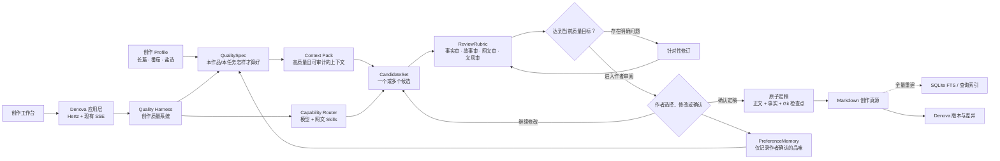
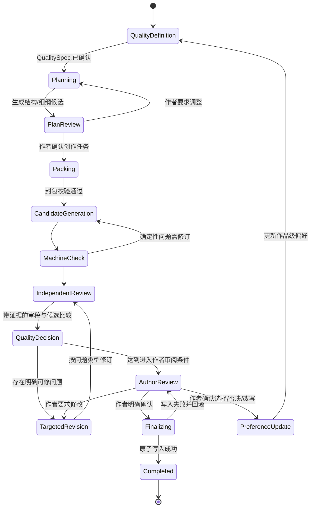

# 小说写作工具最终推荐方案

## 以优秀网文为目标的 Denova 模块化演进

> 文档状态：评审稿 v1.1  
> 日期：2026-07-21  
> 目标读者：产品负责人、架构师、前后端工程师、AI Workflow / Agent 工程师  
> 适用前提：本地优先、个人作者、Denova 二次开发、同时支持长篇与番茄/盐选短篇、所有定稿必须由作者确认

> **v1.1 核心修订：**Harness 的最终目的不是自动化，而是持续提高优秀网文的产出概率。自动化、状态机、Agent 编排和检查点只是支撑质量生产的运行底座。

---

## 阅读导航

- [最终决策与方案取舍](#0-最终决策)
- [产品约束、目标与用户场景](#2-已确认的产品约束)
- [总体架构与核心模块](#5-总体架构)
- [数据、Profile 与 Harness](#7-数据与工作区设计)
- [Agent、Skills 与虾评整合](#10-agent-与隔离策略)
- [前端、API 与非功能需求](#12-前端信息架构与交互)
- [MVP、实施路线与验收](#15-mvp-范围)
- [风险、ADR 与最终取舍](#18-主要风险与应对)
- [评审问题与参考资料](#21-对评审者的重点问题)

## 0. 最终决策

本项目不采用“三份方案平均混合”的做法，也不以功能数量最多为目标。

最终推荐采用：

> **以 Denova 现有工程为唯一技术底座，以模块化单体为系统形态，以文件为创作真源，建设以 QualitySpec 为目标、以专业网文能力为方法、以候选生成—独立审稿—针对性修订—作者反馈为闭环的创作质量 Harness；用 Profile 区分长篇、番茄短篇和知乎盐选短篇，并把作者确认设置为任何自动化都无法绕过的定稿边界。**

这是一套在当前约束下推导出的方案，不是普遍意义上的唯一最优解。如果未来变成云端多人协作产品、只做长篇 CLI，或者必须执行不可信第三方代码，架构需要重新评估。

### 0.1 一句话产品定位

一款本地优先、面向个人作者的 AI 小说创作工作台：系统围绕作品目标组织上下文、模型、网文方法和 Skills，通过多候选比较、独立审稿、针对性修订和作者反馈，提高优秀网文的产出概率；作者始终掌握创作决策与最终定稿权。

### 0.2 技术主线

1. 质量优先：任何阶段、Agent、Skill 或可视化都必须证明它改善了作品，而不是只增加流程。
2. 不重写 Denova，不替换其成熟基础能力。
3. 不建设第二套 Story System 真源。
4. 不让 SQLite、向量库或 Agent 对话记忆成为创作事实来源。
5. 不以子进程数量、Agent 数量或自动化覆盖率代表系统先进程度。
6. 不用固定 AI 分数或通用文学规则阻断作者。
7. 不允许 AI 自动定稿、自动覆盖作者正文或未经确认写入正式事实库。
8. 自动化可以批量运行，但只能批量生成“待作者确认”的结果。
9. Harness 必须通过真实作品与人工盲评证明其结果优于普通单轮生成。

---

## 1. 方案为什么不是“为了融合而融合”

最终方案有一条明确的主架构，其他方案只在不破坏主架构时提供局部经验。

| 来源 | 采用内容 | 明确不采用 |
|---|---|---|
| Denova | Go/Hertz、Eino、Agents、Skills、Automations、SSE、工作区、检查点、Git 版本与差异、React/TipTap/shadcn 前端 | 把游戏模式继续作为写作产品的主入口 |
| Kimi 方案 | 文件优先、上下文分层、来源审计、上游同步、可重建索引、Skills 许可证意识 | 平行 `.story-system` 真源、过重合同链、全局文学硬门禁、MVP 即引入向量库 |
| WorkBuddy 方案 | PRD 结构、用户故事、验收标准、网文能力目录、页面信息架构、风险登记、研发任务追踪 | 前后端重写、技术栈降级、用 WebSocket 替换现有 SSE、子进程伪沙箱、自动 Git 定稿、以功能数量替代质量验证 |
| webnovel-writer | v7 的文件真源、精准读取、薄流程、自愈、作者定稿、写作与审稿分离 | v6 的多份 JSON、多道 gate、派生状态双库和重型 Story System |
| NovelForge Agent | 输入白名单、来源哈希、任务封包、全新 Writer/Reviewer 上下文、审稿者不读写作者推理 | 把“新进程”误认为操作系统安全沙箱 |
| 虾评 Skills | 第一优先级外部能力源；公开下载、原址安装、专业方法、可插拔适配与效果评测 | 把所有 Skill 拼成一个巨型提示词、未经来源记录和安全检查直接执行 |

因此，最终产品不是三套架构的叠加，而是：

- **Denova 提供工程底座；**
- **Quality Harness 负责把创作目标、专业方法、候选、审稿、修订和作者反馈组织成质量闭环；**
- **Profile 提供题材与平台差异；**
- **完整网文能力与虾评 Skills 提供可替换的专业方法；**
- **作者确认提供最终控制权。**

---

## 2. 已确认的产品约束

以下约束应视为产品与架构的“宪法级规则”。任何后续需求与其冲突时，必须先修改决策记录，不能在实现中悄悄绕过。

### 2.1 用户与部署

- 主要用户是个人小说作者，而非多人编辑部。
- 本地优先，作品文件默认保存在作者本机。
- 默认以 Windows 为首要运行环境，同时保持跨平台路径与文件处理能力。
- 云同步、团队协作、在线发布平台不是首个版本的前置条件。

### 2.2 内容类型

- 支持长篇连载小说。
- 支持番茄短篇。
- 支持知乎盐选短篇。
- 三种模式共用作品、人物、情节、审稿、版本和 AI 基础能力，但使用不同创作 Profile。

### 2.3 质量与自动化边界

- AI 可以生成大纲、细纲、人物、正文、候选版本、审稿意见和事实同步候选。
- Harness 的首要职责是提高作品质量；多阶段、批量和断点恢复只是支撑手段。
- 关键开篇、转折、高潮、对白和结尾可以生成多个候选并独立比较。
- 审稿必须指出具体位置、读者感受、问题原因和可执行修法，不能只返回分数。
- 所有未确认结果只能写入工作区。
- 只有作者明确确认，系统才能将正文和事实同步为正式版本。
- 审稿完成不等于正文通过，评分达到阈值也不等于定稿。
- 只有经作者确认的选择、否决和修改才能沉淀为作品级偏好。

### 2.4 Denova 边界

- 保留 Denova 的核心架构与通用能力。
- 写作模式成为主要产品体验。
- 游戏模式保留为独立、隐藏或实验性模块。
- 共通模块的变化不得破坏游戏模式，但写作领域逻辑不得被迫兼容游戏语义。

---

## 3. 产品目标与非目标

### 3.1 产品目标

1. 在同一任务和模型条件下，让 Quality Harness 产出的正文稳定优于普通单轮生成。
2. 让作者从创意到定稿拥有完整、连续、可恢复的高质量创作过程。
3. 通过候选竞争、独立审稿和针对性修订提升开篇、人物、情节、对白、节奏与文风。
4. 降低长篇中的人物漂移、时间线冲突、伏笔遗忘和上下文失控。
5. 为番茄和盐选短篇提供不同于长篇的质量目标与专业方法。
6. 让 AI 的每次输入、输出、来源、选择和修改都可追踪。
7. 让作者可以直接修改 Markdown 文件，而不会破坏系统状态。
8. 让高级自动化服务质量，但不把工作流、日志和工程术语压到作者界面上。
9. 完整接入网文特色能力和虾评 Skills，同时保持能力可替换、可评测。

### 3.2 首个版本明确不做

- 云端多人实时协作与 CRDT。
- 面向第三方的公共云服务和多租户系统。
- 视频生成流水线。
- 游戏模式的大规模增强。
- 默认向量数据库或独立 RAG 服务。
- 完整 Skills 商店和在线支付。
- 为了“真正隔离”而建立重复的 Agent Worker 二进制。
- 在核心创作质量闭环完成前重写桌面运行时；开发期先复用 Denova 本地 Web，Tauri 作为 v1 正式发行形态在后续阶段接入。
- 自动发布到平台后台。
- 以自动化率、Agent 数量、字数吞吐或流程通过率替代小说质量。

---

## 4. 用户与核心场景

### 4.1 长篇作者

核心任务：从作品设定和总纲开始，持续生成与修订章节，同时维护人物、关系、时间线、伏笔和章节状态。

关键场景：

- 新书孵化与作品契约确认。
- 总纲、卷纲、章纲生成与调整。
- 单章写作、审稿、修改和定稿。
- 批量连写后集中审稿。
- 角色状态、伏笔和时间线的同步建议。
- 回改前文后的影响分析。
- 卷末复盘、悬而未决事项检查和下卷规划。

### 4.2 番茄短篇作者

核心任务：在有限篇幅内快速完成高吸引力开篇、明确冲突、持续升级和完整结局。

关键场景：

- 从题材或卖点生成多个可比较选题。
- 生成标题、简介、核心冲突和完整故事骨架。
- 检查开篇信息效率、冲突出现时机和节奏拖沓。
- 按场景或节拍写作，而不是照搬长篇“卷—章”结构。
- 全篇完成后进行结构、因果、人物和阅读动力审查。
- 按当前平台 Profile 导出干净正文。

### 4.3 知乎盐选短篇作者

核心任务：建立可信叙事前提、清晰因果链、持续悬念和有效转折，并完成具有整体感的单篇故事。

关键场景：

- 立意、叙事视角、故事前提与目标读者确认。
- 标题、开头承诺、秘密/信息差和关键转折规划。
- 检查反转是否有前置证据，而非突然揭示。
- 检查人物动机、因果可信度与叙事声音。
- 全篇审读和局部语言修订。
- 按当前平台 Profile 导出。

> 平台规则可能变化。系统不把字数、题材和投稿要求硬编码为永久规则，而是通过可版本化 Profile 管理，并允许作者修改。

---

## 5. 总体架构

### 5.1 架构形态

采用 **质量驱动的模块化单体 + 本地文件工作区 + 可重建查询索引**。

不拆微服务，不新建第二套后端，不替换现有 SSE，不复制 Denova 已有 Agent、Skills、版本和编辑器能力。



### 5.2 分层职责

| 层级 | 职责 | 不负责 |
|---|---|---|
| UI 层 | 作者任务、编辑、差异审阅、状态展示 | 直接决定工作流状态 |
| 应用层 | API、SSE、权限、会话、命令协调 | 文学判断 |
| Quality Harness 层 | QualitySpec、能力选择、候选策略、评审修订循环、阶段状态、检查点和确认边界 | 用流程完成代替质量结果 |
| Profile 层 | 创作模式的质量目标、术语、能力包、ReviewRubric、必需产物和导出 | 保存作品事实 |
| Agent/Skill 层 | 语义规划、候选生成、审稿、修订、提取和建议 | 自动定稿或自行决定长期偏好 |
| 偏好学习层 | 保存作者确认过的选择、否决、改写和项目文风 | 从单次行为偷偷推断永久规则 |
| 创作领域层 | 作品、章节/场景、人物、关系、事件、伏笔等业务模型 | 模型调用细节 |
| 存储层 | 文件事务、工作区、索引、版本、恢复 | 把缓存提升为真源 |

### 5.3 依赖方向

- Profile 定义质量目标和可用能力，不能直接写文件。
- QualitySpec 是每个作品/任务的质量合同，不是固定平台评分表。
- Harness 负责组织质量闭环；其确定性状态机只是运行机制，不是产品目的。
- Agent 只能返回结构化产物或补充资料请求，不能绕过 Harness 修改正式区。
- PreferenceMemory 只能接收作者确认过的信号，不能直接接受模型自评。
- SQLite 索引依赖 Markdown 文件，Markdown 文件不依赖 SQLite。
- UI 依赖稳定的应用层 DTO，不依赖 Agent 或数据库内部结构。
- Skills 通过能力接口接入，工作流不依赖具体 Skill 名称或提示词文本。

---

## 6. 核心模块

模块名称表达逻辑边界；实际实现优先扩展 Denova 现有 package，只有职责确实独立时才新增子 package。

### 6.1 Project & Story Domain

负责：

- 作品元数据、创作模式和 Profile 版本。
- 长篇的卷、章与章节顺序。
- 短篇的段落、场景、节拍和关键转折。
- 人物、关系、地点、世界规则、物件。
- 时间线、伏笔、悬念和其他连续性对象。
- 正式事实与创作计划的区分。

关键原则：计划不等于事实。只有正文定稿后确认发生的内容，才能进入正式连续性资料。

### 6.2 Profile Registry

负责：

- 注册 `long_serial`、`fanqie_short`、`zhihu_salt_short`。
- 定义每种模式的质量目标、阶段、能力包、候选策略、ReviewRubric、必需产物、默认术语和导出方式。
- 保存 Profile 版本、来源日期与作者自定义覆盖。
- 允许同一项目在明确迁移后更换 Profile，禁止静默切换。

Profile 中的文学规则默认是建议或提醒。只有文件格式、作者明确设置的篇幅、项目禁用词等确定性规则可以成为阻断项。

### 6.3 QualitySpec

QualitySpec 回答的不是“流程跑到哪一步”，而是：**这部作品、这个章节或这个场景怎样才算写得好。**

它由 Profile 默认值、作品契约、当前任务和作者确认共同构成，至少包含：

- 目标平台、目标读者和题材承诺。
- 核心卖点与读者应获得的体验。
- 本次任务在全篇中的功能。
- 开篇承诺、冲突、情绪和结尾变化。
- 人物目标、阻力、选择、代价和关系变化。
- 必须延续的事实、伏笔和信息差。
- 文风正本、人物声音和明确禁用写法。
- 当前任务应启用的网文能力、候选策略和审稿 Rubric。
- 作者已确认的偏好，以及其来源和适用范围。

QualitySpec 是可读、可审查、可版本化的质量合同，不是通用文学打分表。作品级规则与任务级目标分开保存，模型提出的修改在作者确认前只能作为候选。

### 6.4 Quality Harness

负责：

- 创建 Job 和 Run。
- 根据 QualitySpec 选择上下文、模型、Skills、候选数量和审稿策略。
- 组织“生成候选—独立审稿—比较—针对性修订—作者反馈”的质量循环。
- 执行显式状态机，保证每次质量循环可暂停、恢复和审计。
- 管理阶段输入、输出、检查点和恢复。
- 控制 Agent/Skill 能力和可读数据范围。
- 记录来源、模型、参数、Token、耗时和错误。
- 记录候选为何被保留或淘汰、审稿问题如何被处理以及修订前后差异。
- 在需要作者决定时暂停。
- 保证未经确认无法进入 Finalize。

Harness 不是一个“超级 Agent”，也不是以自动跑完流程为成功标准。确定性状态迁移由 Go 代码完成，模型只处理语义任务；Harness 是否成功，最终由正文质量和人工评测证明。

### 6.5 Context Pack Builder

负责：

- 根据当前任务生成显式输入白名单。
- 从文件中读取摘要、选区或必要全文。
- 记录每段上下文的来源、用途、范围和哈希。
- 应用可配置大小预算，而不是无限注入历史。
- 分别构建 Writer Pack、Reviewer Pack 和 Extractor Pack。
- 确保 Writer Pack 包含创作所需材料而不是工程日志，Reviewer Pack 包含可完整理解故事的必要文本。
- 根据 QualitySpec 提供本次真正需要的网文方法和作品偏好，而不是注入所有 Skills。
- 当来源发生变化时让旧任务包失效。

Reviewer Pack 必须包含待审草稿，但不包含写作者的隐藏推理、自评和主对话噪音。

### 6.6 Capability Router & Agent Runtime

复用 Denova Eino Agent、Subagent、Provider 和 Skills 体系。Capability Router 根据 QualitySpec、Profile、模型能力和历史评测选择具体实现，而不是把所有能力塞入同一次调用。

逻辑角色包括：

- Planner：提出方向、大纲、细纲和备选方案。
- Writer：根据已确认任务包生成一个或多个正文候选。
- Comparative Reader：在不知道写作者推理的情况下比较候选的实际阅读效果。
- Fact Reviewer：审查设定、人物状态、时间线、信息差与因果。
- Editorial Reviewer：审查人物动力、场景、节奏、表达和阅读感。
- Profile Reviewer：执行长篇、番茄或盐选的专项审稿。
- Reviser：按具体问题类型执行结构、场景、对白、节奏或语言修订。
- Fact Extractor：从待定稿文本提出事实变更候选。
- Summarizer：生成章/场景摘要和检索材料。

这些是逻辑角色，不要求每个角色对应独立操作系统进程。默认使用全新模型上下文即可实现上下文隔离。

### 6.7 CandidateSet & Selection

关键创作节点不必押注于第一次生成。CandidateSet 保存同一任务下的一个或多个候选及其完整来源。

候选策略由 Profile 和 QualitySpec 决定：

- 普通段落和低风险机械修改默认单候选。
- 书名、简介、黄金开篇、关键选择、重大反转、高潮、核心对白和结尾可启用多候选。
- 候选可以是完整正文，也可以是场景方案、对白方案或结尾方案。
- 多候选不是越多越好；数量由任务价值、模型成本和历史评测配置。
- 比较者先完整阅读，再按 QualitySpec 给出证据；不能只比较关键词或分数。
- 作者可查看、混合、拒绝或要求重新生成候选。
- 未选候选保留在工作区，不能污染正式事实和后续上下文。

### 6.8 Review & Revision Engine

审查分为两类：

**确定性检查：**

- 文件与 front matter 格式。
- 作者设置的字数范围。
- 明确禁用词和格式规则。
- 重复片段、连续相同开头、高频词等统计。
- 新专名与名册差异。
- Context Pack 来源哈希。

**语义审查：**

- 人物目标、阻力、选择与代价是否成立。
- 场景是否真正产生状态变化。
- 因果链和信息释放是否可信。
- 人物声音是否一致。
- 与近章/近场景是否结构重复。
- 开头承诺与结尾兑现是否匹配。
- 当前文本是否符合项目而非通用“爽文标准”。
- 当前 Profile 的阅读动力、节奏、反转或长篇连续性目标是否实现。

每条语义问题必须包含：

- 具体位置或证据。
- 读者会产生的感受或误解。
- 场景、人物、信息、因果或语言层面的原因。
- 建议修订层级和最小修改范围。
- 修订后必须重新检查的相关内容。

Revision Router 按问题类型选择能力：故事动力失败时不能只做语言润色；人物选择不成立时不能用增加形容词掩盖；事实冲突必须先解决事实再修文风。

AI 评分只能辅助比较版本，不能自动决定通过或定稿。审稿完成只说明已产出意见，不等于正文已经优秀。

### 6.9 PreferenceMemory

PreferenceMemory 让 Harness 学习“这位作者、这部作品真正认为什么是好”，而不是依赖通用提示词。

可以沉淀：

- 作者在多个候选中选择了哪一个以及明确理由。
- 作者反复删除或改写的表达模式。
- 被接受或拒绝的审稿意见。
- 人物对白、叙事距离和节奏偏好。
- 某个 Skill、模型或 Rubric 对当前作品是否有效。
- 作者明确加入文风正本或禁用写法的规则。

约束：

- 只有作者确认过的信号才能进入长期偏好。
- 每条偏好记录证据、适用范围、版本和可撤销状态。
- 单次选择默认是弱信号，不自动提升为永久规则。
- 模型自评、检测器分数和未定稿文本不能成为长期偏好真源。
- 作者可以查看、编辑、停用或删除任何偏好。

### 6.10 Finalization Service

负责唯一合法的正式写入路径：

1. 检查作者确认令牌及其对应草稿哈希。
2. 验证所有待写入文件仍基于同一输入快照。
3. 生成正文、事实和索引变化预览。
4. 先写临时文件并完成校验。
5. 原子替换正式文件。
6. 记录定稿事件和 Git 检查点。
7. 异步或随后重建查询索引。
8. 任一步失败时恢复到定稿前状态。

UI、Agent、Skill 和脚本均不得绕过此服务写入正式区。

### 6.11 Projection & Search

MVP 使用：

- 文件目录与结构化 front matter。
- SQLite 元数据索引。
- SQLite FTS 全文检索。
- 精确路径、实体 ID 和按需片段读取。

索引必须满足：

- 删除后可从正式 Markdown 全量重建。
- 重建不改变任何创作文件。
- 索引损坏不会阻止作者打开和编辑作品。
- 索引版本与工作区 Schema 版本分离。

向量检索只有在真实长篇评测证明 FTS 与精确读取不足时进入后续版本。

---

## 7. 数据与工作区设计

### 7.1 推荐逻辑目录

```text
<作品目录>/
├── 作品.md                         # 作品基本信息与当前 Profile
├── 作品契约/
│   ├── 创作方向.md
│   └── 文风与禁用写法.md
├── 大纲/
│   ├── 总纲.md
│   ├── 卷纲/                       # 长篇使用
│   ├── 章纲/                       # 长篇使用
│   └── 短篇结构/                   # 番茄/盐选使用
├── 资料/
│   ├── 人物/
│   ├── 地点/
│   ├── 世界规则/
│   ├── 时间线/
│   └── 伏笔与悬念/
├── 正文/
├── 素材/
├── 工作区/
│   ├── 当前任务/
│   ├── 草稿/
│   ├── 审稿/
│   ├── 同步候选/
│   └── 导出/
└── .denova/
    ├── runs/
    ├── checkpoints/
    ├── cache/
    ├── profile-lock.json
    └── index.db
```

这是逻辑结构，不要求一次性破坏现有 Denova 项目目录。实施时通过版本化 Workspace Schema 和迁移适配器逐步落地。

### 7.2 真源矩阵

| 数据 | 真源 | 是否可手改 | 是否可重建 |
|---|---|---:|---:|
| 正式正文、大纲、人物和设定 | Markdown | 是 | 否，必须备份与版本保护 |
| 未定稿草稿与审稿 | 工作区 Markdown/JSON | 是 | 部分可重新生成 |
| 运行状态与检查点 | `.denova/runs` | 不建议 | 可恢复或重新运行 |
| SQLite/FTS 索引 | `.denova/index.db` | 否 | 是 |
| Git 历史 | 项目版本库 | 通过产品界面管理 | 不应依赖数据库重建 |
| 模型会话历史 | Denova 会话存储 | 可清理 | 不是作品事实 |

### 7.3 手工修改处理

作者直接修改正式 Markdown 后：

1. 文件监听或下次打开时发现哈希变化。
2. 系统标记索引过期，而不是拒绝作者修改。
3. 重建受影响索引。
4. 对可能影响人物、时间线和伏笔的修改生成同步建议。
5. 只有作者确认后才更新其他正式文件。

---

## 8. 三类创作 Profile

### 8.1 共用能力

- 作品契约与文风。
- QualitySpec 与作品级质量目标。
- 人物和关系管理。
- 大纲与情节规划。
- Context Pack。
- 候选生成、比较、写作、审稿、针对性修订、差异和版本。
- 题材模板、章节/场景施工单、人物对白、阅读动力、连续性和自然度修订。
- 事实提取与同步候选。
- 经作者确认的 PreferenceMemory。
- 导出与项目备份。

### 8.2 长篇连载 Profile

质量目标：在长期连载中持续提供清晰的章节功能、人物选择、关系与局势变化、阅读动力和可信连续性，避免“每章都能生成但全书越来越散”。

必需产物：

- 作品契约。
- 总纲和当前卷纲。
- 当前章细纲。
- 相关人物、时间线、伏笔和前章衔接。
- 章节草稿、事实审、编辑审和同步候选。

重点能力：

- 精准读取，不默认回读全书。
- 章节龙骨或等价的最短状态记录。
- 多线推演和章节施工单。
- 开篇、冲突、兑现、悬念和结尾阅读压力诊断。
- 人物目标、选择、代价和关系变化检查。
- 批量连写但批量待定稿。
- 卷末复盘。
- 前文回改影响分析。

### 8.3 番茄短篇 Profile

质量目标：以清楚、快速且有情绪张力的方式兑现题材卖点，让读者尽早理解人物处境并持续产生阅读动力，同时保证全篇结构与结局完整。

必需产物：

- 选题与核心卖点。
- 标题/简介候选。
- 完整故事骨架。
- 开篇任务、主要冲突、升级节点和结局设计。
- 分场景草稿和全篇审稿。

重点能力：

- 开篇清晰度与有效信息密度。
- 冲突是否及时进入场面。
- 人物是否在行动和选择中暴露欲望，而不是由旁白说明。
- 节奏是否存在无效重复或长期停滞。
- 每次升级是否改变人物处境、关系或信息，而不是只提高音量。
- 结局是否兑现开头承诺。
- 平台字数与格式由 Profile 配置，不写死在代码中。

### 8.4 知乎盐选短篇 Profile

质量目标：建立稳定叙事声音、可信因果与持续信息压力，使转折既出人意料又有前置证据，并在结尾完成情绪和主题闭环。

必需产物：

- 立意、叙事视角、故事前提和读者承诺。
- 秘密/信息差设计。
- 因果链和关键转折。
- 证据或伏笔布置。
- 全篇草稿、结构审稿和语言审稿。

重点能力：

- 第一段是否建立明确问题或异常。
- 叙事声音是否稳定。
- 人物动机和因果是否可信。
- 反转是否有前置依据并改变读者理解。
- 结尾是否完成情绪与主题闭环。

### 8.5 网文特色能力全量目录

网文特色能力全部进入产品目标范围，但按作品、Profile 和阶段按需调用，不在一次任务中全量注入。

| 能力域 | 目标能力 | 典型产物或作用 |
|---|---|---|
| 题材与立项 | 题材模板、卖点、差异化、书名/标题、简介、标签、读者定位 | 作品启动包与候选方案 |
| 作品设计 | 作品契约、核心承诺、类型预期、文风、禁用写法 | QualitySpec 作品层 |
| 大纲推演 | 总纲、卷纲、短篇结构、多线/六线推演、后续分支模拟 | 已确认大纲与备选路径 |
| 执行规划 | 章纲、场景/节拍、章节施工单、冲突与信息安排 | 当前任务包 |
| 人物塑造 | 人物卡、人物弧、目标与创伤、关系变化、语言习惯 | 人物事实与写作切片 |
| 世界与设定 | 地点、组织、规则、力量体系、物件与代价 | 可检索正式资料 |
| 阅读动力 | 黄金开篇、钩子、冲突、悬念、微兑现、爽点、债务与结尾压力 | 阅读动力诊断与修订建议 |
| 连续性 | 时间线、状态、信息差、伏笔埋设/推进/回收、回改影响 | 事实审与同步候选 |
| 对白与场景 | 人物声音、潜台词、行动、空间调度、场景变化 | 对白/场景候选与专项审稿 |
| 综合审稿 | 事实审、故事审、Profile 审、十一维或可配置多维 Rubric | 带证据的审稿问题 |
| 修订与文风 | 结构重写、场景重构、对白修订、节奏修订、自然度与文风修订 | 按问题类型生成修订稿 |
| 复盘与学习 | 候选选择、作者改写、Skill 效果、卷末/全篇复盘 | PreferenceMemory 与评测记录 |

“37 题材模板”“追读力”“十一维审查”“五维去 AI 味”“六线推演”和“章节施工单”都应在以上能力域中获得明确位置。名称和维度可以来自不同方法，但产品内部依赖稳定 Capability，不依赖某个固定提示词包。

---

## 9. 创作质量 Harness

### 9.1 核心对象

| 对象 | 含义 |
|---|---|
| QualitySpec | 当前作品和任务怎样才算好的可审查目标 |
| Workflow Definition | 某个 Profile 下的阶段定义 |
| Job | 作者发起的一次业务任务，如“写第 12 章” |
| Run | Job 的一次实际执行，可失败、恢复或重跑 |
| Stage | 可检查点化的确定性阶段 |
| CandidateSet | 同一创作任务下的一个或多个候选及来源 |
| ReviewRubric | 当前 Profile/作品/任务实际采用的审稿标准 |
| ReviewIssue | 位置、读感、原因、修订层级和最小修改范围 |
| Artifact | 阶段产生的候选、审稿、任务包或同步候选 |
| Decision | 必须由作者做出的选择或确认 |
| PreferenceSignal | 作者确认过的选择、否决、改写或审稿采纳记录 |
| Source Manifest | 输入文件、范围、哈希和用途清单 |
| Checkpoint | 恢复执行所需的最小状态 |

### 9.2 标准写作流程



流程不是固定九步命令。不同任务可以跳过不必要阶段，也可以在关键开篇、反转和高潮增加候选与专项审稿。每个阶段必须说明它预期改善的质量维度；无法证明价值的阶段应被删除。

### 9.3 候选、审稿与修订策略

- 关键节点按 CandidatePolicy 生成多个候选，普通任务默认单候选控制成本。
- 候选比较先完整读懂故事，再按 QualitySpec 提供证据，禁止只看检测器分数。
- 审稿者与写作者使用全新上下文，事实审、故事审和 Profile 审可以按质量/成本档位组合。
- Revision Router 根据问题类型调用对应能力，不使用一次通用“润色”处理所有问题。
- 修订后重新检查受影响维度，并保留前后差异和问题闭环状态。
- 全局不写死循环次数和模型超时；作者可取消，Profile 可配置成本偏好，系统提示收益递减但不擅自定稿。
- Harness 的完成状态只代表产物已准备好，优秀与否仍需质量评测和作者判断。

### 9.4 批量连写

- 作者先确认控制边界，例如当前卷纲或完整短篇结构。
- Harness 可以连续生成多个章节/场景，并用“已定稿 + 当前批次待定稿”构建后续上下文。
- 每个产物保留独立来源和草稿哈希。
- 批量模式仍使用 QualitySpec 和按需审稿；不能为了吞吐关闭关键质量检查。
- 批次中发现人物、因果或方向性问题时，应暂停后续生成，避免高效复制错误。
- 批次结束后，作者可以整批接受、逐项修改、从某项起重写或全部放弃。
- 批量接受仍应按章节/场景顺序原子定稿，失败时能定位并恢复。

### 9.5 暂停、恢复与失效

- 每个 Stage 完成后保存检查点。
- 模型调用不写死固定超时；可由用户配置取消、成本和安全限制。
- 应用关闭或网络中断后可从最近有效检查点恢复。
- 输入来源哈希变化时，依赖旧来源的后续阶段标记为失效。
- 失效产物保留用于比较，不静默删除。

---

## 10. Agent 与隔离策略

### 10.1 默认隔离

小说写作所需的核心隔离是 **上下文隔离**，不是进程隔离：

- Writer 使用全新消息上下文。
- Reviewer 使用另一份全新上下文。
- Reviewer 不读取 Writer 的思维过程、自评或辩解。
- Agent 只能看到 Source Manifest 允许的数据。
- Agent 输出由主应用验证和落盘。

这可以直接建立在 Denova/Eino 现有 Agent 和 Subagent 能力上，无需复制一套模型、Provider、Skill 和流式通信运行时。

### 10.2 何时需要真正沙箱

只有在运行不可信第三方可执行代码时，才考虑：

- 操作系统受限账户。
- 容器或受限工作区。
- 网络禁用或域名白名单。
- 文件系统挂载边界。
- CPU、内存和进程限制。

单独启动子进程只能隔离内存，不能限制它读取当前用户可访问的磁盘或网络，因此不得称为安全沙箱。

---

## 11. Skills 与虾评能力整合

### 11.1 能力注册而非提示词堆叠

工作流依赖能力 ID，例如：

- `ideation.generate-premises`
- `project.bootstrap-genre`
- `outline.build-long-arc`
- `outline.build-short-structure`
- `outline.simulate-multiline`
- `outline.build-execution-brief`
- `character.build-profile`
- `character.build-dialogue-voice`
- `opening.review-hook`
- `engagement.review-reading-drive`
- `plot.manage-foreshadowing`
- `continuity.review-facts`
- `editor.review-story`
- `editor.review-profile-rubric`
- `style.revise-naturalness`
- `style.revise-prose`

一个能力可以由内置 Skill、用户 Skill 或公开下载的虾评 Skill 提供。Harness 只依赖能力契约，不依赖具体提示词名称；同一能力可以通过真实评测选择更合适的 Skill、模型或组合策略。

### 11.2 Skill Manifest

每个 Skill 至少记录：

- ID、名称、版本和来源。
- 作者、来源 URL 与原始许可/使用说明。
- 内容哈希。
- 适用 Profile 和阶段。
- 输入、输出 Schema。
- 所需模型能力。
- 文件、网络和工具权限。
- Token/成本建议。
- 安全扫描结果。
- 评测集与效果记录。
- 安装方式、更新方式和是否随产品安装包预置。

### 11.3 虾评作为第一优先级能力源

虾评 Skills 公开下载，获取与本地安装不再作为未决问题。产品应提供：

- 小说 Skills 搜索、筛选和详情预览。
- 从虾评原始地址一键下载和安装。
- 用户级、工作区级和项目级安装范围。
- 自动识别或人工映射 Capability ID。
- 安装前权限、文件和网络行为提示。
- 下载后哈希锁定、版本记录、更新比较和回滚。
- 长篇、番茄、盐选、人物对白、审稿修订等推荐能力包。
- 同能力多个 Skills 的 A/B 或盲评比较。

默认优先采用“从原始来源安装”，避免把第三方包复制进 Denova 核心代码。是否随正式安装包预置由发布策略决定，不影响现在的接入、使用和评测。

### 11.4 首批虾评能力映射

以下是首批候选映射，最终以实际下载包的 Manifest、内容和评测结果为准：

| 虾评 Skill/方法 | Capability ID | 适用 Profile | 主要阶段 |
|---|---|---|---|
| 小说助手 | `continuity.review-facts` | 长篇优先，短篇可用 | 事实审与同步候选 |
| 深度小说写作法 | `style.advanced-craft` | 通用 | 写作与结构/语言修订 |
| 爽点架构生成器 | `engagement.design-payoff` | 长篇、番茄 | 大纲、章纲、阅读动力 |
| 小说审校员 | `editor.review-profile-rubric` | 通用 | 独立审稿 |
| 人味写作引擎/AI 文本去味器 | `style.revise-naturalness` | 通用 | 自然度诊断与修订 |
| 维度化器 | `outline.build-execution-brief` | 长篇、复杂短篇 | 章节/场景施工单 |
| 多米长篇创作/多线推演法 | `outline.simulate-multiline` | 长篇 | 总纲、卷纲与多线推演 |
| 对话风格库 | `character.build-dialogue-voice` | 通用 | 人物设计、写作、对白审查 |

`多米长篇创作` 等全流程型 Skill 不能接管 Harness 状态机；它们拆解为大纲、推演、写作或审稿能力，由 Quality Harness 决定何时调用。

### 11.5 来源与许可证边界

- Denova：Apache-2.0。
- NovelForge Agent：Apache-2.0。
- webnovel-writer：GPL-3.0。
- 虾评 Skills：按公开下载能力直接接入和安装，同时记录原始来源、版本、哈希和使用说明。

对 webnovel-writer 默认采用 clean-room 方法论借鉴，不直接复制 GPL 覆盖的代码、模板或提示词。虾评公开下载解决获取和本地使用，不阻塞能力接入；来源记录仍用于更新、回滚、安全审计和正式安装包的可追溯性。本节不是法律意见，正式商业发布前仍应进行常规依赖与素材清单审计。

---

## 12. 前端信息架构与交互

前端策略是 **体验级重构，不是技术栈重写**：保留 React、TipTap、Tailwind、shadcn/Radix 和现有通用能力，重新设计页面信息架构、视觉层级、交互路径，并在垂直切片中拆分现有超大组件。

### 12.1 一级入口

1. **作品**：书库、最近项目、创建作品和导入。
2. **写作**：当前作品的创作主入口。
3. **资料**：人物、关系、世界观、时间线、伏笔和素材。
4. **审稿**：待确认草稿、审稿意见、同步候选和差异。
5. **版本**：检查点、差异、恢复和导出。
6. **运行中心**：后台任务、失败恢复、成本和技术详情。
7. **设置**：模型、Profile、Skills、语言和存储。

共享一级菜单不得自动切换写作/游戏模式，模式切换必须由用户显式操作。

### 12.2 四个核心页面

#### 作品主页

- 当前创作模式和 Profile 版本。
- 作品 QualitySpec 摘要和当前最重要的质量目标。
- 继续写作的唯一主按钮。
- 待作者处理事项。
- 长篇进度或短篇完成度。
- 人物/伏笔/连续性提醒。
- 阅读动力、人物弧、伏笔和近期审稿趋势等任务型洞察。
- 最近版本和失败恢复入口。

#### 规划中心

- 作品契约、总纲/短篇结构、人物和世界观。
- 卡片与文档双视图。
- AI 建议以差异形式展示，不能直接覆盖。
- 长篇与短篇展示各自术语，不暴露通用内部 Schema。

#### 章节/场景工作台

- 左侧：章节、场景或节拍导航。
- 中央：沉浸式 TipTap 编辑器。
- 右侧：当前任务、AI 操作、引用来源和审稿建议。
- 关键节点可查看多个候选并进行选择、对比、合并或重写。
- 运行日志、Token 和 Agent 细节默认折叠。
- 支持专注模式、快捷键、窄屏抽屉和流式输出不跳动。

#### 审稿中心

- 原稿/修订稿差异。
- 问题位置、读者感受、原因和修改建议。
- 确定性检查与语义审查明确分组。
- 按事实、故事、网文、人物、文风和 Profile 专项分组显示 ReviewIssue。
- 每条问题展示位置、读感、原因、修订层级和前后差异。
- 事实同步候选逐项接受/拒绝。
- “继续修改”和“确认定稿”形成清晰的最终分叉。

### 12.3 高级质量与运行视图

- **质量洞察：**实体关系、伏笔时间线、阅读动力变化、人物弧进展、候选选择和审稿问题趋势。
- **运行中心：**当前 Run、阶段、来源、Skills、模型、成本、失败恢复和可选 DAG。
- **评测中心：**Harness 与普通单轮生成的盲评、模型/Skill 对比和历史回归。

DAG、Token、原始日志和完整雷达图属于高级视图，不能成为普通作者完成写作的前置知识。质量图表用于定位和比较，不把文学质量伪装成一个绝对分数。

### 12.4 Tauri 桌面发行策略

Tauri 作为 v1 正式发行形态：

- 复用现有 React 前端，运行在独立桌面窗口中。
- 将 Denova Go 后端作为受控 sidecar 启动、监控和关闭。
- 提供 Windows 安装包、任务栏图标、文件选择、系统通知和后续自动更新能力。
- 开发阶段继续使用本地 Web，以保持调试和迭代效率。
- 在核心创作质量闭环稳定后接入，不让 Rust/Tauri、签名、安装器和 sidecar 生命周期阻塞前期质量验证。

### 12.5 视觉原则

- 延续 Denova 的纯黑/纯白双主题。
- 使用克制的红、黄、绿表示错误、提醒和完成。
- 优先使用现有 shadcn/Radix/TipTap 组件。
- 减少默认三栏信息竞争，作者正文始终是视觉中心。
- 所有用户可见文案支持中英双语。
- 宽屏、窄屏、长文本、空数据和运行失败状态都必须设计。

---

## 13. API、事件与配置策略

### 13.1 通信

- 复用现有 Hertz API。
- 复用现有 SSE 流式事件和重连能力。
- 不因“新功能”额外引入 WebSocket，除非出现 SSE 无法满足的双向实时需求并有性能证据。
- 前端只消费稳定 DTO 和业务事件，不读取后端内部状态结构。

### 13.2 核心事件

- `quality.spec.confirmed`
- `workflow.run.created`
- `workflow.stage.started`
- `workflow.stage.completed`
- `workflow.stage.failed`
- `workflow.input.invalidated`
- `workflow.decision.required`
- `artifact.created`
- `candidate.created`
- `candidate.compared`
- `candidate.selected`
- `review.issue.created`
- `review.completed`
- `revision.completed`
- `preference.confirmed`
- `preference.revoked`
- `finalization.started`
- `finalization.completed`
- `finalization.rolled_back`

每个事件包含稳定的 Run ID、Stage ID、Artifact ID 和时间，不把完整提示词或正文默认塞进事件流。

### 13.3 配置作用域

| 作用域 | 示例 |
|---|---|
| 用户级 | 默认模型、主题、语言、全局 Skills |
| 工作区级 | 存储位置、备份策略、可用 Profile |
| 项目级 | 当前 Profile、作品级 QualitySpec、文风、字数口径、项目 Skills、PreferenceMemory |
| 运行级 | 任务级 QualitySpec、本次模型、成本偏好、候选策略、审稿 Rubric 与强度 |

配置默认值、持久化位置和迁移规则必须明确，不能混写。

---

## 14. 非功能需求

### 14.1 数据安全

- 自动覆盖前必须生成可恢复版本。
- 工作区迁移必须可预览、备份和回滚。
- 支持中文、空格和长路径。
- 崩溃不能留下“正文已换、事实未换”的半提交状态。
- API Key 不写入作品目录和运行日志。

### 14.2 可靠性

- 每个 Workflow Stage 可恢复或安全重跑。
- 同一项目的冲突写入使用项目级锁。
- goroutine 必须 recover 并记录明确上下文。
- LLM 调用不设置不可配置的固定超时。
- 重试必须区分网络错误、模型错误、输入失效和业务审稿不通过。

### 14.3 性能

- 打开作品不依赖全书注入或全库向量化。
- 大纲、人物列表和章节树使用增量读取。
- 长篇检索默认先走结构化索引和 FTS。
- UI 流式更新不得导致编辑器光标跳动或整页重渲染。
- 性能目标基于真实大项目基准测试制定，不写未经验证的绝对数字。

### 14.4 可维护性

- 新能力优先通过 Profile、Skill 或已有通用抽象实现。
- 高频变更文件接近 500 行时主动拆分；超过 800 行不继续堆功能。
- 不新增 `utils/common/misc` 式无边界模块。
- 状态机和事件类型穷尽处理，不用默认分支吞掉新状态。
- 关键数据与状态变化优先写集成测试。

### 14.5 可观测性

每次 Run 记录：

- Profile、QualitySpec 和 Workflow 版本。
- 模型、Provider 和 Skill 版本。
- 输入来源与哈希。
- 阶段耗时、Token 和错误。
- CandidateSet、候选比较依据和生成的 Artifact。
- ReviewIssue、修订路由和问题闭环状态。
- 作者选择、否决、改写、确认的偏好信号与最终化结果。

作者界面展示人话状态；完整技术日志进入运行中心。

可观测性不能只回答“流程是否完成”，还必须回答：哪项能力改善了什么、作者最终保留了什么、Harness 相对普通单轮生成是否产生了可验证的质量收益。

---

## 15. MVP 与 v1 能力范围

### 15.1 P0 必须完成

- 现有 Denova 基线与上游同步策略。
- 三种 Profile 的项目创建和元数据。
- 作品级与任务级 QualitySpec。
- Markdown 正式区、工作区和可重建 SQLite/FTS 索引。
- 作品契约、大纲/短篇结构、人物和正文基本管理。
- 单章或单篇的端到端创作质量 Harness。
- 关键开篇/转折/结尾的 CandidateSet 与候选比较。
- Writer 与 Reviewer 全新上下文。
- ReviewRubric、确定性检查、事实审、故事审、Profile 审和针对性修订。
- 最小 PreferenceMemory：记录作者确认的候选选择、否决和文风规则。
- Capability Registry、Skill Manifest 和虾评原址下载安装能力。
- 首批核心网文能力：题材启动、结构/章纲、人物对白、黄金开篇/阅读动力、连续性、综合审稿、自然度修订。
- 草稿差异、事实同步候选和作者确认。
- 原子定稿、Git 检查点与失败回滚。
- 作品主页、规划中心、写作工作台和审稿中心。
- 中英双语、亮暗主题、宽窄屏适配。
- Windows 中文路径、崩溃恢复和项目迁移验证。
- 同任务同模型下“普通单轮生成 vs Quality Harness”的人工盲评基线。

### 15.2 v1 全量网文能力

- 长篇批量连写和批量审稿。
- 卷末复盘与前文回改影响分析。
- Profile 可视化编辑和版本更新提示。
- 完整题材模板体系，以及模板创建、导入、更新和评测能力。
- 多线/六线推演、章节施工单、追读力、伏笔债务、信息差和人物弧工具。
- 十一维或可配置多维审稿、自然度/文风修订和 Profile 专项审稿。
- 虾评小说 Skills 全量盘点、Capability 映射、推荐能力包和版本管理。
- Skills 管理、用户安装适配器、同能力替换和组合策略。
- 质量洞察、候选比较、模型/Skill 对比和回归评测。
- 前端体验级重构、运行中心高级视图和任务型数据看板。
- Tauri 桌面窗口、Windows 安装包和 Go sidecar 生命周期管理。
- 导出模板与更多平台格式。

### 15.3 P2 候选

- 经评测证明必要后的向量检索。
- 真正受限的第三方 Skill 沙箱。
- 可选云备份与同步。
- 多人协作。
- 游戏模式进一步演进。

---

## 16. 实施路线

### Phase 0：工程基线、质量基线与 Skills 盘点（2–3 周）

交付：

- 同步并评估 Denova 上游差异。
- 保护现有未提交修改，不在重构中覆盖。
- 建立关键请求链、会话、SSE、版本和工作区回归测试。
- 建立长篇、番茄、盐选分层的真实作品任务集和普通单轮生成基线。
- 下载盘点虾评小说 Skills，记录来源、哈希、能力、权限和初步质量。
- 完成依赖/来源矩阵和 Skills 接入红线。
- 冻结 Workspace Schema v1、QualitySpec、Profile、CandidateSet、ReviewIssue、PreferenceMemory 和 Author Finalization ADR。

验收：现有写作和游戏核心流程无回归；三类 Profile 都有可重复的质量基线；所有后续模块有明确接入点。

### Phase 1：创作领域与质量基础（3–5 周）

交付：

- Project/Story Domain。
- 三种 Profile 的最小定义与 QualitySpec。
- 正式区、工作区、运行区边界。
- CandidateSet、ReviewIssue 和 PreferenceMemory 数据模型。
- SQLite/FTS 重建器。
- 作品主页和规划中心骨架。

验收：删除索引后可从文件恢复；作者手改 Markdown 不会导致项目打不开；未确认的偏好和候选不会进入正式区。

### Phase 2：长篇 Quality Harness 垂直闭环（5–7 周）

交付：

- 长篇 QualitySpec、细纲/施工单、Context Pack、候选生成、机检、两审、针对性修订、同步候选和作者定稿。
- 题材启动、多线推演、人物对白、追读力、伏笔连续性、综合审稿和自然度修订的首批能力。
- 虾评安装适配器和长篇推荐能力包。
- 暂停恢复和输入失效处理。
- 编辑器、审稿中心、差异和版本联动。

验收：完成一本测试长篇的连续多章流程，任何路径都不能自动进入定稿；在同任务同模型盲评中，Harness 方案相对普通单轮生成显示稳定、可解释的质量提升。

### Phase 3：双短篇与全量网文能力（5–7 周）

交付：

- 番茄短篇从选题到全篇定稿的完整 Profile。
- 盐选短篇从立意到全篇定稿的完整 Profile。
- 场景/节拍工作台、关键节点多候选和短篇全局审稿。
- 题材模板、多维审稿、阅读动力、信息差、反转、自然度和文风能力补齐。
- 虾评小说 Skills 的完整 Capability 映射、推荐包、更新和回滚。
- Profile 化导出。

验收：两种短篇分别完成多题材样本，不复用长篇卷章规则硬套短篇；每种 Profile 都完成独立人工盲评并证明专项方法产生收益。

### Phase 4：体验级重构、质量洞察与 Tauri（4–6 周）

交付：

- 在现有 React/TipTap/shadcn 技术栈上完成信息架构、视觉和交互重构。
- 候选对比、质量洞察、评测中心和运行中心高级视图。
- Profile 编辑、模型/Skill 对比和效果回归。
- Tauri 桌面窗口、Windows 安装器、Go sidecar 管理和更新基础。
- 全局快捷键、系统文件选择、通知和桌面启动体验。

验收：普通作者无需理解 DAG 即可完成创作；高级用户可审查完整来源和运行过程；桌面应用可安装、启动、关闭并安全管理本地后端。

### Phase 5：质量回归、可靠性与 Beta（4–6 周）

交付：

- 大项目性能测试。
- Windows 中文路径和异常恢复矩阵。
- 迁移、备份、回滚和索引损坏演练。
- 三类 Profile、多题材、多模型和多 Skills 的质量回归。
- 审稿准确性、候选收益、偏好学习和成本/质量档位验证。
- 使用文档、双语文案、版本说明和 Beta 安装包。

验收：核心数据安全门槛全部通过；三类 Profile 的 Quality Harness 均在人工盲评中优于各自单轮基线；已知限制明确记录。

### 16.1 工期判断

- 单人全职：约 26–36 周形成包含完整网文能力与 Tauri 的可发布 v1。
- 2–3 名熟悉 Denova 的工程师：约 17–24 个日历周。
- 12–16 周适合交付质量闭环 MVP，不适合同时承诺全量模板、完整 Skills 评测、Tauri 精修、协作、视频和游戏扩展。

工期取决于模型/Skill 质量评测、真实作品修订、UI 迭代和桌面发行验证，不能只按代码文件数量估算。质量没有被证明时，流程代码写完不视为阶段完成。

---

## 17. 测试与验收

### 17.1 架构级验收

- 不存在除 Markdown 正式文件之外的第二创作真源。
- SQLite 删除后可以重建。
- QualitySpec、CandidateSet、ReviewIssue 和 PreferenceMemory 有明确边界与版本。
- Agent 无法直接写正式区。
- 未持有对应草稿哈希的作者确认不能定稿。
- 输入来源变化会让旧任务包失效。
- Writer 和 Reviewer 的模型上下文确实分离。
- 未经作者确认的选择或模型自评不能进入 PreferenceMemory。
- Revision Router 能按问题类型选择能力，不把所有问题路由到语言润色。
- SSE 断线重连不会重复执行阶段或丢失完成事件。

### 17.2 产品级验收

- 长篇、番茄短篇、盐选短篇均能完成端到端创作。
- 作者无需理解 Git、数据库、Agent 或 DAG 才能完成创作。
- 作者能确认和修改 QualitySpec，并理解本次创作要实现什么。
- 关键内容能生成、比较、选择和组合多个候选。
- 所有 AI 修改都能查看来源和差异。
- 每条重要审稿问题都能定位到正文并给出可执行修法。
- 作者可以拒绝任意事实同步建议。
- 作者可以查看、修改和撤销任何 PreferenceMemory。
- 自动批量创作结束后仍停留在待审状态。
- 崩溃恢复后能明确显示已完成、待重跑和已失效阶段。

### 17.3 质量评测

Harness 的验收不是“流程跑通”，而是 **在相同任务、相同模型和可比成本条件下，持续生成优于普通单轮调用的网文**。

#### A. 人工盲评主指标

对同一任务生成：

- A：普通单轮提示词结果。
- B：Quality Harness 结果。

评审者不知道结果来源，进行成对选择并说明证据。分别评估：

- 开篇是否清楚、及时建立问题与阅读动力。
- 人物是否有目标、阻力、选择和代价。
- 对话是否符合身份、关系和当下利益。
- 情节是否存在因果断裂或方便剧情。
- 场景是否发生了不可逆的关系、信息或局势变化。
- 情绪、冲突、悬念与兑现是否形成阅读压力。
- 长篇连续性是否稳定。
- 番茄短篇是否快速进入有效冲突并兑现卖点。
- 盐选短篇是否有稳定声音、可信因果和有依据的反转。
- 文风是否自然，是否存在机械解释、模板腔或对白过度高效。

#### B. 创作过程指标

- 作者首轮可用率。
- AI 正文在定稿中的保留比例及保留位置。
- 多候选相对单候选的选择收益。
- 审稿意见被作者采纳、部分采纳和拒绝的比例。
- 修订后在盲评中胜过修订前的比例。
- 连续性错误、回改成本和无效重写次数。
- 不同模型、Skills 和能力组合的质量/成本表现。

#### C. 审稿系统指标

- 审稿意见是否具体、可定位、可执行。
- 是否准确区分故事、人物、事实、节奏和语言问题。
- 是否存在误报、漏报、空泛建议或无意义同义词替换。
- 审稿者能否先正确复述人物目标、阻力、选择、代价和章末变化。

评测集按 Profile、题材、任务类型和篇幅分层，不能用一个爽文标准覆盖所有作品。模型自动指标只用于回归预警，最终质量结论由人工样本评审确认。

首个版本不提前伪造固定胜率门槛；Phase 0 建立基线后冻结发布门槛。至少应满足：三类 Profile 均有稳定、可解释的盲评提升，且不能以明显增加事实错误、作者改稿量或不可接受成本为代价。

---

## 18. 主要风险与应对

| 风险 | 影响 | 应对 |
|---|---|---|
| Denova 上游持续变化 | 二次开发难同步 | 保持增量模块、减少核心侵入、定期同步并建回归测试 |
| 多重真源 | 数据冲突或丢失 | Markdown 唯一真源、索引可重建、正式写入只走 Finalization |
| AI 语义判断不稳定 | 错误审稿或事实提取 | 确定性与语义检查分离、展示证据、作者确认 |
| 流程表演替代质量 | 阶段很多但正文没有变好 | 每个阶段声明质量假设，用同任务盲评验证，没有收益就删除 |
| 工作流过重 | 成本高、等待长 | Profile 分级、按需候选和 Reviewer、缓存确定性产物、精准读取 |
| Skills 全量堆叠 | 提示词冲突、风格混乱、成本失控 | Capability Router 按 QualitySpec 选择最少必要能力并做组合评测 |
| 评审器偏差或奖励投机 | 文本迎合 Rubric 而不像小说 | 多评审者、人工盲评、证据要求和跨题材回归 |
| PreferenceMemory 过拟合 | 把一次选择固化成僵硬文风 | 仅收作者确认信号、范围化、弱信号累计、可查看和撤销 |
| 平台规则变化 | 模板快速过期 | Profile 版本化、规则来源和日期可见、允许作者覆盖 |
| 虾评 Skill 更新或行为漂移 | 质量、安全或兼容性突变 | 原址安装、版本/哈希锁定、权限提示、回归评测和一键回滚 |
| 过早引入 RAG/向量库 | 复杂度和安装成本上升 | 先 FTS 和精确读取，用真实评测决定升级 |
| UI 继续堆在大文件 | 回归与维护成本上升 | 垂直切片时同步拆分高风险组件，不继续扩大超大文件 |
| 自动流程误覆盖作品 | 不可接受的数据损失 | 工作区隔离、哈希确认、原子写入、Git 检查点和回滚演练 |
| 子进程被误认成沙箱 | 安全边界虚假 | 上下文隔离与 OS 沙箱分开描述，只有不可信代码才启用强隔离 |
| Tauri/sidecar 打包复杂 | 安装、签名、更新或进程生命周期问题 | 核心闭环后接入，单独建立 Windows 安装与关闭恢复矩阵 |

---

## 19. 关键 ADR（架构决策记录）

### ADR-001：保留 Denova，采用模块化演进

**决定：**不重写后端或替换前端技术栈，但对前端进行体验级重构。  
**理由：**现有 Agent、Skills、SSE、编辑器、版本和工作区已覆盖大量基础能力。  
**代价：**需要治理现有大文件和耦合点，并持续处理上游同步。

### ADR-002：Markdown 是唯一创作真源

**决定：**SQLite、运行 JSON 和模型记忆均不得成为正式创作事实源。  
**理由：**作者必须能直接查看、修改、比较和备份作品。  
**代价：**需要可靠索引重建与手改检测。

### ADR-003：Harness 是创作质量系统，程序状态机是运行底座

**决定：**Harness 围绕 QualitySpec 组织候选、审稿、修订和作者反馈；阶段控制、检查点和定稿边界由 Go 代码执行。  
**理由：**产品目的是真实提升网文质量，确定性流程只是保证质量方法可重复、可审计。  
**代价：**除 Stage、Artifact 和 Decision 外，还要维护 QualitySpec、CandidateSet、ReviewIssue 和 PreferenceMemory。

### ADR-004：作者确认是不可绕过的定稿条件

**决定：**自动化最多生成待审产物。  
**理由：**文学判断和正式事实归作者。  
**代价：**全自动模式的确认粒度只能上移到批次，不能取消。

### ADR-005：Profile 隔离长篇和两类短篇

**决定：**共用引擎，差异通过 Profile 表达。  
**理由：**避免三套产品重复建设，也避免用长篇规则硬套短篇。  
**代价：**需要稳定的 Profile 契约与迁移规则。

### ADR-006：默认不使用独立 Worker 和向量库

**决定：**先复用 Eino 上下文隔离及 SQLite FTS。  
**理由：**当前没有证据证明额外运行时能抵消其复杂度。  
**代价：**未来达到真实瓶颈时需增量引入。

### ADR-007：Skills 通过能力契约接入

**决定：**Harness 依赖 capability，不依赖具体 Skill。  
**理由：**提示词和第三方来源会变化，工作流不应被锁死。  
**代价：**需要统一输入输出和兼容性测试。

### ADR-008：关键创作节点支持候选竞争

**决定：**开篇、关键选择、反转、高潮、核心对白和结尾可以按 CandidatePolicy 生成多候选。  
**理由：**高价值创作决策不应始终押注于第一次随机生成。  
**代价：**增加模型成本和比较复杂度，必须通过候选收益评测控制使用范围。

### ADR-009：作者确认信号构成 PreferenceMemory

**决定：**只从作者明确选择、否决、改写和确认中学习作品偏好。  
**理由：**优秀网文依赖具体作者和作品的品味，不能只依赖通用 Rubric。  
**代价：**需要范围、证据、版本、撤销和防过拟合机制。

### ADR-010：虾评是第一优先级 Skill 来源

**决定：**提供虾评原址发现、下载、安装、映射、评测、更新和回滚能力。  
**理由：**完整网文方法是产品核心能力，公开下载已解决获取和本地安装问题。  
**代价：**需要维护来源、哈希、权限、兼容性和质量回归。

### ADR-011：Tauri 是 v1 发行形态，不是前期开发底座

**决定：**核心质量闭环完成后，将现有 React 前端和 Go 后端包装为 Tauri 桌面应用。  
**理由：**最终用户需要双击启动的本地软件，但桌面打包不应提前阻塞正文质量验证。  
**代价：**增加 Rust/Tauri 工具链、安装签名、sidecar 生命周期和跨版本测试。

---

## 20. 最终取舍清单

### 立即采用

- Denova 现有 Go/Hertz/Eino/React/TipTap/shadcn 技术栈。
- 模块化单体。
- 文件真源与可重建索引。
- 以优秀网文为目标的 Quality Harness。
- QualitySpec、CandidateSet、ReviewRubric、Revision Router 和 PreferenceMemory。
- 三类创作 Profile。
- Context Pack 白名单与来源哈希。
- Writer/Reviewer 全新上下文。
- 工作区、差异、作者确认和原子定稿。
- Skills Capability Registry。
- 网文特色能力全量目录与分期交付。
- 虾评原址发现、下载、安装、映射和评测。
- 前端体验级重构。
- Tauri 作为 v1 正式发行目标，核心闭环后实施。

### 延后，以评测为前提

- 向量检索和本地 Embedding。
- 独立 Agent Worker。
- 第三方代码强沙箱。
- 云备份与协作。
- Skills 商店。

### 明确拒绝

- 全量重写 Denova。
- 降级或替换现有前后端技术栈。
- `.story-system` 与 Markdown 并列为正式真源。
- 用固定爽点、伏笔、剧情比例控制所有作品。
- 用 AI 检测分数自动判断小说质量。
- 用自动化率、Agent 数量、流程通过率或每小时字数代替质量结果。
- 把所有网文 Skills 同时塞进一个提示词或每个任务。
- 未经作者确认自动写事实、定稿或 Git commit。
- 把普通子进程宣传成安全沙箱。
- 直接复制 GPL 覆盖内容后仍按 Apache 方式分发。

---

## 21. 对评审者的重点问题

请评审者不要只评价“功能是否丰富”，重点挑战以下问题：

1. 是否存在任何能绕过 Author Finalization 写入正式区的路径？
2. Markdown 与 SQLite 的依赖方向是否始终单向、可验证？
3. Profile 抽象能否表达长篇、番茄和盐选差异，而不演变成三套分叉代码？
4. Harness 是否真正改善正文，还是只增加了阶段、Agent 和可视化？
5. QualitySpec 是否表达了本作品的质量目标，而不是换名后的固定评分表？
6. Context Pack 的来源、范围、哈希和失效是否足以审计？
7. 候选竞争在哪些任务上产生真实收益，在哪些任务上只是浪费成本？
8. ReviewIssue 是否有具体证据和可执行修法，修订后是否在盲评中更好？
9. PreferenceMemory 是否只学习作者确认信号，并且可解释、可撤销、不过拟合？
10. 哪些模块可以复用 Denova 现有能力，哪些确实需要新增边界？
11. MVP 是否还包含没有验证价值的技术或功能？
12. 工期是否覆盖数据迁移、异常恢复、真实作品评测、虾评适配、UI 迭代和 Tauri 发行，而不只计算编码时间？

任何修改建议都应说明它改善了哪项约束、引入了什么新复杂度，以及如何验证收益。

---

## 22. 参考资料

### 本次评审输入

- Kimi K3：《小说写作工具-项目设计方案.md》
- WorkBuddy：《novel-writer-PRD.md》
- WorkBuddy：《novel-writer-architecture.md》
- WorkBuddy：《class-diagram.mermaid》
- WorkBuddy：《sequence-diagram.mermaid》
- WorkBuddy：《codex-review-feedback.md》

### 官方项目

- Denova：https://github.com/alfredxw/denova
- webnovel-writer：https://github.com/lingfengQAQ/webnovel-writer
- webnovel-writer v7 PRD：https://github.com/lingfengQAQ/webnovel-writer/blob/v7/docs/architecture/v7-prd.md
- NovelForge Agent：https://github.com/LvPengfei1/novelforge-agent
- NovelForge 方案：https://github.com/LvPengfei1/novelforge-agent/blob/main/docs/novel-agent-plan.md
- NovelForge 审稿协议：https://github.com/LvPengfei1/novelforge-agent/blob/main/NOVEL_REVIEW_PROTOCOL.md
- 虾评小说 Skills 检索：https://xiaping.coze.com/?search=小说
- 扣子官方 Skills 下载与安装说明：https://docs.coze.cn/tutorial_openclaw_continues_to_grow
- Tauri 官方架构：https://v2.tauri.app/concept/architecture/
- Tauri Sidecar：https://v2.tauri.app/develop/sidecar/

---

## 23. 结论

当前约束下的最优技术路线不是“把三份方案合在一起”，而是：

> **让 Denova 继续做平台，让 Quality Harness 围绕作品目标组织上下文、模型、网文方法、候选、审稿、修订和作者反馈，让 Profile 表达长篇与两类短篇各自的优秀标准，让完整网文能力与虾评 Skills 提供可替换方法，让 Markdown 保存作品，让作者决定什么才是优秀且正式的作品。**

这条路线以正文质量为最高目标，以数据安全、作者控制、复用现有资产和长期可维护性为约束，主动舍弃了看起来先进但缺少质量收益证据的重写、微服务、子进程、早期向量库和自动定稿。

它不是把小说生产得最快的方案，而是在当前目标、团队规模、工程基础和风险边界下，最有机会持续生成更好网文、接受作者品味校正并长期演进的方案。
