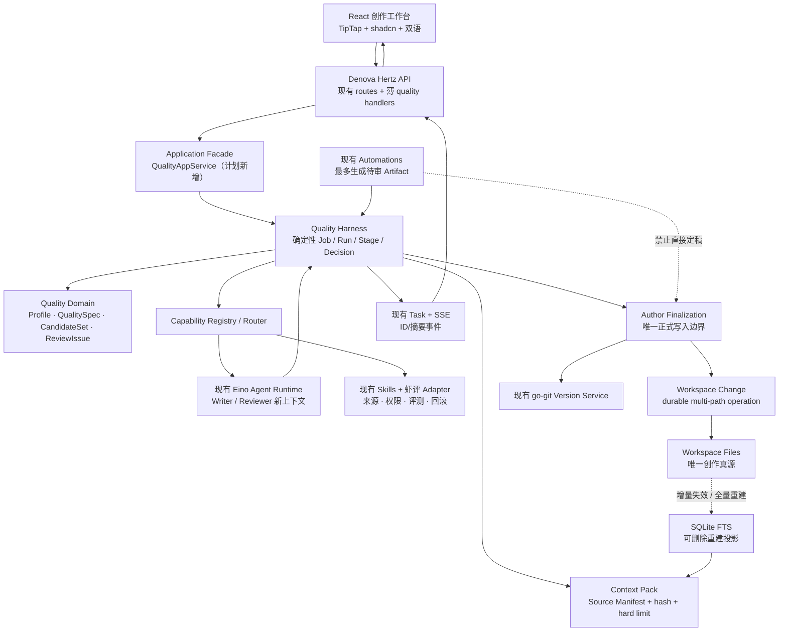
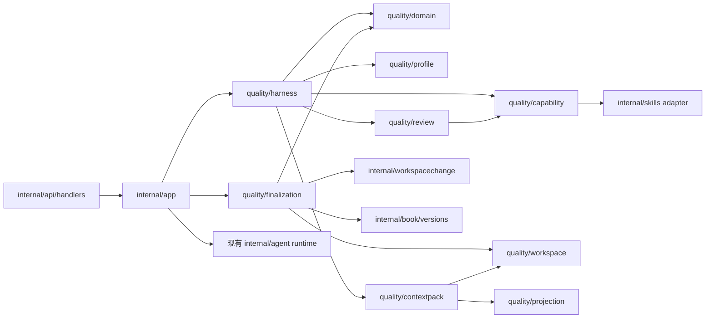
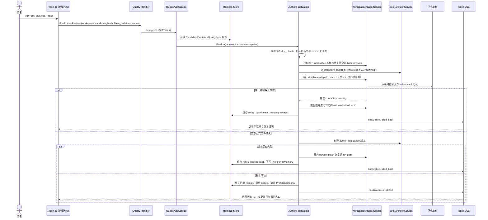

# 架构演进与变更地图

> 当前架构基线：`feat/quality-harness-foundation@91c6e509a6beea98e8d025777c97b34b2bc6ac9f`。
> 目标：在 Denova 模块化单体中增加 Quality Harness，不建立第二后端、第二 Agent Runtime、第二 SSE 或第二创作真源。
> 标记为“计划新增”的路径当前不存在；其余路径均已用源码核实。

## 1. 当前系统事实

### 1.1 后端请求与运行链

1. `cmd/denova/main.go` 加载配置、构造 `internal/app.App`、启动 Hertz `internal/api.Server`。
2. `internal/api/routes.go` 登记 workspace、chat、skills、automations、versions、interactive 等真实路由。
3. `internal/app/runtime_builder.go` 为当前 workspace 装配 `book.State`、`session.Store`、Agent runner、interactive store 和 `book.VersionService`。
4. `internal/agent/builder.go` 复用 Eino ADK、Provider、filesystem/Skill middleware；`internal/agent/chat.go` 组装有界上下文并产出 `agent.Event`。
5. `internal/app/task.go` 把后台运行与 HTTP 连接解耦；`internal/api/sse/task.go` 输出已有快照和后续 live 事件；`internal/api/agentui/stream.go` 将未知事件安全映射为 activity data。

### 1.2 文件、写入与版本链

- `internal/book/state.go` 已建立 `ideas.md`、`setting/`、`chapters/` 和 `.denova` 内部目录。
- `internal/book/files.go` 提供安全路径、revision 和普通文件操作。
- 编辑器保存走 `internal/workspacechange/save.go`；Agent 变更走 `apply.go`；review/undo/redo 的多路径持久意图在 `operation.go` 中实现。
- `internal/book/versions/` 用 go-git 保存 workspace 版本、差异和恢复；`.denova/runs`、changes、reviews、interactive 等运行路径被明确排除。
- 当前没有面向已确认定稿的公开通用多文件批量 API；`commitGroupOperationLocked` 是内部能力。这是 P2-T07 的明确扩展点和风险，不得用循环 `os.WriteFile` 绕过。

### 1.3 Agent 上下文链

- `internal/agent/context/context.go` 已有 `Source`、`Purpose`、`Placement`、`Limit`、Included/Truncated 等边界。
- `internal/agent/context_ledger.go` 保存来源、用途、bytes/hash/preview 和截断原因。
- `internal/agent/run_ledger.go` 只持久化有界运行元数据，不保存完整 prompt、thinking 或工具大对象。
- `internal/agent/tool_result_policy.go` 对工具结果做结构化 manifest 和大小上限。
- `internal/session/display.go` 与 `session.go` 已把展示事件和模型有效上下文分开。

### 1.4 Skills 与 Automation 链

- `internal/skills/catalog.go`、`directories.go` 已处理 builtin/user/workspace scope 和覆盖优先级。
- `internal/skills/install.go`、`remote.go`、`github.go` 已处理安全解压、远程/GitHub 下载、预览和安装。
- 当前缺少不可变来源记录、完整内容 hash、许可/权限、Capability 映射、评测历史、更新比较和回滚。
- `internal/automation/` 已有权限、调度、run、trigger、Inbox；`internal/app/automation_app_service.go` 已 944 行，不应继续承载 Harness 状态机。
- 当前 `auto_write` 是 Automation 通用能力；目标架构必须在 Harness 正式区之上再施加不可绕过的 Author Finalization 边界。

### 1.5 前端链

- `web/src/App.tsx`、`ModeRouter.tsx`、`WorkbenchShell.tsx` 分别为 937、1184、976 行，属于高冲突和高风险接入点。
- `web/src/stores/workspace-store.ts` 分离可见 `mode` 与 `nova:content-mode`，为共享菜单不切模式提供现有语义。
- 编辑器使用 TipTap：`web/src/components/Editor/MarkdownRichEditor.tsx`；`useEditorDraftPersistence.ts` 已处理 revision/冲突/保存。
- 差异、评论、版本和恢复已有组件：`web/src/features/changes/`、`features/document-review/`、`components/Versions/VersionPanel.tsx`。
- `web/src/i18n/locales/zh-CN/` 和 `en-US/` 是唯一翻译体系；主题变量在 `web/src/index.css`。

## 2. 目标总体架构

关键依赖原则：

- API 和 UI 不直接依赖具体 Skill、模型或存储格式。
- Harness 只依赖 Capability 和端口，不依赖具体 Skill 名称。
- Agent 只返回结构化 Artifact/补充输入请求，不掌握正式写入句柄。
- Finalization 是唯一同时依赖 `workspacechange` 与 `book.VersionService` 的质量模块。
- projection 单向读取文件并生成索引；正式事实从不反向由 index 写回。

## 3. 计划新增 package 与依赖方向

### 3.1 Go package 布局

| 计划新增路径 | 单一职责 | 允许依赖 | 禁止依赖 |
|---|---|---|---|
| `internal/quality/domain/` | 核心 ID、值对象、聚合和穷尽状态；不处理 IO | Go 标准库 | `app`、`api`、Agent、文件、SQLite |
| `internal/quality/profile/` | 三 Profile registry、版本、默认策略和 QualitySpec 合并 | `domain` | API/UI、具体 Skill 名称 |
| `internal/quality/workspace/` | Workspace Schema、文件 repository、迁移预览/备份/回滚 | `domain`、`workspacepath`、窄的 book reader | `app`、API、Agent |
| `internal/quality/projection/` | SQLite/FTS schema、增量失效和全量 rebuild | `domain`、`workspace` | Harness 状态迁移、正式写入 |
| `internal/quality/contextpack/` | Source Manifest、精确读取、用途和大小预算 | `domain`、`profile`、reader ports | session display、完整历史、无限全文 |
| `internal/quality/capability/` | Capability registry/router、Skill manifest/adapter 和评测选择 | `domain`、`profile`、窄 `skills` adapter | Harness 具体 stage、UI |
| `internal/quality/review/` | reviewer 运行请求、ReviewIssue 验证和 revision routing | `domain`、`capability`、Agent port | 正式写入、PreferenceMemory 直接写入 |
| `internal/quality/harness/` | Job/Run/Stage 状态机、检查点、失效、Decision 和 orchestration ports | `domain`、`profile`、`contextpack`、`capability`、`review` | Hertz、React、具体文件布局 |
| `internal/quality/finalization/` | 作者确认校验、批量正式写入、版本检查点、receipt/补偿 | `domain`、`workspace`、`workspacechange`、`book/versions` | Agent、Automation、API DTO |
| `internal/quality/evaluation/` | 离线 corpus、盲包、指标和 Gate Manifest | `domain`、标准库 | 产品 runtime 状态、API Key |
| `internal/app/quality_app_service.go` | 按当前 workspace 装配上述服务并提供应用用例 | quality packages、现有 runtime snapshot | 领域逻辑、巨型状态机 |
| `internal/api/handlers/handler_quality_projects.go`（计划新增） | Profile/QualitySpec/迁移的 HTTP 参数、错误和 locale 映射 | `app`、API DTO | 文件 IO、Agent 选择、状态判断 |
| `internal/api/handlers/handler_quality_runs.go`（计划新增） | Job/Run/Decision/Finalization 与 SSE 入口 | `app`、API DTO | 文件 IO、Agent 选择、状态判断 |
| `internal/api/handlers/handler_quality_evaluation.go`（计划新增） | 评测查询与聚合结果 transport | `app`、API DTO | 评测决策、文件 IO |

`domain` 不是 `common`/`utils` 垃圾桶：只有被两个以上质量子域共享、且具有稳定业务语义的对象才能进入。仅被一个 use case 使用的配置留在拥有它的 package。

### 3.2 依赖有向图

不允许反向 import：`workspacechange`、`book`、`agent`、`skills` 不 import `internal/quality`；集成由 `app` 或 quality adapter 向下完成，从而降低 upstream 同步冲突。

### 3.3 前端 feature 布局

| 计划新增路径 | 职责 |
|---|---|
| `web/src/features/quality/types.ts` | 后端稳定 DTO 的前端镜像；不复制后端内部状态 |
| `web/src/lib/api-client/quality-projects.ts` | Profile、QualitySpec、workspace migration API |
| `web/src/lib/api-client/quality-runs.ts` | Job/Run/Decision/finalization/SSE API |
| `web/src/lib/api-client/quality-evaluation.ts` | 评测和质量洞察 API |
| `web/src/features/quality/project/` | 作品主页、Profile 与 QualitySpec |
| `web/src/features/quality/harness/` | 运行阶段、候选和 Decision UI |
| `web/src/features/quality/review/` | ReviewIssue、差异、修订和作者定稿 |
| `web/src/features/quality/evaluation/` | 盲评/质量洞察/模型与 Skill 对比 |
| `web/src/i18n/locales/zh-CN/quality.ts` | Quality Harness 中文文案 |
| `web/src/i18n/locales/en-US/quality.ts` | 与中文同 key 的英文文案 |

`App.tsx`、`ModeRouter.tsx`、`WorkbenchShell.tsx` 只负责 lazy route/feature boundary 和已有模式状态，不接收 CandidateSet、ReviewIssue 或 Run 状态机细节。若接入使任一文件继续显著增长，P4-T01 前移为先行重构 Task，但不得借机改变菜单行为。

## 4. Workspace Schema v1 推荐映射

最终物理布局由 P0-T03 ADR 批准；推荐采用最小破坏映射：

| 数据类别 | 当前/推荐物理路径 | 真源 | 版本策略 |
|---|---|---:|---|
| 创作灵感 | `ideas.md`（现有） | 是 | 进入 workspace Git 版本 |
| 大纲、进度、人物状态、章纲 | `setting/`（现有） | 是 | 进入版本 |
| 正式正文 | `chapters/`（现有） | 是 | 进入版本；仅 Finalization 或作者编辑器保存可写 |
| 结构化 lore | `.denova/lore/items.json`（现有） | 是 | 进入版本；同步候选确认后写入 |
| 当前 Profile | `.denova/profile-lock.json`（计划新增） | 是 | 进入版本 |
| QualitySpec | `.denova/quality/specs/`（计划新增） | 是 | 进入版本；模型修改先形成候选 |
| PreferenceMemory | `.denova/quality/preferences.jsonl`（计划新增） | 是 | 进入版本；撤销追加事件 |
| Candidate/Review/Sync Artifact | `.denova/quality/artifacts/`（计划新增） | 待审文件真源 | 进入版本或按 ADR 的保留策略显式归档，不进入正式 Context Pack |
| Harness Job/Run/Checkpoint | `.denova/quality/runs/`（计划新增） | 运行恢复记录 | 从 workspace 版本排除；可恢复/重跑 |
| Agent run/checkpoint | `.denova/runs/`、`.denova/checkpoints/`（现有） | Agent 运行记录 | 保持现有语义 |
| FTS projection | `.denova/index.db`（计划新增） | 否 | 排除版本，可删除重建 |
| 缓存 | `.denova/cache/`（计划新增） | 否 | 排除版本，可删除 |
| 本地历史 | `作品目录/.git/`（现有运行生成） | 恢复历史 | 由 `book/versions` 管理，不经普通 workspace 文件 API |

禁止从 `.denova/index.db`、会话 JSONL 或 Agent run ledger 反向生成正式事实。旧 `.nova` 只按 `workspacepath` 现有兼容规则读取；不在启用 Harness 时无预览强制迁移。

## 5. 核心数据流

### 5.1 创建任务与生成候选

1. UI 提交 Profile、作品/任务 QualitySpec 版本、目标 Artifact 和作者已确认的任务边界。
2. handler 只校验 transport；`QualityAppService` 捕获当前 workspace identity，创建 Job/Run。
3. Harness 从文件 repository 构建 Source Manifest；每项含 path/range、purpose、hash、byte limit、included/truncated。
4. Context Pack Builder 精确读取并验证总预算；不直接装载所有会话、日志、Skills 或全书。
5. Capability Router 根据 Profile、QualitySpec、任务、模型能力和已批准评测选择最少必要 Capability 实现。
6. Writer 使用全新上下文；产出先验证 Schema，再写 Candidate Artifact 文件。
7. Reviewer 使用另一份全新上下文，只看到允许的正文、QualitySpec/ReviewRubric 和来源，不看到 Writer thinking/self-review。
8. ReviewIssue 保存证据、位置和路由；Revision Router 只修受影响范围并重新检查相应维度。
9. SSE 只发 ID、stage、状态、摘要和可查询 Artifact ID；正文由受权限控制的普通 API 按需读取。

### 5.2 手工修改与失效

1. 编辑器或外部工具改变正式 Markdown。
2. `workspacechange`/读取路径发现 revision/hash 变化；projection 标记对应记录 stale。
3. 依赖该 hash 的 Context Pack、Candidate、Review 和后续 Stage 标记 `invalidated`，Artifact 保留。
4. SSE 发送 `workflow.input.invalidated`，UI 展示受影响范围和重跑选择。
5. FTS 增量重建；任何同步到其他正式文件的建议仍是待审 Artifact。

### 5.3 SSE 事件流

目标事件由 `quality/harness` 定义 transport-neutral envelope，在 `app` 转成现有 `agent.Event`，经 `Task.Subscribe()` 和 `StreamTaskUI()` 输出：

- `workflow.run.created`
- `workflow.stage.started|completed|failed`
- `workflow.input.invalidated`
- `workflow.decision.required`
- `artifact.created`
- `candidate.created|compared|selected`
- `review.issue.created`
- `review.completed`
- `revision.completed`
- `preference.confirmed|revoked`
- `finalization.started|completed|rolled_back`

统一最小 envelope（计划合同）包含 `event_id`、`run_id`、`stage_id`、`artifact_id`（适用时）、`occurred_at`、`sequence`、`summary`。不得默认包含完整 prompt、thinking、正文、工具大结果或 API Key。

事件传输是 UI 恢复通道，不是运行真源。断线后先从持久 Run repository 读取当前状态，再用 Task snapshot/live 补显示事件；客户端重连不得触发 stage 执行。

## 6. 作者定稿关键时序

必须由 ADR-AF-001 解决的细节：Git 快照与文件事务是不同介质，不能虚假宣称单一 ACID 事务。实现必须使用 durable write intent、确定 roll-forward/compensation 和最终 receipt，使恢复结果可判定；任何失败都不能留下“已显示完成但没有版本”或“PreferenceMemory 已学习但正文未定稿”。

## 7. 复用、扩展、新增与明确不改

### 7.1 直接复用

- `internal/app.Task` 的后台执行、panic recover、snapshot/live 订阅。
- `internal/api/sse.StreamTaskUI` 和 `agentui.StreamEncoder` 的 AI SDK stream。
- Eino model/provider、Agent runner、Skills middleware 和已有工具安全策略。
- `agent/context` 与 context ledger 的来源、用途和大小模型。
- `workspacechange` 的 revision、防并发覆盖、durable ledger、atomic file、review/undo/redo。
- `book/versions` 的 go-git history、diff、restore 和 workspace snapshot。
- Skills 的 scope/catalog/preview/remote/GitHub/install 安全路径。
- Automation 的 scheduler/run/Inbox，但只作为 Harness Job 触发器。
- TipTap 编辑器、changes/document-review、VersionPanel、shadcn、TanStack Query、Zustand、i18n 和主题变量。

### 7.2 有边界扩展

- `internal/api/routes.go`：只新增 `/api/quality/*` 路由。
- `internal/app/runtime_builder.go`：只装配 `QualityAppService` 的 workspace-scoped dependencies。
- `internal/workspacechange`：新增具名、可恢复的公开多路径 batch；保持内部 ledger 兼容。
- `internal/book/versions/files.go`：按 ADR 精确排除 index/cache/run，保留 QualitySpec/Preference/Artifact；补完整测试。
- `internal/skills`：source record/hash/permission/update rollback 通过新文件或子 package 扩展，不继续堆入 `install.go`。
- `config/`：只有配置确有用户/工作区/运行作用域时新增；默认值、持久化和迁移必须同时完成。
- 前端 workbench：只接 lazy feature route 和一个 active state，业务状态留在 `features/quality`。

### 7.3 计划新增

- `internal/quality/*` 领域、状态机、上下文、能力、评审、定稿、投影和评测包。
- `internal/app/quality_app_service.go` 和聚焦的 quality handlers。
- `web/src/features/quality/*` 与对应 API client/i18n。
- Workspace Schema/QualitySpec/Profile/CandidateSet/ReviewIssue/PreferenceMemory/Finalization 的版本化文件合同。
- Phase 4 的 Tauri shell；在 P3-T08 前不存在于依赖或关键路径。

### 7.4 明确不改或不提前改

- Phase 0–3 不改 `internal/interactive/` 和 `web/src/features/interactive/` 的游戏业务模型；只跑共享回归。
- 不替换 `internal/agent/runner.go` 的 Eino Runtime，不复制 Provider/model profile。
- 不用 WebSocket 替换 `internal/api/sse/`。
- 不重写 `internal/book/versions/git_store.go`；只做必要、可测的源类型/排除扩展。
- 不替换 TipTap、shadcn、TanStack Query、Zustand 或 i18n。
- 不引入向量库、独立 Worker、普通子进程伪沙箱、云同步或协作。
- 不在 Phase 3 前引入 Rust/Tauri 工具链。

## 8. 高风险模块和隔离策略

| 现有文件 | 当前行数 | 风险 | 计划隔离 |
|---|---:|---|---|
| `internal/app/automation_app_service.go` | 944 | 多职责且频繁运行 | 新建 Harness adapter；Automation 只触发 Job，不放状态机 |
| `internal/app/runtime_manager.go` | 697 | workspace 生命周期核心 | 只加装配字段/薄访问器，质量逻辑在 `QualityAppService` |
| `internal/app/chat_app_service.go` | 650 | 会话、Agent、上下文耦合 | Writer/Reviewer 用质量 adapter，不把流程塞入 chat |
| `internal/agent/chat.go` | 696 | 核心流式与上下文 | 复用稳定 Run API；不加入 Profile 状态机分支 |
| `internal/agent/builder.go` | 689 | Agent 构造集中 | 新能力优先用已有 Build 参数/adapter，避免继续扩展大 switch |
| `web/src/App.tsx` | 937 | 全局 UI 协调 | feature route/lazy boundary；不传递全部质量对象 |
| `web/src/components/workbench/ModeRouter.tsx` | 1184 | 已超过 800 行 | 质量页面独立 feature；必要时先拆 route layer |
| `web/src/components/workbench/WorkbenchShell.tsx` | 976 | 导航规则极敏感 | 只增加一项声明式 activity；特征测试锁定模式行为 |
| `web/src/hooks/useAgentChat.ts` | 581 | chat 状态复杂 | Quality Run 独立 hook，不复用为万能流程 hook |
| `web/src/components/Editor/useEditorDraftPersistence.ts` | 572 | revision/冲突安全关键 | 只通过既有回调刷新；定稿由后端事务，不从 hook 直接写 |

## 9. 源码路径核实清单

以下抽查超过 20 个真实路径；“现有”均在当前 HEAD 存在。

| # | 路径 | 状态 | 核实职责 |
|---:|---|---|---|
| 1 | `cmd/denova/main.go` | 现有 | 启动与服务装配 |
| 2 | `internal/api/server.go` | 现有 | Hertz server |
| 3 | `internal/api/routes.go` | 现有 | API 路由 |
| 4 | `internal/api/handlers/handler_chat.go` | 现有 | Chat Task/SSE handler |
| 5 | `internal/api/sse/task.go` | 现有 | Task snapshot/live SSE |
| 6 | `internal/api/agentui/stream.go` | 现有 | AI SDK UI event 编码 |
| 7 | `internal/app/app.go` | 现有 | App facade |
| 8 | `internal/app/runtime_builder.go` | 现有 | workspace runtime 装配 |
| 9 | `internal/app/task.go` | 现有 | 后台 Task 与事件订阅 |
| 10 | `internal/app/workspace_version_mutations.go` | 现有 | 版本应用用例 |
| 11 | `internal/agent/builder.go` | 现有 | Eino Agent 构造 |
| 12 | `internal/agent/runner.go` | 现有 | Runner/checkpoint |
| 13 | `internal/agent/chat.go` | 现有 | Chat request 与运行 |
| 14 | `internal/agent/context/context.go` | 现有 | 有界上下文 Source |
| 15 | `internal/agent/context_ledger.go` | 现有 | Context provenance ledger |
| 16 | `internal/agent/run_ledger.go` | 现有 | 有界运行元数据 |
| 17 | `internal/agent/tool_result_policy.go` | 现有 | 工具结果结构化筛选 |
| 18 | `internal/book/state.go` | 现有 | workspace 创作目录/上下文 |
| 19 | `internal/book/files.go` | 现有 | 文件/revision/安全路径 |
| 20 | `internal/book/versions/files.go` | 现有 | 版本文件包含/排除 |
| 21 | `internal/book/versions/restore.go` | 现有 | 版本恢复 |
| 22 | `internal/workspacepath/workspacepath.go` | 现有 | `.denova`/`.nova` 路径选择 |
| 23 | `internal/workspacechange/service.go` | 现有 | workspace change service |
| 24 | `internal/workspacechange/apply.go` | 现有 | revision 校验与变更提交 |
| 25 | `internal/workspacechange/operation.go` | 现有 | durable multi-path operation |
| 26 | `internal/workspacechange/atomic_file.go` | 现有 | 原子可见文件写入 |
| 27 | `internal/session/types.go` | 现有 | 会话/展示/compaction 类型 |
| 28 | `internal/session/display.go` | 现有 | display-only 事件 |
| 29 | `internal/skills/types.go` | 现有 | Skill scope/summary |
| 30 | `internal/skills/install.go` | 现有 | ZIP/directory 安装 |
| 31 | `internal/skills/remote.go` | 现有 | 受限远程下载 |
| 32 | `internal/skills/github.go` | 现有 | GitHub source |
| 33 | `internal/automation/types.go` | 现有 | Automation 任务/权限/run |
| 34 | `internal/app/automation_app_service.go` | 现有 | Automation 应用服务 |
| 35 | `web/src/App.tsx` | 现有 | 全局前端协调 |
| 36 | `web/src/stores/workspace-store.ts` | 现有 | mode 与 panel 状态 |
| 37 | `web/src/components/workbench/ModeRouter.tsx` | 现有 | 一级 route 映射 |
| 38 | `web/src/components/workbench/WorkbenchShell.tsx` | 现有 | 导航和布局 |
| 39 | `web/src/components/Editor/MarkdownRichEditor.tsx` | 现有 | TipTap 编辑器 |
| 40 | `web/src/components/Editor/useEditorDraftPersistence.ts` | 现有 | draft 保存与冲突 |
| 41 | `web/src/components/Versions/VersionPanel.tsx` | 现有 | 版本 UI |
| 42 | `web/src/features/changes/` | 现有 | Agent change/diff/review |
| 43 | `web/src/features/document-review/` | 现有 | 文档批注 |
| 44 | `web/src/features/skills/SkillsView.tsx` | 现有 | Skills UI |
| 45 | `web/src/lib/api-client/workspace.ts` | 现有 | Workspace API client |
| 46 | `web/src/lib/api-client/versions.ts` | 现有 | Version API client |
| 47 | `web/src/i18n/locales/zh-CN/` | 现有 | 中文文案 |
| 48 | `web/src/i18n/locales/en-US/` | 现有 | 英文文案 |
| 49 | `internal/quality/domain/` | 计划新增 | 质量领域合同 |
| 50 | `internal/quality/harness/` | 计划新增 | 确定性质量状态机 |
| 51 | `internal/quality/finalization/` | 计划新增 | 作者定稿事务 |
| 52 | `internal/quality/projection/` | 计划新增 | SQLite/FTS 投影 |
| 53 | `web/src/features/quality/` | 计划新增 | Quality Harness 前端 feature |

## 10. 架构完成判据

- `go list -deps`/import 检查不存在现有基础 package 反向 import `internal/quality`。
- 所有新增状态和事件穷尽处理；未知状态返回明确错误，不能由 default 吞掉。
- 实际模型消息证明来源、用途、hash、限制和 Writer/Reviewer 隔离，而非只看日志预览。
- SSE 重连只恢复显示和状态，不重复开始模型调用。
- 删除 FTS 后可由文件完全重建；数据库从未成为正式写入前置条件。
- 静态搜索不存在 Agent/Automation/Skill 绕过 Finalization 写正式路径的入口。
- 写作/游戏模式回归、共享菜单 active 和显式模式切换均通过。
- 大文件没有继续承载新的核心职责；新增 package 的 public API 最小且有职责注释。
