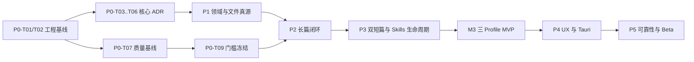

# Harness Novel 总体开发计划

> 状态：部分实施；截至 2026-07-22，P0-T09 有受限 live cohort 和工程门禁证据，但真实 regression 人工评审为 0/24，Phase 0 与 Phase 1 均为 `NOT-ENOUGH-DATA / BLOCKED`，详见 `../evaluation/PHASE_0_BASELINE_REPORT.md`。
> 制定日期：2026-07-21
> 唯一工程仓库：`D:\vibe\harness novel`
> 当前分支：`feat/quality-harness-foundation`
> 本报告证据 HEAD：`08c0694a8ac26f4b2a0dce815945c46107a0572a`
> Denova 上游基线：`upstream/master@eb5e4ee53ad158fe88dfb7148408edc6558e481a`
> 最高优先级产品基线：`docs/project-design/final/小说写作工具-最终融合最优方案.md` v1.1

## 0. 规划审计时的仓库事实

| 项目 | 已核实值 |
|---|---|
| Repository root | `D:/vibe/harness novel` |
| Branch | `feat/quality-harness-foundation` |
| HEAD | `91c6e509a6beea98e8d025777c97b34b2bc6ac9f` |
| Tracking branch | `origin/feat/quality-harness-foundation` |
| `origin` | `https://github.com/wyi006636-cyber/denova.git` |
| `upstream` | `https://github.com/alfredxw/denova.git` |
| `upstream/master` | `eb5e4ee53ad158fe88dfb7148408edc6558e481a` |
| Merge base | `eb5e4ee53ad158fe88dfb7148408edc6558e481a` |
| 开始时工作区 | clean，`git status --short --untracked-files=all` 无输出 |
| 当前源码差异 | HEAD 相对 upstream baseline 没有 Go/TypeScript 源码差异；当前提交仅导入设计基线资料 |

direct remote head 在规划开始时也已用 `git ls-remote` 复核：origin feature 指向当前 HEAD，upstream master 指向上述基线。

## 1. 目标与成功定义

Harness Novel 的产品目标是提高优秀网文的产出概率。自动化数量、Agent 数量、阶段完成率、单位时间字数都只是运行或成本信号，不能替代正文质量。

本计划以 Denova 为唯一工程底座，沿用 Go/Hertz、Eino Agent Runtime、Skills、Automations、SSE、工作区、Git 版本、React、TipTap、shadcn 和双语体系，通过模块化单体增量增加 Quality Harness。成功必须同时满足：

1. `long_serial`、`fanqie_short`、`zhihu_salt_short` 三个 Profile 均有独立质量目标、工作流与评测证据。
2. 同任务、同模型、可比成本下，Harness 候选在人工盲评中稳定且可解释地优于普通单轮基线。
3. 文件始终是创作事实真源；SQLite/FTS 只是可删除、可全量重建的查询投影。
4. Writer、Reviewer 和比较者使用隔离的模型上下文，只读取 Source Manifest 允许的有界来源。
5. AI、Automation、批量任务和 Skills 都不能绕过作者确认；正式正文或设定的最终写入只能经过 Author Finalization。
6. 写作与游戏模式继续共享 Denova 的稳定基础能力，一级共享菜单不改变当前内容模式。

## 2. 不可变实施原则

- 不重写现有前后端或 Agent Runtime，不建立第二套后端、会话、SSE、Skills 安装器或版本系统。
- 不建立 `.story-system` 等并行创作真源；不让数据库、会话历史、模型记忆或运行日志成为正式事实。
- 不写死模型运行超时或迭代次数；允许作者取消，并把成本、安全、空转保护做成具名配置。
- 不把所有 Skills 注入同一调用。工作流只依赖稳定 Capability ID，由 Capability Router 选择最少必要实现。
- 不用普通子进程冒充安全沙箱；真正执行不可信第三方代码前必须另行完成安全边界决策。
- 不在 Phase 3 质量闭环通过前引入 Tauri；不在 FTS 真实不足前引入向量检索。
- 新增用户可见文案必须同步中文和英文；可见前端变更必须验证亮/暗主题、宽/窄屏、长文本和空数据。
- 任何阶段都不得通过 skip、删除测试、降低断言或扩大失败白名单制造绿灯。
- 每个实现提交前更新 `CHANGELOG.md`；Commit Message 与 Pull Request Title 使用英文。

## 3. 当前架构基线与演进边界

| 能力 | 已核实源码入口 | 实施判断 |
|---|---|---|
| 启动与 HTTP | `cmd/denova/main.go`、`internal/api/server.go`、`internal/api/routes.go` | 复用；只登记薄路由和 handler |
| 应用装配 | `internal/app/app.go`、`internal/app/runtime_builder.go`、`internal/app/runtime_manager.go` | 扩展薄 facade；`runtime_manager.go` 已 697 行，不承载 Harness 状态机 |
| Agent Runtime | `internal/agent/builder.go`、`internal/agent/runner.go`、`internal/agent/chat.go` | 复用 Eino、Provider、工具和流式处理；增加专用运行适配器，不复制 runtime |
| 上下文边界 | `internal/agent/context/context.go`、`internal/agent/context_ledger.go`、`internal/agent/tool_result_policy.go` | 扩展 Context Pack、来源哈希和用途；沿用有界账本 |
| 后台任务与 SSE | `internal/app/task.go`、`internal/api/sse/task.go`、`internal/api/agentui/stream.go` | 复用事件传输；Harness 状态必须持久化，不能只依赖内存事件缓冲 |
| 工作区文件 | `internal/book/state.go`、`internal/book/files.go`、`internal/workspacepath/workspacepath.go` | 保留现有 `ideas.md`、`setting/`、`chapters/` 和 `.denova/`，通过 Workspace Schema 适配演进 |
| 受控写入 | `internal/workspacechange/apply.go`、`save.go`、`review.go`、`operation.go` | Author Finalization 的关键复用点；需新增公开的具名批量定稿能力，而不是直接写文件 |
| 本地版本 | `internal/book/versions/`、`internal/app/workspace_version_mutations.go` | 复用 go-git 快照、差异和恢复；定稿前后生成可恢复版本 |
| Skills | `internal/skills/`、`internal/app/skills_app_service.go`、`internal/api/handlers/handler_skills.go` | 复用发现、预览、远程/GitHub 下载和安装；扩展来源、哈希、权限、Capability、评测、更新和回滚 |
| Automations | `internal/automation/`、`internal/app/automation_app_service.go`、`automation_trigger_service.go` | 复用调度、运行和 Inbox；不得承载 Harness 状态机或直接定稿 |
| 编辑器与审稿 | `web/src/components/Editor/`、`web/src/features/changes/`、`web/src/features/document-review/` | 复用 TipTap、差异和批注；增加候选/ReviewIssue 视图 |
| 导航与模式 | `web/src/stores/workspace-store.ts`、`web/src/components/workbench/ModeRouter.tsx`、`WorkbenchShell.tsx` | 保持单一活动一级菜单和显式模式切换；三个文件均已偏大，只接 feature slice |
| 版本前端 | `web/src/components/Versions/VersionPanel.tsx`、`web/src/features/versions/` | 复用版本、差异与恢复 UI |
| 双语和主题 | `web/src/i18n/locales/zh-CN/`、`en-US/`、`web/src/index.css` | 原位扩展；不得创建 Harness 私有翻译体系或独立主题 |

详细的复用、扩展、新增、不改清单见 `ARCHITECTURE_CHANGE_MAP.md`。

## 4. 里程碑总览

| 里程碑 | 完成 Phase | 可验证结果 | 不是完成标准的信号 |
|---|---:|---|---|
| M0 基线冻结 | 0 | 三 Profile 可重复基线、核心回归、Skills 清单、七类核心 ADR 已批准 | 文档数量、测试数量 |
| M1 领域底座 | 1 | 文件真源边界、三 Profile、QualitySpec、领域对象、可重建 FTS 和前端骨架可用 | 页面已出现、数据库表已创建 |
| M2 长篇垂直闭环 | 2 | 连续多章从任务到作者定稿闭环，任何路径均不能自动定稿，长篇盲评有解释性提升 | 状态机跑完、Agent 调用更多 |
| M3 Quality Harness MVP | 3 | 三 Profile 均端到端，首批网文能力与虾评能力可替换、可评测、可回滚，三组盲评达门槛 | 全量 Skills、全量模板、Tauri |
| M4 v1 RC | 4 | 普通作者可完成创作，高级用户可审计来源；Windows Tauri 安装、启动、关闭和 sidecar 管理通过 | 仅能打开桌面窗口 |
| M5 Beta | 5 | 数据安全、恢复、性能和三 Profile 质量回归通过，双语发布资料和安装包完整 | 只通过自动测试或一次演示 |

## 5. Phase 0–Phase 5 计划

### Phase 0：工程基线、质量基线与 Skills 盘点

**目标：**在不实现 Harness 产品业务闭环前，冻结可复现的工程、质量、来源与决策基线。P0-T09 可实现一个版本化、评测专用、离线的 Harness runner，用于取得真实 S/H 配对证据；它不是产品运行时集成、用户工作流、正式工作区写入、自动发布或第三方脚本执行。

**任务：**

| Task ID | 交付物 | 依赖 | 估算 |
|---|---|---|---:|
| P0-T01 | 上游/环境/源码接入点基线、来源与依赖矩阵 | 无 | 0.75 人日 |
| P0-T02 | 请求、会话、SSE、工作区、版本、导航与写作/游戏共通能力特征测试 | P0-T01 | 2.5 人日 |
| P0-T03 | Workspace Schema v1 与真源/运行/投影区 ADR | P0-T01 | 0.75 人日 |
| P0-T04 | Profile 与 QualitySpec ADR、三 Profile 最小合同 | P0-T03 | 1.0 人日 |
| P0-T05 | CandidateSet 与 ReviewIssue ADR | P0-T04 | 1.0 人日 |
| P0-T06 | PreferenceMemory 与 Author Finalization ADR | P0-T03、P0-T05 | 1.0 人日 |
| P0-T07 | 三 Profile 真实任务集、普通单轮基线协议和可重复采样工具 | P0-T04 | 3.0 人日 |
| P0-T08 | 虾评 Skills 盘点、来源/哈希/权限/Capability 初映射和接入红线 | P0-T04 | 2.0 人日 |
| P0-T08A | 用户批准的全目录发现/证据增量：公开元数据快照、能力召回、重复/评论证据与双通道短名单；不改写 P0-T08 历史 | P0-T08 | 4.0 人日 |
| P0-T09 | 评测专用离线 Harness runner 的调优/冻结回归配对 pilot、Phase 0 集成门禁和未来质量门槛冻结 | P0-T02、P0-T06、P0-T07、P0-T08、P0-T08A | 1.5 人日 |

**交付物：**基线说明、回归测试、三类评测集与单轮结果、虾评来源清单、七类核心 ADR、质量门槛清单。

**人员与时间：**单人 17.5 人日，约 3–3.5 周；双人可并行 P0-T02、P0-T07/P0-T08A，约 2.5 周。角色需要 Go/Agent、React 测试、网文评测三类能力，单人承担时不得省略人工评测。

**退出条件：**

- `upstream/master` 基线和特性分支差异可复现；工作区无未知修改。
- 当前写作和游戏核心流程特征测试全部通过。
- 三 Profile 均有版本化任务集、普通单轮输出和盲评协议；P0-T09 的离线 runner 仅以 tuning shakeout 后的冻结 regression paired pilot 取得证据，全部 `release_holdout` 仍只保留元数据/hash。
- ADR-WS-001、ADR-QS-001、ADR-PROFILE-001、ADR-CS-001、ADR-RI-001、ADR-PM-001、ADR-AF-001 均为 `Accepted`。
- 后续所有核心模块都有真实接入路径；不存在依赖虚构接口的任务。
- P0-T09 仅从真实 regression pilot 与人工评审方差冻结未来样本量和非劣规则；这不构成 Phase 2/3/5 质量 PASS，未冻结时禁止进入对外质量声明。

### Phase 1：创作领域与质量基础

**目标：**建立文件优先、可版本化、可迁移的领域底座，不运行完整生成闭环。

| Task ID | 交付物 | 依赖 | 估算 |
|---|---|---|---:|
| P1-T01 | `Profile` 注册表、`QualitySpec` 组合/校验/版本合同 | P0-T04、P0-T09 | 2–3 人日 |
| P1-T02 | Workspace Schema v1 适配器、分区校验、迁移预览/备份/回滚 | P0-T03、P0-T06 | 3–4 人日 |
| P1-T03 | SQLite/FTS 可重建投影、手改失效检测和重建命令 | P1-T02、ADR-PROJECTION-001 | 3–4 人日 |
| P1-T04 | CandidateSet、ReviewIssue、PreferenceMemory 文件仓储与版本迁移 | P0-T05、P0-T06、P1-T02 | 2–3 人日 |
| P1-T05 | Quality API、SSE 事件合同和稳定 ID/摘要载荷 | P1-T01、P1-T04 | 1.5–2 人日 |
| P1-T06 | 作品主页、规划中心、Profile/QualitySpec 前端骨架与双语适配 | P1-T01、P1-T05 | 2.5–4 人日 |
| P1-T07 | Phase 1 集成、删除索引重建、手改 Markdown、跨模式回归门禁 | P1-T02–P1-T06 | 1–2 人日 |

**人员与时间：**单人 15–22 人日，约 3–4.5 周；按最终方案保留 3–5 周窗口，建议 1 名 Go/Agent 工程师和 1 名前端工程师并行，评测/QA 0.25 FTE。

**退出条件：**删除 `.denova/index.db` 后可从文件完整恢复；作者手改正式 Markdown 后项目可打开并只标记投影失效；候选、未确认偏好和运行状态不进入正式事实；三 Profile 元数据可创建、读取、升级；前端不自动改变写作/游戏模式。

### Phase 2：长篇 Quality Harness 垂直闭环

**目标：**完成 `long_serial` 从 QualitySpec 到 Author Finalization 的真实多章质量闭环。

| Task ID | 交付物 | 依赖 | 估算 |
|---|---|---|---:|
| P2-T01 | 有来源、用途、哈希和硬上限的 Context Pack Builder | P1-T01–P1-T03 | 2.5–3.5 人日 |
| P2-T02 | Capability Registry/Router 与内置/现有 Skill Adapter | P0-T08、P1-T01 | 2.5–3.5 人日 |
| P2-T03 | 确定性 Harness 状态机、持久检查点、取消/恢复/输入失效 | P1-T04、P1-T05 | 4–5 人日 |
| P2-T04 | Writer 隔离上下文、CandidatePolicy 与候选生成 | P2-T01–P2-T03 | 2.5–3.5 人日 |
| P2-T05 | 确定性检查、独立事实审/故事审/Profile 审和 ReviewIssue | P2-T01、P2-T02、P2-T04 | 3.5–4.5 人日 |
| P2-T06 | Revision Router、问题闭环、修订后复审和候选选择/混合 | P2-T05 | 2.5–3.5 人日 |
| P2-T07 | 同步候选、PreferenceSignal 和原子 Author Finalization/Git 检查点 | P2-T03、P2-T06、ADR-AF-001 | 4–5 人日 |
| P2-T08 | 长篇运行、候选、审稿、差异、定稿联动 UI | P2-T03–P2-T07 | 3–4.5 人日 |
| P2-T09 | 连续多章真实样本、恢复演练和长篇盲评门禁 | P2-T01–P2-T08 | 2–3 人日 |

**人员与时间：**单人 26.5–36 人日，约 5.5–7 周；2 名工程师加 0.5 FTE 评测/编辑可控制在最终方案的 5–7 周。

**退出条件：**一本测试长篇可连续完成多个章节；Writer/Reviewer 实际消息装配结果证明隔离；输入哈希变化会使下游产物失效；任一 API、Automation 或 Agent 都不能跳过带草稿哈希的作者确认；定稿失败可回滚；长篇人工盲评满足 P0-T09 冻结门槛。

### Phase 3：双短篇与全量网文能力

**目标：**完成两种短篇专项闭环和虾评能力全生命周期，形成三 Profile Quality Harness MVP。

| Task ID | 交付物 | 依赖 | 估算 |
|---|---|---|---:|
| P3-T01 | 番茄短篇 Profile、结构/节拍/开篇/卖点/结局专项合同 | P1-T01、P2-T03 | 2.5–3.5 人日 |
| P3-T02 | 盐选短篇 Profile、声音/因果/信息压力/反转/闭环专项合同 | P1-T01、P2-T03 | 2.5–3.5 人日 |
| P3-T03 | 短篇场景工作台、关键节点多候选、全篇审稿和 Profile 化导出 | P3-T01、P3-T02、P2-T04–P2-T08 | 4–5 人日 |
| P3-T04 | 虾评发现/详情/原址下载/登记/来源哈希/许可与权限提示 | P0-T08、P2-T02 | 3–4 人日 |
| P3-T05 | Capability 映射、同能力评测、更新比较、锁定和一键回滚 | P3-T04、P0-T07 | 3.5–5 人日 |
| P3-T06 | 题材启动、结构/施工单、对白、阅读动力、连续性、综合审稿、自然度能力补齐 | P2-T02、P3-T05 | 4–5 人日 |
| P3-T07 | 长篇批量连写/短篇批次运行的待审边界、暂停和逐项定稿 | P2-T03、P2-T07 | 2.5–3.5 人日 |
| P3-T08 | 三 Profile 多题材样本、盲评、成本和审稿准确性 MVP 门禁 | P3-T01–P3-T07 | 2.5–3.5 人日 |

**人员与时间：**单人 24.5–33 人日，约 5–6.5 周；2–3 人团队按最终方案的 5–7 周排期，其中至少 0.5 FTE 为真人编辑/评测。

**退出条件：**两种短篇不能依赖长篇卷章硬规则；三 Profile 均完成端到端定稿和独立盲评；虾评 Skill 从发现到回滚全链可审计；批量任务结束仍是待审；首批网文能力的质量收益或移除理由均有证据。

### Phase 4：体验级重构、质量洞察与 Tauri

**目标：**在质量闭环已证明有效后完成 v1 体验和 Windows 桌面发行形态。

| Task ID | 交付物 | 依赖 | 估算 |
|---|---|---|---:|
| P4-T01 | 现有 React/TipTap/shadcn 上的信息架构与大组件按职责拆分 | P3-T08 | 4–6 人日 |
| P4-T02 | 质量洞察、评测中心、运行中心高级视图和 Profile 编辑 | P3-T08 | 4–6 人日 |
| P4-T03 | Tauri shell、Go sidecar 启停/健康检查/退出恢复和配置边界 | P3-T08、ADR-TAURI-001 | 4–6 人日 |
| P4-T04 | Windows 安装器、文件选择、通知、快捷键、签名/更新基础 | P4-T03 | 3–5 人日 |
| P4-T05 | 桌面权限、中文/空格/长路径、异常关闭与单实例矩阵 | P4-T03、P4-T04 | 3–4 人日 |
| P4-T06 | v1 RC 端到端可用性、双语/主题/响应式和桌面门禁 | P4-T01–P4-T05 | 2–3 人日 |

**人员与时间：**单人 20–30 人日，约 4–6 周；建议 React 产品工程师与熟悉 Rust/Tauri/Windows 的工程师并行。

**退出条件：**非技术作者无需理解 DAG、Git 或 Agent 即可完成创作；高级用户能审查来源和运行证据；桌面应用可安装、启动、关闭并可靠回收 sidecar；Tauri 未改变 Web 开发与质量评测主路径。

### Phase 5：质量回归、可靠性与 Beta

**目标：**把三 Profile 的质量收益、数据安全和桌面可靠性固化为可发布门禁。

| Task ID | 交付物 | 依赖 | 估算 |
|---|---|---|---:|
| P5-T01 | Workspace/领域对象/Profile/Skill 迁移、备份、预览和回滚演练 | P1-T02、P3-T05 | 3–5 人日 |
| P5-T02 | 崩溃、断网、SSE 重连、阶段恢复、索引损坏和半提交故障注入 | P2-T03、P2-T07、P4-T03 | 4–5 人日 |
| P5-T03 | 大项目性能、上下文预算、精确读取、成本档位和 UI 流式性能 | P2-T01、P4-T01 | 3–4 人日 |
| P5-T04 | 三 Profile × 多题材 × 多模型/Skill 的人工盲评与质量回归 | P3-T08、P4-T02 | 5–7 人日 |
| P5-T05 | 上游同步演练、依赖/许可/安全审计和差异最小化 | 全部工程任务 | 2–3 人日 |
| P5-T06 | README/README.en/CHANGELOG/前端版本、tag、双语 Release notes 与 Beta 安装包 | P5-T01–P5-T05 | 2–3 人日 |
| P5-T07 | Beta 反馈分级、已知限制和发布/回滚决策 | P5-T06 | 1–2 人日 |

**人员与时间：**单人 20–29 人日，约 4–6 周；质量评测至少需要 2 名互盲评审者，争议样本由第 3 人裁决。

**退出条件：**数据安全红线全部通过；三 Profile 的 95% 配对置信区间和非劣门槛满足 P0 冻结的 Gate Manifest；没有未分类新增回归；版本号、双语 README、CHANGELOG、tag 和 Release notes 一致；回滚包与恢复手册可执行。

## 6. 关键路径与并行关系

真正关键路径是：Author Finalization/真源 ADR → Workspace Schema → 领域对象 → Harness 状态机 → 长篇闭环 → 两个短篇 Profile → 三 Profile 盲评 → Tauri → Beta。Skills 盘点、评测任务集和前端骨架可并行，但不能绕过上述依赖提前宣布 MVP。

## 7. MVP、v1 与延期范围

### Quality Harness MVP（M3，Phase 0–3）

- 三 Profile 项目元数据和 QualitySpec。
- 文件正式区、待审产物区、运行区与可重建 FTS 投影。
- 单章/单篇端到端候选—独立审稿—针对性修订—作者定稿。
- 关键节点 CandidateSet、ReviewIssue、最小 PreferenceMemory。
- Context Pack 来源/用途/哈希/上限，Writer/Reviewer 新上下文。
- Capability Registry、虾评原址安装、来源/哈希/权限、首批能力映射和回滚。
- 作品主页、规划、写作、审稿、差异与版本联动。
- 三 Profile 普通单轮 vs Harness 人工盲评证据。

MVP 不包含：Tauri 精修、完整题材模板库、所有虾评 Skills、协作、云同步或向量检索。最终方案所述 12–16 周只在 2–3 人并行、评测资源持续可用且不把 v1 范围塞入 MVP 时成立。

### v1（M4–M5，Phase 4–5）

- 长篇批量连写/审稿、卷末复盘和回改影响分析。
- Profile 编辑与迁移、完整网文能力目录、Skills 评测/更新/组合策略。
- 质量洞察、评测与高级运行中心。
- Tauri Windows 桌面窗口、安装器和 Go sidecar 生命周期。
- 数据恢复、性能、三 Profile 质量回归和正式发布资料。

### 延期候选（必须由证据触发）

- 向量检索/本地 Embedding：只有 FTS 与精确读取在真实长篇评测中不足时立项。
- 独立 Agent Worker：只有上下文隔离无法满足故障或资源边界时立项。
- 真正受限的第三方代码沙箱：只有需要执行不可信代码时立项。
- 云备份/同步、多人协作、Skills 商店、游戏模式进一步演进。

## 8. 总体资源与工期

| 配置 | 预计日历时间 | 前提 |
|---|---:|---|
| 1 人全职 | 26–36 周 | 同一人具备 Go/React/Agent 能力，另有真人评测支持；不并行大范围上游改造 |
| 2 人核心团队 | 20–26 周 | 后端/Agent 与前端/产品并行，评测 0.5 FTE，Tauri 阶段补专项能力 |
| 3 人核心团队 | 17–24 周 | 两条工程线加持续评测/QA；严格控制 MVP 和 v1 边界 |

各 Task 合计约 120–164 人日；再保留约 10% 的上游同步、迁移、故障演练和真实作品返工缓冲，与最终方案的单人 26–36 周一致。质量没有被盲评证明时，即使代码按期完成也不能压缩退出条件。

## 9. 推荐的第一个编码任务

推荐先实施 **P0-T02：Denova 核心安全边界特征测试**，而不是先创建领域模型或页面。

理由：当前质量功能会穿过请求、SSE、工作区写入、版本、编辑器和共享导航；这些现有边界一旦被误改，会同时破坏写作和游戏模式。P0-T02 先把当前正确行为写成可执行证据，且不依赖尚未批准的数据模型 ADR，是风险最低、信息增益最高的首个编码提交。

它依赖的决定只有：

- 已冻结的仓库与上游基线 P0-T01；
- 最终方案已有的不可绕过约束：文件真源、作者确认、SSE 复用、共享菜单不切模式；
- 对当前机器缺失 Go 工具链的环境修复。它不依赖 Workspace Schema、QualitySpec 等待定字段设计。

详细任务边界、测试文件和命令见 `PHASE_0_DETAILED_PLAN.md` 的 P0-T02。

## 10. 计划治理

- 每个 Task 只允许一个主要职责和一个可独立回退的 Commit 边界。
- 新发现的核心工作必须先在 `REQUIREMENTS_TRACEABILITY_MATRIX.md` 取得 Requirement ID，再进入任务；反之，P0/P1 需求没有 Task 承接时不得开工。
- ADR 状态由 `RISK_AND_DECISION_REGISTER.md` 管理；阻塞 ADR 未 `Accepted` 时不得实现依赖接口。
- 每个 Phase 的具体命令、人工证据和失败分类以 `VALIDATION_AND_RELEASE_GATES.md` 为准。
- 任何物理目录、API 或类型与本计划不一致时，以当前源码核验结果和已批准 ADR 为准，并在实现提交前同步修订本计划与 CHANGELOG。
