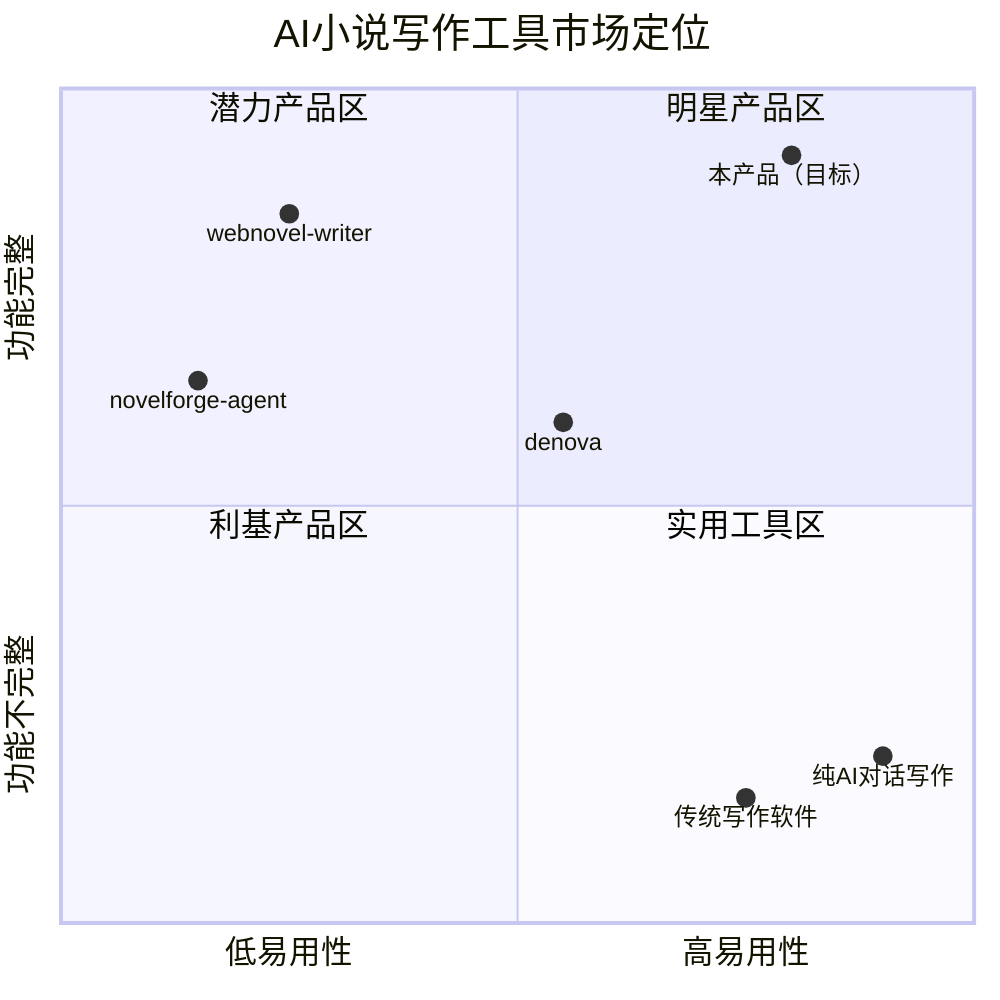
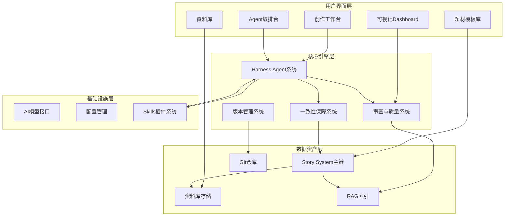
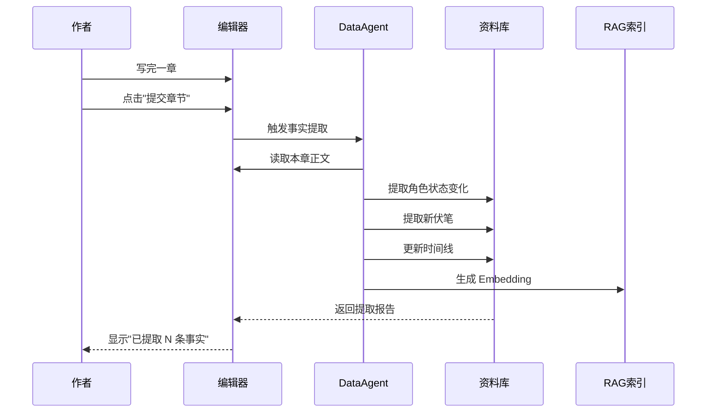
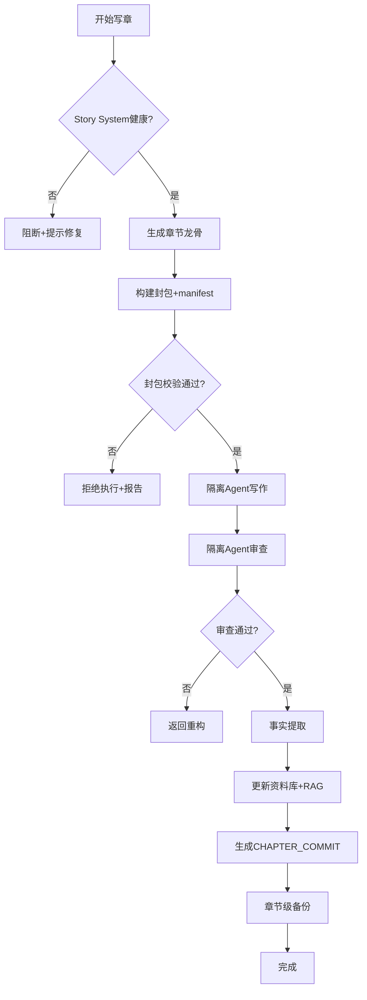
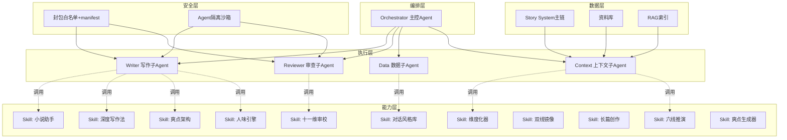
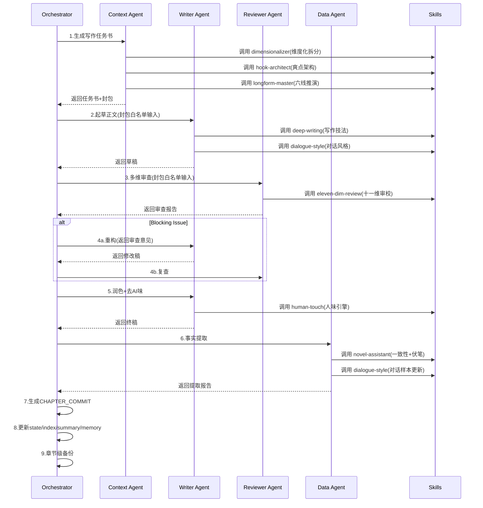
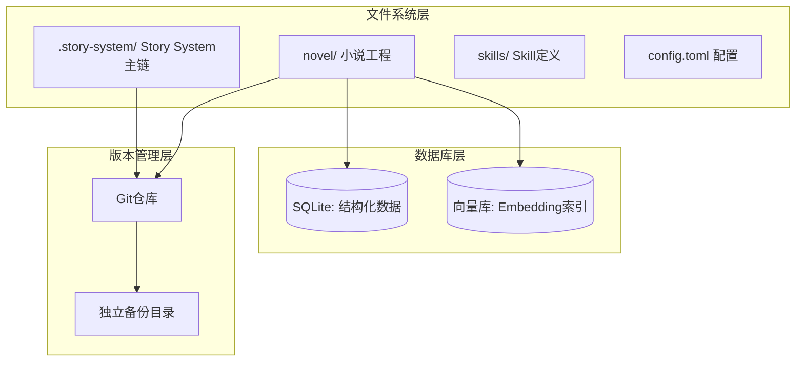
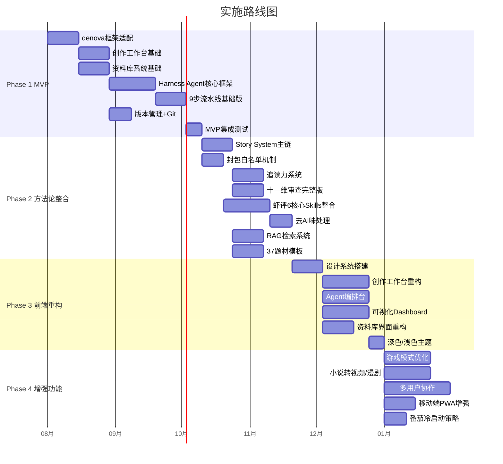

# 小说写作工具 — 完整产品需求文档（PRD）

> **文档版本**：v1.0  
> **撰写人**：产品经理 Alice  
> **日期**：2026-07  
> **状态**：待评审

---

## 目录

1. [产品概述](#1-产品概述)
2. [竞品分析](#2-竞品分析)
3. [用户故事](#3-用户故事)
4. [需求池](#4-需求池)
5. [核心功能模块设计](#5-核心功能模块设计)
6. [Harness Agent 系统设计](#6-harness-agent-系统设计)
7. [UI/UX 设计方向](#7-uiux-设计方向)
8. [技术选型建议](#8-技术选型建议)
9. [实施路径](#9-实施路径)
10. [待确认问题](#10-待确认问题)

---

## 1. 产品概述

### 1.1 产品定位

**一句话定位**：一款以 Agent 编排为核心的 AI 长篇小说创作工作站——融合生产级架构、网文方法论与可插拔技能生态，让作者从构思到连载全程在同一个平台完成。

**详细说明**：

本产品以开源项目 **denova** 为基础框架进行二次开发，保留其后端 Go 架构、Git 版本管理、模块化 Skills 系统和双模式设计优势；吸收 **webnovel-writer** 的 Story System 主链方法论、9 步写章流水线、追读力系统和 37 个网文题材模板；借鉴 **novelforge-agent** 的隔离子智能体工作流、章节龙骨机制和封包白名单安全策略；并将 **虾评平台 11 个写作 skills** 整合为一套可插拔的 Harness Agent 系统，实现小说创作的全流程自动化辅助。

与现有三个参考项目相比，本产品的核心差异在于：**不是简单的功能叠加，而是以 Agent 编排层为中枢，将方法论、架构安全和技能生态三者统一为一个可视化的创作操作系统。**

### 1.2 目标用户画像

| 用户类型 | 画像描述 | 核心痛点 | 使用场景 |
|---------|---------|---------|---------|
| **主要用户：网文连载作者** | 20-35岁，有 1-3 部连载作品，日更 4000-8000 字，熟悉番茄/起点等平台规则 | 长篇连载中角色崩坏、伏笔遗忘、节奏失控；AI 辅助写作但产出质量不稳定、AI 味重 | 日常日更、大纲规划、质量自检、多作品管理 |
| **主要用户：转型中的传统写作者** | 30-45岁，有文学功底但缺乏网文方法论，想用 AI 辅助但不会编程 | 不懂 CLI 工具，需要可视化界面；想学网文技巧但缺乏系统指导 | 学习网文技法、AI 辅助创作、作品质量提升 |
| **次要用户：AI 写作研究者/工具开发者** | 技术背景，研究 AI 辅助创作的最佳实践 | 现有工具要么太简单（无方法论）要么太底层（纯 CLI 无界面），缺乏可研究的完整系统 | 研究写作 Agent 架构、评估 Skills 效果、二次开发 |
| **次要用户：内容工作室/MCN** | 管理多名写手，批量产出内容 | 缺乏统一的创作管理和质量标准工具 | 多作品并行管理、批量审校、风格统一 |

### 1.3 核心价值主张

与三个参考项目的差异化对比：

| 维度 | denova | webnovel-writer | novelforge-agent | **本产品** |
|------|--------|----------------|-----------------|-----------|
| 架构成熟度 | ★★★★☆ 生产级 | ★★☆☆☆ 插件级 | ★★★☆☆ CLI级 | **★★★★★ 生产级+** |
| 写作方法论 | ★★☆☆☆ 基础流程 | ★★★★★ 完整体系 | ★★★☆☆ 防矛盾机制 | **★★★★★ 完整体系+增强** |
| Agent 智能化 | ★★★☆☆ 基础 Agent | ★★★★☆ 多 Agent 协作 | ★★★★☆ 隔离子智能体 | **★★★★★ 编排式 Harness** |
| 可视化界面 | ★★★☆☆ 基础前端 | ★★☆☆☆ 只读面板 | ★☆☆☆☆ 无 | **★★★★★ 全功能工作台** |
| 技能可扩展性 | ★★★☆☆ Skills 目录 | ★★★☆☆ 固定命令 | ★★☆☆☆ 模板化 | **★★★★★ 可插拔 Harness** |
| 上手门槛 | ★★★☆☆ 中等 | ★★☆☆☆ 需懂 Claude Code | ★☆☆☆☆ 需懂 Python | **★★★★☆ 可视化引导** |

**三大不可替代性**：

1. **唯一的「Agent 编排 + 方法论 + 架构安全」三位一体平台**——denova 有架构无方法论，webnovel-writer 有方法论无架构，novelforge-agent 有安全机制无界面，本产品将三者融合为一个统一系统。
2. **可插拔的 Harness Agent 技能生态**——虾评 11 个 skills 不是简单嵌入，而是被抽象为标准化的 Agent 能力插槽，用户可按需启用、组合、自定义，形成个人化的创作 Agent 团队。
3. **可视化全流程创作操作系统**——从构思、设定、大纲、章节、审校到发布，全程在一个界面内完成，无需在 CLI、编辑器、面板之间切换。

### 1.4 产品愿景

**成为 AI 时代网文创作的「操作系统」**——让每一位作者都拥有一支由专业 Agent 组成的虚拟编辑部，从灵感孵化到连载交付，全程智能辅助、质量可控、风格可塑。

---

## 2. 竞品分析

### 2.1 三项目对比矩阵

| 对比维度 | denova | webnovel-writer | novelforge-agent |
|---------|--------|----------------|-----------------|
| **定位** | AI 创作平台（小说+RPG双模式） | Claude Code 长篇网文辅助系统 | 长篇小说智能体框架 |
| **技术栈** | Go 53% + TypeScript 45.8%，Vite，pnpm，TOML，Git | Claude Code 插件，Python 重 | 纯 Python CLI |
| **架构特点** | 双模式并行、上下文管理、数据真源分层、模块化 | Story System 主链、多 Agent 协作、RAG 检索 | 三层资料模型、隔离子智能体、封包白名单 |
| **方法论** | 基础写作流程（构思→设定→大纲→细纲→正文→进度） | 9步写章流水线、追读力系统、37题材模板 | 章节龙骨、证据等级、架构批准机制 |
| **Agent 系统** | 创作 Agent + 游戏导演 Agent + Skills/SubAgents | Context/Reviewer/Data/Deconstruction Agent | 隔离写作子Agent + 隔离审查子Agent + 主控Agent |
| **前端** | SPA（Vite+TS），PWA，中英文i18n | 无独立前端，Dashboard为预打包只读面板 | 无前端 |
| **版本管理** | Git + Undo/Redo + 自动保存 | 章节级备份 + 断点续跑 | manifest.json + SHA-256 哈希 |
| **一致性保障** | 数据真源分层 | Story System 主链 + RAG | 章节龙骨 + 封包白名单 |
| **开源协议** | Apache-2.0 | — | Apache-2.0 |
| **社区规模** | 503 stars，87 forks，单一开发者 | 较小 | 较小 |
| **核心优势** | 生产级架构、双模式、上下文管理、产品化成熟 | 方法论完整、长篇一致性好、题材丰富 | Agent隔离好、防矛盾强、安全规范 |
| **核心不足** | Beta不稳定、依赖复杂、无数据库、文档差 | 强依赖Claude Code、Python重、无前端 | 无前端、纯CLI、上手门槛高 |

### 2.2 差异化机会点

基于三项目的优势与不足，本产品识别出以下 **6 个差异化机会点**：

| # | 机会点 | 来源洞察 | 本产品策略 |
|---|-------|---------|-----------|
| 1 | **方法论可视化** | webnovel-writer 方法论极强但无独立前端，novelforge-agent 防矛盾好但纯 CLI | 将 9 步流水线、章节龙骨、追读力系统全部可视化为 Agent 编排台 |
| 2 | **Harness 技能生态** | denova 有 Skills 目录但能力有限，虾评 skills 丰富但散落各处 | 建立标准 Agent 能力插槽，11+ 个 skills 可插拔组合 |
| 3 | **架构安全 + 方法论融合** | novelforge-agent 的隔离机制和 webnovel-writer 的 Story System 从未在同一系统中 | 封包白名单 + Story System 主链融合为统一的一致性保障层 |
| 4 | **全流程一体化** | 三个项目各自只覆盖部分流程，用户需多工具切换 | 构思→设定→大纲→章节→审校→发布，一个平台完成 |
| 5 | **AI 味抑制** | 虾评「人味写作引擎」和「深度小说写作法」提供了去 AI 味能力，但无平台整合 | 将去 AI 味作为 Agent 流水线的标准环节 |
| 6 | **质量量化** | webnovel-writer 追读力系统和虾评十一维审校提供了质量量化，但缺乏可视化 | Dashboard 实时展示追读力曲线、质量雷达图、实体关系图谱 |

### 2.3 市场定位象限图



**定位解读**：本产品目标是占据象限图的右上角（明星产品区），即在功能完整度接近 webnovel-writer 的同时，将易用性提升到接近传统写作软件的水平。这是三个参考项目都未达到的空白区域。

---

## 3. 用户故事

### 3.1 核心用户故事

| # | 角色 | 故事 | 优先级 |
|---|------|------|--------|
| US-01 | 网文连载作者 | 作为一个日更作者，我想要 AI 根据大纲和前文自动生成章节草稿，这样我能将 8000 字的日更时间从 6 小时缩短到 2 小时 | P0 |
| US-02 | 网文连载作者 | 作为一个连载 100 万字的作者，我想要系统自动追踪所有角色的状态、关系和伏笔，这样我不会出现角色崩坏或伏笔遗忘 | P0 |
| US-03 | 网文连载作者 | 作为一个追求质量的作者，我想要 AI 在生成后自动做十一维质量审查和追读力分析，这样我能在发布前发现问题而不是被读者指出 | P0 |
| US-04 | 转型写作者 | 作为一个不擅长网文技巧的传统写作者，我想要选择题材模板后系统自动生成大纲框架和爽点结构，这样我能快速学习网文创作方法论 | P1 |
| US-05 | 转型写作者 | 作为一个不懂编程的作者，我想要在一个可视化界面里完成所有创作操作，这样我不需要学习命令行工具 | P0 |
| US-06 | 网文连载作者 | 作为一个追求读者粘性的作者，我想要看到追读力曲线和爽点分布图，这样我能客观评估章节的吸引力并调整节奏 | P1 |
| US-07 | AI写作研究者 | 作为一个研究 AI 写作的研究者，我想要查看 Agent 的执行日志和每个 skill 的调用记录，这样我能分析哪些 Agent 配置产出质量最高 | P1 |
| US-08 | 网文连载作者 | 作为一个多作品并行创作的作者，我想要在一个平台管理多部小说且各作品设定互不干扰，这样我能同时连载不同题材的作品 | P1 |
| US-09 | 内容工作室 | 作为一个工作室管理者，我想要统一设定写作风格和质量标准，这样多个写手的产出风格一致 | P2 |
| US-10 | 网文连载作者 | 作为一个对 AI 味敏感的作者，我想要系统自动执行去 AI 味处理（语感注入、矛盾节奏、感官偏心），这样读者无法分辨是 AI 辅助还是纯人工写作 | P1 |
| US-11 | 网文连载作者 | 作为一个写到中途卡文的作者，我想要 AI 分析当前进度和伏笔状态后给出多种续写方案，这样我能突破创作瓶颈 | P1 |
| US-12 | 转型写作者 | 作为一个新手作者，我想要系统在我写完一章后自动提取事实并存入资料库，这样我不需要手动维护设定集 | P0 |

### 3.2 用户故事地图


---

## 4. 需求池

### 4.1 P0 — MVP 必须（基于 denova 框架 + 核心写作流程 + Harness Agent 基础）

| ID | 需求 | 验收标准 | 来源 |
|----|------|---------|------|
| P0-01 | denova 框架搭建与基础适配 | Go 后端 + TS 前端可正常启动，支持本地项目创建、打开、保存 | denova |
| P0-02 | 创作工作台（编辑器） | 支持 Markdown 编辑、章节树导航、实时字数统计、自动保存（间隔 30s） | denova |
| P0-03 | 资料库系统基础 | 支持角色、世界观、地点、势力、规则、物品的增删改查，与章节关联 | denova |
| P0-04 | 大纲与章节细纲管理 | 支持总纲→卷纲→章纲三级结构，可拖拽排序，大纲与正文双向链接 | denova + webnovel-writer |
| P0-05 | Harness Agent 核心框架 | 主控 Agent 可调度写作子 Agent 和审查子 Agent，支持配置化编排 | novelforge-agent |
| P0-06 | Agent 隔离机制 | 写作子 Agent 和审查子 Agent 在独立上下文中运行，互不污染 | novelforge-agent |
| P0-07 | 章节龙骨机制 | 每章自动生成龙骨文件（章节功能、开章状态、本章目标、核心推进、结尾变化、后续约束、待回收问题） | novelforge-agent |
| P0-08 | Story System 主链 | `.story-system/` 作为唯一事实源，写作前生成"合同"，写完后生成"提交" | webnovel-writer |
| P0-09 | 9步写章流水线（基础版） | 预检→刷新契约→生成任务书→起草正文→多维审查→润色→事实提取→提交→备份 | webnovel-writer |
| P0-10 | 版本管理（Git + Undo/Redo） | 每次保存自动 Git commit，支持跨重启 Undo/Redo，支持章节级 Diff 查看 | denova |
| P0-11 | 基础质量审查 | 爽点检查、一致性检查、节奏检查、OOC检查、连贯性检查（5维基础版） | webnovel-writer |
| P0-12 | OpenAI 兼容接口集成 | 支持配置任意 OpenAI 兼容 API（含本地模型），支持模型切换 | denova |
| P0-13 | 进度追踪面板 | 显示总字数、日更字数、完成度、章节状态（草稿/审查中/已发布） | denova |
| P0-14 | 多作品管理 | 支持创建多个独立项目，各项目设定、大纲、正文完全隔离 | denova |

### 4.2 P1 — 重要（方法论整合 + 前端 UI 重构 + 虾评 skills 整合）

| ID | 需求 | 验收标准 | 来源 |
|----|------|---------|------|
| P1-01 | 前端 UI 全面重构 | 全新视觉设计，三栏布局（导航/编辑/面板），响应式，深色/浅色主题 | 新增 |
| P1-02 | Agent 编排台（可视化） | 可视化展示 Agent 执行流程，支持实时查看每步状态、日志、中间产物 | 新增 |
| P1-03 | 追读力系统 | Hook/Cool-point/微兑现/债务追踪，追读力曲线可视化 | webnovel-writer |
| P1-04 | 十一维质量审查（完整版） | 爽点/一致性/节奏/OOC/连贯/追读力/伏笔/逻辑/文风/人设/结构 十一维检查 | 虾评-小说审校员 |
| P1-05 | 37 网文题材模板 | 37 个题材模板可一键应用，含大纲框架、爽点结构、角色卡模板 | webnovel-writer |
| P1-06 | 虾评 Skills 整合（核心6个） | 小说助手、深度小说写作法、小说爽点架构生成器、小说审校员、人味写作引擎、小说框架维度化器 整合为可调用 Agent 能力 | 虾评 |
| P1-07 | 去 AI 味处理 | 语感注入、矛盾节奏、感官偏心、留白机制、偏移系统 五维去 AI 味 | 虾评-人味写作引擎 |
| P1-08 | RAG 检索系统 | Embedding + Rerank 检索，无 Key 时回退 BM25，支持跨章节语义搜索 | webnovel-writer |
| P1-09 | 封包白名单机制 | 每次调用 Agent 前生成 manifest.json（路径/用途/行号/SHA-256），拒绝伪造封包 | novelforge-agent |
| P1-10 | 可视化 Dashboard | 实体关系图谱、追读力数据、章节内容浏览、项目健康度 | webnovel-writer |
| P1-11 | 断点续跑 | Agent 流水线失败后从断点继续，不重写已完成步骤 | webnovel-writer |
| P1-12 | 角色对话风格样本库 | 每个角色可存储对话风格样本，AI 生成对话时参考保持一致性 | 虾评-小说助手 |
| P1-13 | 伏笔时间线管理 | 可视化伏笔埋设与回收时间线，未回收伏笔预警 | 虾评-小说助手 + 新增 |
| P1-14 | 六线推演法 | 大纲阶段支持六线（主线/感情线/成长线/势力线/伏笔线/爽点线）并行推演 | 虾评-多米的长篇创作 |
| P1-15 | 章节施工单生成 | 基于大纲和维度化拆分，自动生成每章的施工单（写作维度+目标+约束） | 虾评-小说框架维度化器 |

### 4.3 P2 — 增强（游戏模式优化、协作、移动端等）

| ID | 需求 | 验收标准 | 来源 |
|----|------|---------|------|
| P2-01 | 游戏模式（RPG）保留与优化 | 保留 denova 的互动 RPG 模式，优化为可选模块 | denova |
| P2-02 | 小说转视频脚本 | 小说/剧本转完整视频剧本（四幕结构+素材提示词+时间轴分镜） | 虾评-故事转视频脚本 |
| P2-03 | 小说转漫剧 | 小说改漫剧工业化产线（11道签字闸+8项冻结表） | 虾评-多米的漫剧工坊 |
| P2-04 | 多用户协作 | 多人同时编辑，角色权限管理，实时同步 | 新增 |
| P2-05 | 移动端/PWA | PWA 支持，移动端阅读与轻量编辑 | denova |
| P2-06 | 番茄小说冷启动策略 | 平台运营策略指导，冷启动期发文节奏建议 | 虾评-番茄策略 |
| P2-07 | 双线镜像叙事 | 支持双线镜像叙事结构（A/B 双线交付） | 虾评-多米的长篇创作 |
| P2-08 | A/B 双线交付 | 同一章节生成 A/B 两个版本供选择 | 虾评-多米的长篇创作 |
| P2-09 | docx 终稿导出 | 支持导出为 Word 文档，含格式化排版 | 虾评-多米的长篇创作 |
| P2-10 | 项目体检（Doctor） | 自动检查目录结构、文件完整性、数据库一致性、依赖状态 | webnovel-writer |
| P2-11 | 长期记忆学习 | 把好用的写法记下来存入长期记忆，后续创作复用 | webnovel-writer |
| P2-12 | 局域网共享/远程访问 | 支持局域网内多设备访问同一项目 | denova |

---

## 5. 核心功能模块设计

### 5.1 模块总览



### 5.2 创作工作台

**功能描述**：作者日常创作的核心界面，集成编辑器、大纲导航、章节管理、进度追踪于一体。

| 子功能 | 输入 | 输出 | 关键流程 |
|-------|------|------|---------|
| 章节编辑器 | 用户键盘输入 / Agent 生成内容 | Markdown 格式正文 | 编辑→实时预览→自动保存(30s)→Git提交 |
| 大纲导航树 | 总纲/卷纲/章纲数据 | 可折叠树形结构 | 点击章节→跳转正文→大纲与正文双向链接 |
| Agent 写作面板 | 当前章节上下文 + 龙骨 + 施工单 | AI 生成的章节草稿 | 选择写作模式→Agent 编排→流水线执行→结果注入编辑器 |
| 进度追踪 | 章节状态 + 字数统计 | 进度条 + 日更统计 + 完成度 | 实时统计→可视化展示→里程碑提醒 |
| Diff 查看 | Git 提交历史 | 差异对比视图 | 选择版本→逐行 Diff→支持回滚 |

**布局设计**：

```
┌─────────────────────────────────────────────────────────┐
│  顶部栏：项目切换 | 模型选择 | 保存状态 | Undo/Redo       │
├──────────┬──────────────────────────┬───────────────────┤
│ 左栏     │  中栏（编辑器）           │  右栏（上下文面板） │
│          │                          │                   │
│ 章节树   │  # 第十二章 龙族密语      │  当前章节龙骨     │
│ ├第一卷  │                          │  ├ 章节功能       │
│ │├第1章  │  正文内容...              │  ├ 开章状态       │
│ │├第2章  │                          │  ├ 本章目标       │
│ │└第3章  │  (Markdown 实时预览)      │  ├ 核心推进       │
│ ├第二卷  │                          │  └ 待回收问题     │
│ │├第4章  │                          │                   │
│ │└第5章●│                          │  相关角色状态     │
│          │                          │  ├ 林逸 Lv.23     │
│ 进度面板 │                          │  └ 苏婉 好感+15   │
│ 总字数   │                          │                   │
│ 12.5万   │                          │  [Agent写作] 按钮  │
└──────────┴──────────────────────────┴───────────────────┘
```

### 5.3 资料库系统

**功能描述**：管理小说创作的所有设定资产，是 Story System 主链的数据基础，支持 Agent 自动读写和人工维护。

| 资产类型 | 字段 | Agent 操作 | 人工操作 |
|---------|------|-----------|---------|
| 角色 | 姓名/外貌/性格/背景/能力/关系/对话风格样本/状态变化 | 自动提取事实更新状态 | 创建/编辑/删除 |
| 世界观 | 世界规则/力量体系/历史背景/文化设定 | 读取作为写作上下文 | 创建/编辑 |
| 地点 | 名称/描述/关联角色/地理关系 | 读取作为写作上下文 | 创建/编辑 |
| 势力 | 名称/目标/成员/实力/关系 | 读取作为写作上下文 | 创建/编辑 |
| 规则 | 力量规则/社会规则/特殊规则 | 一致性检查时参考 | 创建/编辑 |
| 物品 | 名称/属性/来源/持有者 | 自动追踪持有者变化 | 创建/编辑 |
| 伏笔 | 埋设章节/回收章节/状态(未回收/已回收)/关联角色 | 自动检测埋设与回收 | 创建/编辑/标记 |
| 时间线 | 事件/时间点/关联角色/关联章节 | 自动提取事件 | 创建/编辑 |

**数据流向**：



### 5.4 Harness Agent 系统

> ⚠️ 此模块为核心创新模块，详见 [第6章](#6-harness-agent-系统设计) 专项设计。

### 5.5 一致性保障系统

**功能描述**：融合 webnovel-writer 的 Story System 主链和 novelforge-agent 的章节龙骨 + 封包白名单，构建多层一致性防护网。

| 保障层 | 机制 | 作用 | 来源 |
|-------|------|------|------|
| L1 数据真源 | Story System 主链（`.story-system/`） | 唯一事实源，写作前"合同"、写完后"提交" | webnovel-writer |
| L2 章节骨架 | 章节龙骨文件 | 每章只记防矛盾骨架信息，跨章一致性基线 | novelforge-agent |
| L3 封包安全 | manifest.json + SHA-256 | 验证 Agent 输入的封包完整性，拒绝伪造/陈旧 | novelforge-agent |
| L4 事实追踪 | Data Agent 自动提取 | 每章写完自动提取事实更新资料库 | webnovel-writer |
| L5 检索验证 | RAG 语义检索 | 写作时检索相关历史章节，防止矛盾 | webnovel-writer |
| L6 证据分级 | 已确立事实 vs AI 推断 | 区分确定信息和推测，避免以推测为据 | novelforge-agent |

**一致性检查流程**：



### 5.6 审查与质量系统

**功能描述**：多维度自动化质量审查，融合 webnovel-writer 的 5 维基础审查和虾评的十一维深度审校。

**审查维度矩阵**：

| 维度 | 检查内容 | 阈值/标准 | 来源 |
|------|---------|----------|------|
| 爽点密度 | 每章爽点数量与分布 | ≥1个/2000字 | webnovel-writer + 虾评 |
| 一致性 | 角色行为/世界观/设定一致性 | 0 硬伤 | webnovel-writer |
| 节奏 | 情节推进速度/信息密度 | 符合题材基准 | webnovel-writer |
| OOC | 角色行为是否符合人设 | 0 OOC | webnovel-writer |
| 连贯性 | 上下文衔接/逻辑通顺 | 0 断裂 | webnovel-writer |
| 追读力 | Hook/Cool-point/微兑现/债务 | 追读力分≥70 | webnovel-writer |
| 伏笔 | 埋设/回收/冲突检查 | 无矛盾伏笔 | 虾评 |
| 逻辑 | 剧情逻辑/因果链 | 0 逻辑漏洞 | 虾评 |
| 文风 | 文风一致性/AI味检测 | AI味分≤30 | 虾评 |
| 人设 | 人设偏移/成长合理性 | 偏移在阈值内 | 虾评 |
| 结构 | 章节结构/开头结尾/转场 | 符合结构模板 | 虾评 |

**Blocking 机制**：审查分为 Blocking（阻断发布）和 Warning（警告但不阻断）两级。

| 级别 | 适用维度 | 行为 |
|------|---------|------|
| Blocking | 一致性、OOC、逻辑、伏笔矛盾 | 审查不通过则阻断，必须修复或重构 |
| Warning | 爽点密度、节奏、追读力、文风 | 标记问题但不阻断，作者可选择忽略 |

### 5.7 版本管理系统

**功能描述**：基于 denova 的 Git 版本管理，增强为多层级版本控制。

| 版本层级 | 触发时机 | 存储方式 | 回滚粒度 |
|---------|---------|---------|---------|
| 实时保存 | 编辑中每 30s | 本地临时文件 | 字符级 Undo/Redo |
| 章节提交 | Agent 写章完成 | Git commit | 章节级回滚 |
| 里程碑版本 | 手动/卷完结 | Git tag | 版本对比 |
| Agent 快照 | Agent 每步执行前 | Git stash | 步骤级回退 |
| 章节备份 | 每章提交后 | 独立备份目录 | 独立恢复 |

### 5.8 可视化面板（Dashboard）

**功能描述**：只读可视化面板，展示项目全貌，辅助作者决策。

| 面板模块 | 展示内容 | 数据来源 | 更新频率 |
|---------|---------|---------|---------|
| 项目概览 | 总字数/章节数/完成度/日更趋势 | Git + 编辑器统计 | 实时 |
| 实体关系图谱 | 角色/势力/地点关系网络 | 资料库 | 章节提交后 |
| 追读力曲线 | 每章追读力分数趋势 | 审查系统 | 章节审查后 |
| 爽点分布图 | 爽点类型与位置热力图 | 审查系统 | 章节审查后 |
| 伏笔时间线 | 伏笔埋设-回收甘特图 | 资料库-伏笔 | 实时 |
| 角色状态卡 | 角色当前状态/位置/关系 | 资料库 | 章节提交后 |
| 质量雷达图 | 十一维质量得分 | 审查系统 | 章节审查后 |
| 项目健康度 | 目录/文件/数据库/依赖状态 | Doctor 检查 | 手动/定时 |

### 5.9 题材模板系统

**功能描述**：基于 webnovel-writer 的 37 个网文题材模板，提供一键初始化项目框架的能力。

**模板分类**：

| 大类 | 题材数 | 包含题材 | 模板内容 |
|------|-------|---------|---------|
| 玄幻修仙类 | 7 | 修仙/系统流/高武/西幻/无限流/末世/科幻 | 大纲框架+爽点结构+力量体系模板+角色卡模板 |
| 都市现代类 | 6 | 都市异能/都市日常/都市脑洞/现实题材/电竞/直播文 | 大纲框架+爽点结构+社会关系模板+角色卡模板 |
| 言情类 | 7 | 古言/宫斗宅斗/青春甜宠/豪门总裁/狗血言情/替身文/种田 | 大纲框架+甜宠节奏模板+感情线模板+角色卡模板 |
| 特殊题材 | 7 | 规则怪谈/悬疑脑洞/悬疑灵异/历史古代/抗战谍战/知乎短篇/克苏鲁 | 大纲框架+悬疑结构+氛围模板+角色卡模板 |
| 自定义 | ∞ | 用户自建 | 可保存为自定义模板复用 |

**模板应用流程**：选择题材 → 填写基础信息（书名/主角/核心设定）→ AI 生成初始框架 → 作者确认/修改 → 生成 Story System 初始"合同" → 进入创作工作台。

---

## 6. Harness Agent 系统设计

> 本章为产品核心创新模块，是本产品与三个参考项目的根本差异所在。

### 6.1 设计理念

**Harness（驾驭）** 的含义：不是让单个 AI 模型包揽一切，而是构建一个**编排框架**，将不同专业能力的 Agent 和 Skill 像马具一样"套"在 AI 模型上，让模型在受控的、结构化的、可审计的流程中发挥能力。

**三条设计原则**：

1. **隔离性**（借鉴 novelforge-agent）：每个子 Agent 在独立上下文中运行，不继承主对话历史，只接收经封包白名单验证的输入。
2. **可插拔性**（借鉴 denova Skills + 虾评 skills）：Skills 以标准接口注册为 Agent 能力，可按需启用/禁用/组合/自定义。
3. **可编排性**（借鉴 webnovel-writer 流水线）：写章流程以 DAG（有向无环图）编排，每步可配置、可中断、可断点续跑。

### 6.2 Agent 架构总览



**各 Agent 职责定义**：

| Agent | 职责 | 输入 | 输出 | 隔离方式 |
|-------|------|------|------|---------|
| **Orchestrator（主控）** | 编排全流程、取舍整合、异常处理 | 用户指令 + 项目状态 | 执行报告 + 最终章节 | 主对话上下文 |
| **Writer（写作子Agent）** | 草拟正文、润色、去AI味 | 封包白名单输入（任务书+龙骨+资料+前章结尾） | 章节草稿/润色稿 | 独立进程，不继承主对话 |
| **Reviewer（审查子Agent）** | 十一维质量审查、Blocking判定 | 封包白名单输入（正文+近章+设定+审查协议） | 审查报告+Blocking/Warning标记 | 独立进程，不继承主对话 |
| **Data（数据子Agent）** | 事实提取、资料库更新、RAG索引 | 章节正文+现有资料库 | 提取报告+更新后的资料库 | 独立进程，只写数据层 |
| **Context（上下文子Agent）** | 生成写作任务书、构建封包、管理可见上下文 | 项目状态+章节信息+资料库+RAG | 写作任务书+封包+manifest | 主控上下文子调用 |

### 6.3 Agent 隔离机制

**借鉴 novelforge-agent 的隔离设计，增强为三层隔离**：

| 隔离层 | 机制 | 目的 |
|-------|------|------|
| **上下文隔离** | 写作/审查子 Agent 不继承主对话历史，固定读取已批准的项目简报、全书龙骨、总体大纲、文风正本，只接收本章相关资料与前章结尾 | 防止上下文污染导致幻觉 |
| **进程隔离** | 写作子 Agent 和审查子 Agent 在独立进程中运行（shell=False），互不可见 | 防止 Agent 间串扰 |
| **封包隔离** | 每次调用前生成 manifest.json（路径/用途/行号范围/SHA-256），Agent 只能读取白名单内文件 | 防止伪造或陈旧输入 |

**封包白名单 manifest.json 示例结构**：

```json
{
  "chapter_id": "ch012",
  "novel_slug": "dragon-language",
  "generated_at": "2026-07-15T10:30:00Z",
  "approved_snapshot_hash": "sha256:a1b2c3...",
  "files": [
    {
      "path": "novel/01_outline/total_outline.md",
      "purpose": "全书大纲",
      "line_range": "1-200",
      "sha256": "sha256:d4e5f6..."
    },
    {
      "path": "novel/03_plot/chapters/ch011-ending.md",
      "purpose": "前章结尾",
      "line_range": "180-220",
      "sha256": "sha256:g7h8i9..."
    },
    {
      "path": "novel/03_plot/chapters/ch012-spine.md",
      "purpose": "本章龙骨",
      "line_range": "1-50",
      "sha256": "sha256:j1k2l3..."
    }
  ]
}
```

### 6.4 Skills 整合方案

**核心设计**：将虾评 11 个 skills 抽象为标准化的 Agent 能力插槽，通过统一的 Skill 接口注册到 Harness 系统。

**Skill 接口规范**：

```
Skill 接口定义：
├── metadata（元数据）
│   ├── id: 唯一标识
│   ├── name: 显示名称
│   ├── category: 分类（写作/审查/规划/数据/风格）
│   ├── description: 功能描述
│   └── version: 版本号
├── input_schema（输入模式）
│   ├── required: 必需参数
│   └── optional: 可选参数
├── output_schema（输出模式）
│   ├── type: 输出类型（文本/结构化数据/标记）
│   └── format: 输出格式
├── applicable_agents（适用Agent）
│   └── [Writer, Reviewer, Context, Data]
├── prompt_template（提示词模板）
│   └── 含变量占位符的标准化提示词
└── config（配置项）
    ├── enabled: 是否启用
    ├── priority: 优先级
    └── params: 可调参数
```

**11 个 Skills 的整合映射**：

| 虾评 Skill | 整合为 | 适用 Agent | 触发时机 | 能力描述 |
|-----------|--------|-----------|---------|---------|
| 小说助手 | `skill:novel-assistant` | Data / Context | 章节提交后 / 写作前 | 一致性检查、人物设定管理、伏笔时间线追踪、记忆压缩 |
| 深度小说写作法 | `skill:deep-writing` | Writer | 写作草稿生成时 | 双线镜像叙事、人物小传、草蛇灰线伏笔、诗化语言、灰色人设 |
| 小说爽点架构生成器 | `skill:hook-architect` | Context / Writer | 大纲规划时 / 章节施工单生成时 | 六大爽点类型架构生成 |
| 小说审校员 | `skill:eleven-dim-review` | Reviewer | 审查环节 | 十一维质量检查+多章批量审校+跨章引用验证 |
| 人味写作引擎 | `skill:human-touch` | Writer | 润色环节 | 五维去AI味+违禁词表+感官细节库+节奏模板 |
| 小说框架维度化器 | `skill:dimensionalizer` | Context | 章节施工单生成时 | 维度化拆分+施工单生成+跨维度一致性检查 |
| 多米的长篇创作 | `skill:longform-master` | Context / Writer | 全流程 | 七阶段全流程+六线推演+写作铁律+人物命运卡 |
| 角色对话风格样本库 | `skill:dialogue-style` | Writer / Data | 对话生成时 / 事实提取时 | 角色对话风格样本管理与应用 |
| Seedance剧情转提示词 | `skill:video-prompt` | （P2 扩展） | 用户主动触发 | 小说转视频提示词 |
| 故事转视频脚本 | `skill:video-script` | （P2 扩展） | 用户主动触发 | 小说转完整视频剧本 |
| 番茄冷启动策略 | `skill:platform-strategy` | （P2 扩展） | 用户主动查询 | 平台运营策略指导 |

**Skill 组合示例（写章流水线中的调用链）**：



### 6.5 Agent 编排流程（9步写章流水线落地）

**基于 webnovel-writer 的 9 步流水线，融合 novelforge-agent 的隔离机制和虾评 skills**：

| 步骤 | 动作 | 执行 Agent | 调用 Skill | 隔离 | 断点续跑 |
|------|------|-----------|-----------|------|---------|
| 1.预检 | 检查项目根、占位符、Story System 健康状态 | Orchestrator | — | 主上下文 | 从此步重跑 |
| 2.刷新契约 | 生成本章 runtime contract | Context | dimensionalizer, hook-architect, longform-master | 子调用 | 从此步重跑 |
| 3.生成任务书 | 构建封包+manifest，生成写作任务书 | Context | — | 子调用 | 从此步重跑 |
| 4.起草正文 | 隔离写作子 Agent 生成草稿 | Writer（隔离） | deep-writing, dialogue-style | **独立进程** | 从此步重跑 |
| 5.多维审查 | 隔离审查子 Agent 做十一维审查 | Reviewer（隔离） | eleven-dim-review | **独立进程** | Blocking则回步骤4 |
| 6.润色终检 | 润色排版+去AI味+终检 | Writer（隔离） | human-touch | **独立进程** | 从此步重跑 |
| 7.事实提取 | 提取事实，更新资料库+RAG | Data（隔离） | novel-assistant, dialogue-style | **独立进程** | 从此步重跑 |
| 8.章节提交 | 生成 CHAPTER_COMMIT，驱动状态投影 | Orchestrator | — | 主上下文 | 从此步重跑 |
| 9.章节备份 | 章节级独立备份 | Orchestrator | — | 主上下文 | 从此步重跑 |

**断点续跑机制**：每步完成后写入 `.story-system/checkpoint.json`，记录已完成步骤。失败后从此文件读取断点，跳过已完成步骤继续执行。

### 6.6 上下文管理策略

**借鉴 denova 的渐进式组织模型，适配到本产品的 Agent 架构**：

| 策略 | 机制 | 目的 |
|------|------|------|
| **渐进式可见上下文** | Context Agent 根据当前步骤动态决定 Agent 可见的上下文范围（全纲→卷纲→章纲→前章结尾→本章龙骨） | 控制 token 成本，防止信息过载 |
| **有界工具结果** | Agent 调用工具（如资料库查询）的结果有 token 上限，超出则截断+提示 | 防止单次工具调用消耗过多 token |
| **带来源的检查点** | 每个上下文片段附带来源标记（已提交章节/当前状态/稳定设定/未来意图） | 区分事实等级，避免以推断为据 |
| **缓存优化** | 相同输入的 Agent 调用结果缓存，避免重复计算 | 降低 API 成本 |
| **封包最小化** | 只打包本章必需的资料，非必需资料通过 RAG 按需检索 | 平衡上下文完整性与 token 成本 |

**上下文优先级模型**：

```
优先级从高到低：
1. 本章龙骨（必须完整包含）
2. 前章结尾（必须包含，约 500-1000 字）
3. 本章施工单（必须包含）
4. 本章相关角色当前状态（必须包含）
5. 本章相关设定（按需包含）
6. 全书大纲摘要（压缩版，按需包含）
7. 历史章节片段（RAG 检索按需包含）
8. 文风正本（压缩版，按需包含）
```

---

## 7. UI/UX 设计方向

### 7.1 设计原则

| 原则 | 含义 | 落地方式 |
|------|------|---------|
| **聚焦创作** | 界面不干扰写作心流 | 编辑器全屏模式、最小化干扰、快捷键优先 |
| **渐进披露** | 复杂功能按需展开 | 默认简洁，高级功能折叠/侧滑 |
| **所见即所得** | Agent 执行过程可视化 | Agent 编排台实时展示执行状态 |
| **一致性** | 全局视觉与交互统一 | 统一设计系统、组件库 |
| **可逆操作** | 所有操作可撤销 | 全局 Undo/Redo + Git 版本回滚 |
| **响应式** | 适配不同屏幕尺寸 | 三栏可折叠、PWA 移动端适配 |

### 7.2 信息架构

```mermaid
graph TD
    Root[小说写作工作站]
    Root --> P[项目管理]
    Root --> W[创作工作台]
    Root --> L[资料库]
    Root --> A[Agent编排台]
    Root --> D[可视化Dashboard]
    Root --> T[题材模板库]
    Root --> S[设置]

    P --> P1[项目列表]
    P --> P2[新建项目]
    P --> P3[项目配置]

    W --> W1[章节编辑器]
    W --> W2[大纲导航]
    W --> W3[Agent写作面板]
    W --> W4[进度追踪]
    W --> W5[版本Diff]

    L --> L1[角色管理]
    L --> L2[世界观]
    L --> L3[地点/势力/规则/物品]
    L --> L4[伏笔时间线]
    L --> L5[对话风格库]

    A --> A1[流水线编排]
    A --> A2[Skill管理]
    A --> A3[执行日志]
    A --> A4[断点续跑]

    D --> D1[项目概览]
    D --> D2[实体关系图谱]
    D --> D3[追读力曲线]
    D --> D4[质量雷达图]
    D --> D5[项目健康度]

    T --> T1[玄幻修仙]
    T --> T2[都市现代]
    T --> T3[言情]
    T --> T4[特殊题材]
    T --> T5[自定义]

    S --> S1[AI模型配置]
    S --> S2[外观主题]
    S --> S3[Agent配置]
    S --> S4[数据与备份]
```



### 7.3 关键页面线框图描述

#### 页面一：创作工作台（核心页面）

```
┌─────────────────────────────────────────────────────────────┐
│ [Logo] 项目:龙族密语 ▼ | 模型:GPT-4o ▼ | ●已保存 | ↶ ↷ | ⚙  │
├──────────┬───────────────────────────────┬──────────────────┤
│ 章节导航  │  编辑区                        │ 上下文面板        │
│          │                               │                  │
│ 📁第一卷  │  # 第十二章 龙族密语            │ 📋 章节龙骨       │
│  ├第1章  │                               │  功能:推进主线    │
│  ├第2章  │  夜色如墨，林逸站在龙脊山       │  目标:揭示龙语    │
│  └...   │  巅...(正文内容)               │  推进:获得龙鳞    │
│ 📁第二卷  │                               │                  │
│  ├第10章 │  ---                           │ 👤 相关角色       │
│  ├第11章 │  > AI续写中... ████░░ 60%      │  林逸 Lv.23       │
│  └第12章●│                               │  苏婉 好感+15     │
│          │                               │                  │
│ ─────── │                               │ 🎯 施工单         │
│ 📊 进度   │  [Agent写作] [手动编辑]        │  ✓ 爽点:打脸      │
│ 总:12.5万│  [润色] [审查] [提交]           │  ✓ 伏笔:龙语     │
│ 今日:6.2k│                               │  ○ 待回收:龙鳞    │
│ 完成:68% │                               │                  │
└──────────┴───────────────────────────────┴──────────────────┘
```

**交互要点**：
- 左栏章节树可拖拽排序，右键菜单支持"在此后插入新章"
- 编辑区支持 Markdown 实时预览，`Ctrl+S` 手动保存
- Agent 写作时编辑区显示进度条，可随时中断
- 右栏上下文面板可折叠/展开，支持固定/浮动模式

#### 页面二：Agent 编排台

```
┌─────────────────────────────────────────────────────────────┐
│ Agent 编排台 — 第十二章                        [开始执行] [停止]│
├─────────────────────────────────────────────────────────────┤
│                                                             │
│  流水线编排（DAG 可视化）                                     │
│                                                             │
│  ┌─────┐    ┌─────┐    ┌─────┐    ┌─────┐    ┌─────┐      │
│  │预检  │───→│刷新  │───→│任务书│───→│起草  │───→│审查  │      │
│  │✓完成 │    │✓完成 │    │✓完成 │    │⏳执行│    │ 待执行│      │
│  └─────┘    └─────┘    └─────┘    └─────┘    └─────┘      │
│                                               │             │
│                          ┌────────────────────┘             │
│                          ↓ Blocking?                        │
│                    ┌─────┐    ┌─────┐    ┌─────┐           │
│                    │润色  │───→│提取  │───→│提交  │           │
│                    │ 待执行│    │ 待执行│    │ 待执行│           │
│                    └─────┘    └─────┘    └─────┘           │
│                                                             │
├─────────────────────────────────────────────────────────────┤
│ 执行日志                                            [展开▼]  │
│ 10:30:01 [预检] Story System 健康 ✓                        │
│ 10:30:02 [刷新] runtime contract 已生成 ✓                   │
│ 10:30:05 [任务书] 封包 5 文件, manifest 已验证 ✓             │
│ 10:30:10 [起草] Writer Agent 启动 (隔离进程 PID:12345)       │
│ 10:30:15 [起草] 调用 Skill: deep-writing                    │
│ 10:30:20 [起草] 调用 Skill: dialogue-style                  │
│ 10:30:25 [起草] 生成草稿 3200 字...                          │
│                                                             │
├─────────────────────────────────────────────────────────────┤
│ Skill 配置                                           [编辑]  │
│ ☑ deep-writing (深度写作法)      ☑ human-touch (人味引擎)   │
│ ☑ dialogue-style (对话风格库)    ☑ eleven-dim-review (审校) │
│ ☑ hook-architect (爽点架构)      ☑ dimensionalizer (维度化) │
│ ☐ longform-master (长篇创作)     ☐ video-prompt (视频提示词)│
└─────────────────────────────────────────────────────────────┘
```

#### 页面三：可视化 Dashboard

```
┌─────────────────────────────────────────────────────────────┐
│ 项目 Dashboard — 龙族密语                                     │
├───────────────┬───────────────┬─────────────────────────────┤
│ 📊 项目概览    │ 📈 追读力曲线   │ 🕸️ 实体关系图谱             │
│               │               │                             │
│ 总字数:12.5万  │    100│  ╱╲   │      林逸 ── 苏婉           │
│ 章节:12/50    │     80│╱  ╲╱╲ │       │      │              │
│ 完成度:68%    │     60│      ╲│      龙王 ── 林逸           │
│ 日均:6.2k字   │     40│       │       │                    │
│               │     20│       │      暗影 ── 苏婉           │
│ 连续日更:7天   │      0└───────│                             │
│               │       1  5  9 12                          │
├───────────────┼───────────────┼─────────────────────────────┤
│ 🎯 质量雷达图   │ 📌 伏笔时间线   │ 📋 章节质量列表             │
│               │               │                             │
│    爽点 90    │ Ch3 ──────╮   │ Ch12: 85分 ⭐ 追读力强       │
│    ╱╲        │ Ch5 ────────╮ │ Ch11: 72分    节奏偏慢       │
│ 逻辑 95─文风85│ Ch8 ─────────│ Ch10: 88分 ⭐ 爽点密集        │
│    ╲╱        │ Ch11 ──── ●  │ Ch9:  65分 ⚠ OOC警告         │
│    追读 78    │       (未回收)│ Ch8:  91分 ⭐⭐              │
├───────────────┴───────────────┴─────────────────────────────┤
│ 🏥 项目健康度: 良好 (Doctor 检查于 10:00)    [重新检查]       │
└─────────────────────────────────────────────────────────────┘
```

### 7.4 视觉风格建议

| 维度 | 建议 | 理由 |
|------|------|------|
| **整体风格** | 现代极简 + 微妙的文学感（适度衬线字体点缀） | 平衡专业工具感与创作氛围 |
| **配色方案** | 深色主题为主：背景 #1a1a2e / 卡片 #16213e / 主色 #0f3460 / 强调色 #e94560 / 文字 #eaeaea；浅色主题：背景 #f5f5f5 / 主色 #2563eb / 强调色 #dc2626 | 深色主题减少长时间写作的眼部疲劳；强调色用于关键操作 |
| **字体** | 正文编辑：思源宋体 / Noto Serif SC（中文）+ Georgia（英文）；UI：思源黑体 / Noto Sans SC + Inter | 衬线字体增强创作沉浸感；无衬线保证 UI 清晰 |
| **组件库** | 推荐 **Shadcn UI + Radix Primitives + Tailwind CSS**（替代 denova 现有前端方案） | 高度可定制、无运行时开销、设计系统完善、社区活跃 |
| **图标** | Lucide Icons（线性图标，与 Shadcn UI 配套） | 风格统一、轻量、可树摇 |
| **动效** | 微动效为主（过渡 200ms ease），Agent 执行时使用进度条+脉冲指示 | 不干扰创作心流，但提供清晰的状态反馈 |
| **间距** | 8px 基准网格，编辑区行高 1.8，段间距 16px | 舒适的阅读与写作体验 |

---

## 8. 技术选型建议

### 8.1 后端技术选型

| 组件 | denova 现有 | 建议方案 | 理由 |
|------|-----------|---------|------|
| **语言** | Go 1.26.5+ | **保留 Go** | Go 的并发模型适合 Agent 编排，编译型语言性能好，denova 已有成熟基础 |
| **配置** | TOML | **保留 TOML + 增加 YAML 支持** | TOML 适合简单配置，YAML 适合复杂 Agent 编排配置 |
| **版本管理** | Git（本地） | **保留 Git + 增加自动分支策略** | Git 是最佳文件版本管理方案，增加自动分支保护 Agent 写作过程 |
| **搜索** | ripgrep | **保留 ripgrep + 增加 SQLite FTS5** | ripgrep 适合文件搜索，SQLite FTS5 适合结构化全文检索 |
| **API 框架** | Go HTTP | **保留 + 增加 WebSocket** | WebSocket 用于 Agent 执行状态实时推送 |
| **新增：数据库** | 无 | **引入 SQLite（嵌入式）** | 存储结构化数据（角色状态、伏笔追踪、审查记录），嵌入式无需额外部署 |

**SQLite 引入说明**（向老板解释）：

> denova 原来不用数据库，所有数据存在文件里。这在项目小的时候没问题，但当小说超过 50 万字、角色超过 50 个、伏笔超过 100 条时，文件检索会变慢。SQLite 是一种"嵌入式数据库"——它不需要单独安装和启动，就是一个文件，但能提供数据库级别的查询速度。引入它就像给文件柜装了个索引系统，不改变文件存放方式，但查找速度快很多。

### 8.2 前端技术选型

| 组件 | denova 现有 | 建议方案 | 理由 |
|------|-----------|---------|------|
| **构建工具** | Vite | **保留 Vite** | 最快的构建工具，HMR 极速 |
| **语言** | TypeScript | **保留 TypeScript** | 类型安全，大型项目必需 |
| **组件库** | （未明确） | **Shadcn UI + Radix + Tailwind CSS** | 替代方案：高度可定制、设计系统完善、不像 MUI 那样"看起来都一样" |
| **状态管理** | （未明确） | **Zustand** | 轻量、API 简洁、TypeScript 友好 |
| **路由** | （未明确） | **React Router v7** | 生态成熟，支持数据加载 |
| **富文本编辑器** | （未明确） | **Tiptap（基于 ProseMirror）** | 支持 Markdown、可扩展、协作编辑能力（P2 多用户时复用） |
| **图表库** | （未明确） | **Recharts + D3.js（复杂图谱）** | Recharts 做常规图表，D3 做实体关系图谱 |
| **PWA** | 已支持 | **保留 + 增强** | 移动端适配 |

### 8.3 AI 集成方案

| 能力 | 方案 | 说明 |
|------|------|------|
| **语言模型接口** | OpenAI 兼容接口（保留 denova 方案） | 支持任意 OpenAI 兼容 API：OpenAI/Claude/本地 Ollama/国产模型（通义/文心/智谱） |
| **模型切换** | 配置化多模型管理 | 不同 Agent 可配置不同模型（如 Writer 用 Claude，Reviewer 用 GPT-4o） |
| **Embedding** | OpenAI text-embedding-3 / 本地 BGE-M3 | 无 API Key 时回退本地模型 |
| **Rerank** | Cohere Rerank / BGE-Reranker | 无 API Key 时跳过 Rerank |
| **RAG 检索** | Embedding + Rerank，回退 BM25 | 语义检索+关键词检索双保险 |
| **图像模型** | gpt-image-1（保留 denova 方案） | 用于角色立绘、场景图生成（P2） |
| **Token 管理** | 渐进式上下文 + 缓存 + 有界工具结果 | 控制 token 成本（借鉴 denova 核心创新） |

### 8.4 数据存储架构



| 存储层 | 存储内容 | 技术 | 说明 |
|-------|---------|------|------|
| 文件系统 | 正文、大纲、龙骨、设定、Skill 定义 | 本地文件 + Markdown | 人类可读、Git 友好 |
| SQLite | 角色状态、伏笔追踪、审查记录、施工单、时间线 | SQLite 嵌入式 | 结构化查询，无需部署 |
| 向量库 | 章节段落 Embedding | SQLite-vec 或 Chroma | RAG 语义检索 |
| Git | 全部文件版本历史 | Git | 版本管理、Undo/Redo |
| 备份 | 章节级独立备份 | 文件复制 | 防止 Git 误操作 |

### 8.5 部署方案

| 部署模式 | 适用场景 | 方案 | 说明 |
|---------|---------|------|------|
| **本地桌面应用** | 个人作者（主要） | Tauri 打包（Go 后端 + Web 前端） | 跨平台（Win/Mac/Linux），本地运行无需服务器 |
| **本地 Web 服务** | 局域网共享 | Go 后端服务 + 前端静态文件 | denova 已有基础，端口 5173 |
| **Docker 部署** | 工作室/团队 | Docker Compose（Go + 前端 + SQLite） | 一键部署，适合 P2 多用户协作 |
| **云部署** | 远程访问（P2） | Docker + 云服务器 | 支持 PWA 远程访问 |

---

## 9. 实施路径

### 9.1 总体路线图



### 9.2 各阶段详情

#### Phase 1：MVP（基于 denova 跑通核心写作流程 + Harness Agent 基础）

**目标**：让作者能用本工具完成"选模板→写大纲→Agent 写章→自动审查→版本管理"的完整闭环。

**里程碑**：

| 里程碑 | 交付物 | 验收标准 |
|-------|-------|---------|
| M1.1 框架就绪 | denova 适配版可启动 | Go 后端 + TS 前端正常启动，可创建/打开/保存项目 |
| M1.2 工作台可用 | 创作工作台基础版 | 编辑器可写正文，章节树可导航，自动保存正常 |
| M1.3 资料库可用 | 资料库基础版 | 角色/世界观/地点等可增删改查 |
| M1.4 Agent 可编 | Harness Agent 核心框架 | 主控 Agent 可调度写作+审查子 Agent，隔离机制生效 |
| M1.5 流水线跑通 | 9步流水线基础版 | 可用 Agent 完成一章的自动写作+5维审查+事实提取 |
| M1.6 版本可控 | Git + Undo/Redo | 自动 commit 正常，Undo/Redo 正常，Diff 可查看 |
| **M1.0 MVP 发布** | **可用的 MVP** | **一个作者可以完成从建项目到写完一章的全流程** |

**MVP 验收标准**（整体）：
1. 创建新项目 → 选择题材模板 → AI 生成初始大纲 → 编辑大纲 → Agent 写第一章 → 自动审查 → 事实提取入库 → 保存版本
2. 整个流程在一个界面内完成，无需命令行操作
3. 写章流水线的 9 步全部可执行（5 维基础审查），失败可断点续跑
4. Git 版本管理正常工作，Undo/Redo 跨重启可用

#### Phase 2：方法论整合（webnovel-writer 方法论 + 虾评 skills）

**目标**：将 webnovel-writer 的完整方法论和虾评核心 skills 整合到 Harness Agent 系统中，使写作质量达到"可连载"水平。

**里程碑**：

| 里程碑 | 交付物 | 验收标准 |
|-------|-------|---------|
| M2.1 Story System | 完整 Story System 主链 | 写作前生成"合同"，写完后生成"提交"，断点续跑正常 |
| M2.2 封包安全 | 封包白名单 + manifest | Agent 输入经 SHA-256 验证，伪造封包被拒绝 |
| M2.3 追读力 | 追读力系统 | Hook/Cool-point/微兑现/债务追踪正常，分数可查看 |
| M2.4 十一维审查 | 完整十一维质量审查 | 11 个维度全部可检查，Blocking/Warning 机制正常 |
| M2.5 Skills 整合 | 6 个核心虾评 Skills | 小说助手/深度写作/爽点架构/十一维审校/人味引擎/维度化器 可调用 |
| M2.6 去 AI 味 | 人味写作引擎 | 五维去 AI 味生效，AI 味检测分数下降 |
| M2.7 RAG | RAG 检索系统 | 语义检索+BM25 回退正常，跨章节搜索可用 |
| M2.8 题材模板 | 37 个题材模板 | 37 个模板可一键应用，含大纲框架+爽点结构 |

**Phase 2 验收标准**（整体）：
1. 用 Agent 连续写 5 章，角色状态/伏笔/时间线无矛盾
2. 十一维审查全部通过（或只有 Warning）
3. 去 AI 味后 AI 味检测分数 ≤ 30
4. 37 个题材模板可正常应用
5. RAG 检索能找到相关历史章节

#### Phase 3：前端重构（UI/UX 全面升级）

**目标**：全面重构前端界面，达到"美观、流畅、易用"的标准，让非技术用户也能无门槛使用。

**里程碑**：

| 里程碑 | 交付物 | 验收标准 |
|-------|-------|---------|
| M3.1 设计系统 | 组件库 + 设计规范 | Shadcn UI 组件库搭建完成，深色/浅色主题 |
| M3.2 工作台重构 | 全新创作工作台 | 三栏布局，Tiptap 编辑器，Agent 写作面板集成 |
| M3.3 Agent 编排台 | 可视化编排台 | DAG 流水线可视化，执行日志实时展示，Skill 配置 |
| M3.4 Dashboard | 可视化面板 | 实体图谱/追读力曲线/质量雷达/伏笔时间线 |
| M3.5 资料库重构 | 全新资料库界面 | 可视化卡片式管理，伏笔时间线，对话风格库 |

**Phase 3 验收标准**（整体）：
1. 全新界面美观度达到一线 SaaS 产品水平
2. 非技术用户 10 分钟内可上手完成第一章创作
3. Agent 编排台可视化展示完整 9 步流程
4. Dashboard 所有面板数据准确

#### Phase 4：增强功能（游戏模式优化、协作、移动端）

**目标**：扩展产品边界，满足进阶用户和团队用户需求。

**里程碑**：

| 里程碑 | 交付物 | 验收标准 |
|-------|-------|---------|
| M4.1 游戏模式 | RPG 模式优化 | denova 游戏模式保留，作为可选模块 |
| M4.2 视频转化 | 小说转视频脚本/漫剧 | 2 个 skills 整合，可生成视频脚本 |
| M4.3 多用户协作 | 协作编辑 | 多人同时编辑，角色权限管理 |
| M4.4 移动端 | PWA 增强 | 移动端可阅读+轻量编辑 |
| M4.5 平台策略 | 番茄冷启动 | 平台运营策略指导 |

### 9.3 风险与应对

| 风险 | 概率 | 影响 | 应对策略 |
|------|------|------|---------|
| denova 框架适配工作量超预期 | 中 | 高 | Phase 1 预留缓冲时间，优先跑通核心路径 |
| Agent 隔离机制在 Go 中实现复杂 | 中 | 高 | 参考 novelforge-agent 的 Python 实现，用 Go goroutine + 独立进程模拟 |
| 虾评 skills 提示词需大量适配 | 高 | 中 | 分批整合，先核心 6 个，再扩展 5 个 |
| AI 模型成本过高 | 中 | 中 | 上下文管理策略 + 缓存 + 本地模型回退 |
| 前端重构周期长 | 中 | 中 | Phase 3 可与 Phase 2 后半段并行 |
| 用户上手门槛仍高 | 低 | 高 | Phase 3 重点投入引导式 onboarding |

---

## 10. 待确认问题

以下问题需要老板决策，将直接影响产品方向和实施计划：

| # | 问题 | 背景 | 建议倾向 | 影响范围 |
|---|------|------|---------|---------|
| Q1 | **目标用户优先级**：优先服务"网文连载作者"还是"转型中的传统写作者"？ | 两者需求有差异：连载作者要效率（快速日更），传统写作者要学习（网文方法论引导）。资源有限时需取舍。 | 建议优先连载作者（核心用户群更大、付费意愿更强），传统写作者作为第二阶段 | 影响功能优先级和 UI 设计 |
| Q2 | **游戏模式（RPG）是否保留？** | denova 的双模式是其特色，但 RPG 模式增加了复杂度，且与小说写作核心场景关系不大。 | 建议保留但降为 P2（可选模块），不投入核心开发资源 | 影响架构复杂度和开发资源分配 |
| Q3 | **商业模式：开源还是闭源商业化？** | denova 是 Apache-2.0 开源，本产品基于其二开。如果商业化需要考虑许可证合规。虾评 skills 的整合也需要考虑授权。 | 建议核心框架开源（保持社区活力），高级 Agent 能力和云服务闭源收费 | 影响技术架构（License 隔离）和商业模式 |
| Q4 | **AI 模型依赖策略：是否支持本地模型优先？** | 完全依赖外部 API 成本高且受限（网络/审查）。本地模型（如 Ollama + Qwen）可降低成本但质量可能不如 GPT-4o。 | 建议支持"本地模型做草稿/事实提取，云端模型做审查/润色"的混合策略 | 影响 AI 集成架构和用户成本 |
| Q5 | **多用户协作的优先级**：是否在 MVP 后尽快做？ | 工作室/MCN 是付费意愿强的用户群，但协作功能技术复杂度高（CRDT/OT 实时同步）。 | 建议 P2 后期（Phase 4），先用单用户版本验证 PMF 再投入协作 | 影响开发路线图 |
| Q6 | **虾评 skills 的获取方式**：11 个 skills 是否都能获取到完整提示词？主理人提供的清单是功能描述，实际整合需要完整的 skill 定义文件。 | Skills 整合是核心差异化能力，但依赖完整提示词。 | 需要主理人确认 skills 获取渠道，或安排专门时间研究每个 skill 的实现 | 影响 Phase 2 的 skills 整合工作 |
| Q7 | **denova 二开的法律合规**：Apache-2.0 允许二开和商业化，但需要保留版权声明和许可证声明。是否确认在此约束下开发？ | 合规问题是商业化的前提。 | 建议法务确认后推进 | 影响项目启动 |
| Q8 | **前端技术栈替换风险**：建议用 Shadcn UI 替换 denova 现有前端方案，这意味着前端几乎重写。是否接受这个成本？ | denova 现有前端方案未明确，但 UI 重构是老板明确要求。Shadcn UI 是当前最佳选择但需要重写。 | 建议接受，前端重构本身就是 Phase 3 的核心任务 | 影响 Phase 3 工作量 |

---

## 附录 A：需求来源映射

| 需求池 ID | 来源项目 | 来源 Skill | 说明 |
|-----------|---------|-----------|------|
| P0-01~P0-03 | denova | — | 框架基础 |
| P0-04 | denova + webnovel-writer | — | 大纲管理 |
| P0-05~P0-06 | novelforge-agent | — | Agent 隔离 |
| P0-07 | novelforge-agent | — | 章节龙骨 |
| P0-08 | webnovel-writer | — | Story System |
| P0-09 | webnovel-writer | — | 9步流水线 |
| P0-10 | denova | — | 版本管理 |
| P0-11 | webnovel-writer | — | 基础审查 |
| P1-04 | 虾评 | 小说审校员 | 十一维审查 |
| P1-06 | 虾评 | 6个核心skill | Skills整合 |
| P1-07 | 虾评 | 人味写作引擎 | 去AI味 |
| P1-12 | 虾评 | 小说助手 | 对话风格库 |
| P1-14 | 虾评 | 多米的长篇创作 | 六线推演 |
| P1-15 | 虾评 | 小说框架维度化器 | 施工单 |
| P2-02~P2-03 | 虾评 | 视频脚本/漫剧 | 视频转化 |
| P2-06 | 虾评 | 番茄策略 | 平台运营 |

---

## 附录 B：术语表

| 术语 | 含义 |
|------|------|
| **Harness Agent** | 本产品的核心创新——以编排框架将不同专业 Agent 和 Skill "套"在 AI 模型上，受控、结构化、可审计 |
| **Story System 主链** | webnovel-writer 的核心机制——`.story-system/` 作为唯一事实源，写作前"合同"、写完后"提交" |
| **章节龙骨** | novelforge-agent 的机制——每章只记录防矛盾骨架信息（功能/状态/目标/推进/变化/约束/待回收） |
| **封包白名单** | novelforge-agent 的安全机制——manifest.json 记录 Agent 输入文件的路径/用途/行号/SHA-256 |
| **追读力** | webnovel-writer 的质量指标——Hook/Cool-point/微兑现/债务追踪四要素 |
| **Agent 隔离** | novelforge-agent 的核心经验——子 Agent 在独立进程/上下文中运行，不继承主对话 |
| **断点续跑** | webnovel-writer 的可靠性机制——Agent 流水线失败后从断点继续，不重写已完成步骤 |
| **去 AI 味** | 虾评人味写作引擎——五维（语感注入/矛盾节奏/感官偏心/留白机制/偏移系统）消除 AI 写作痕迹 |
| **施工单** | 虾评维度化器——基于大纲和维度化拆分，为每章生成的写作施工指导 |
| **六线推演** | 虾评多米长篇创作——主线/感情线/成长线/势力线/伏笔线/爽点线并行推演 |

---

> **文档结束**  
> 本 PRD 将作为后续架构设计（架构师高见远）和开发实施的输入基础。  
> 如有疑问或修改建议，请联系产品经理 Alice。
