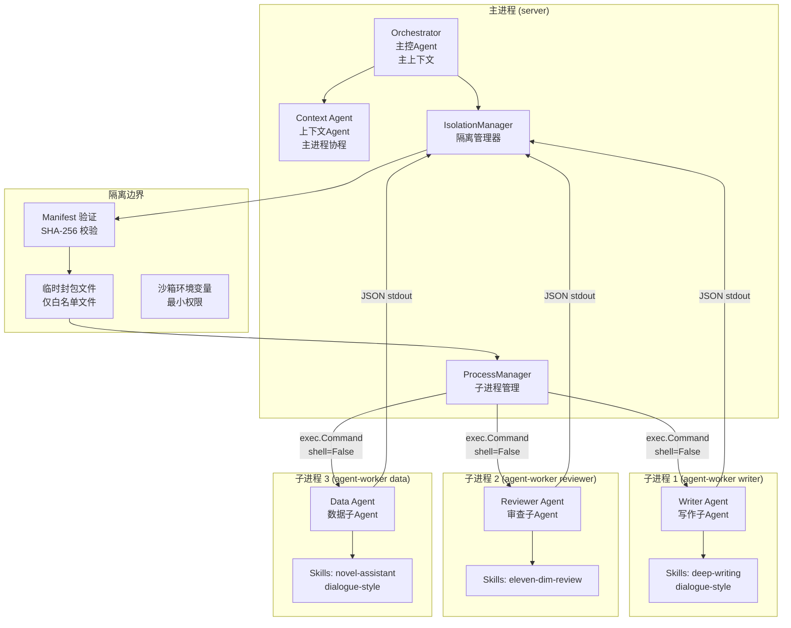
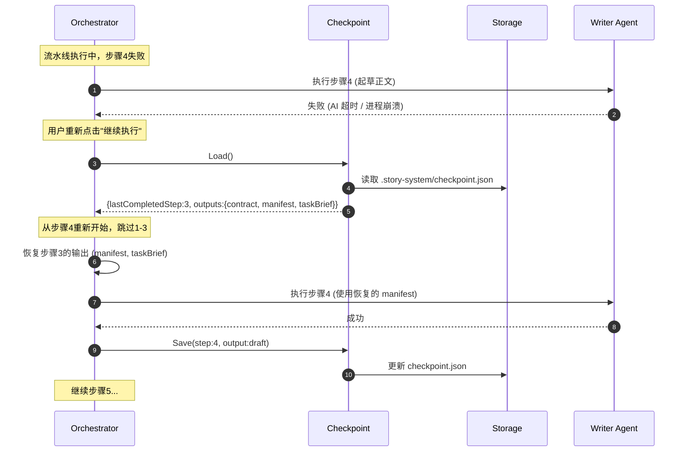
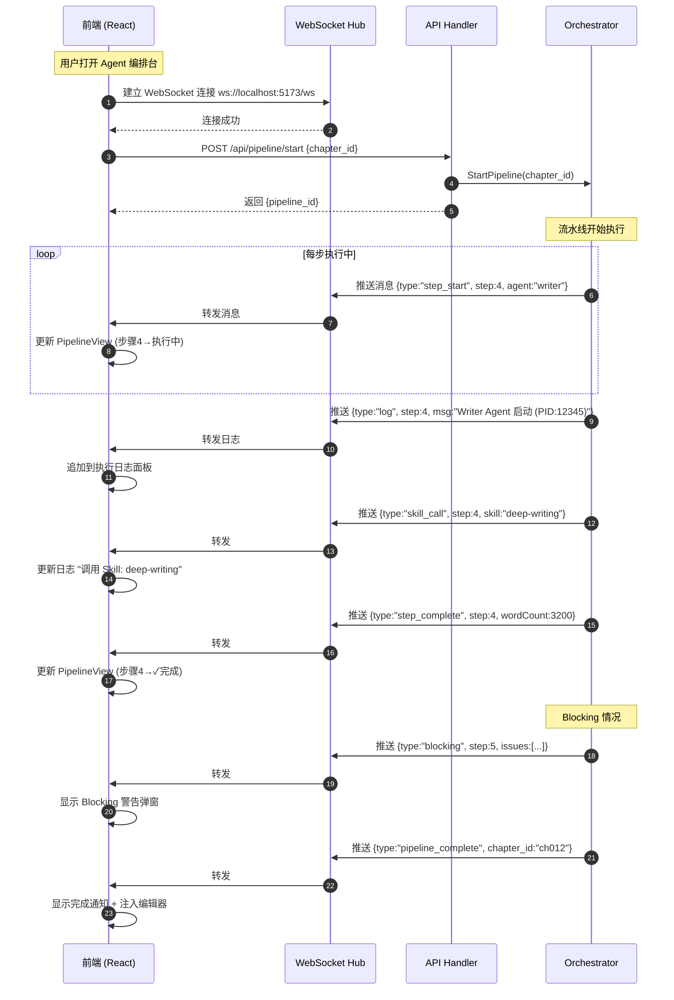
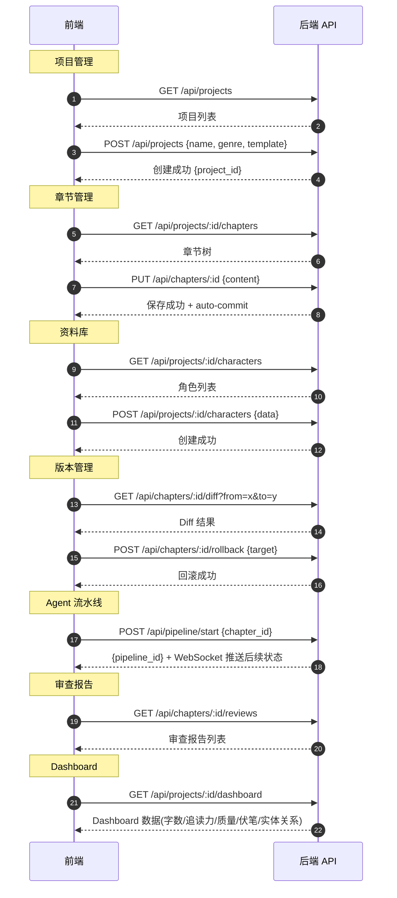
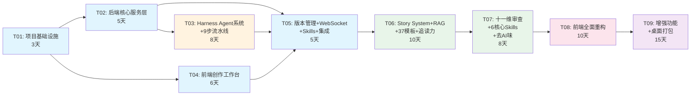

# 小说写作工具 — 系统架构设计文档

> **文档版本**：v1.0  
> **撰写人**：架构师 Bob（高见远）  
> **日期**：2026-07  
> **状态**：待评审  
> **输入**：PRD v1.0（产品经理 Alice）

---

## 目录

1. [实现方案与框架选型](#1-实现方案与框架选型)
2. [文件列表及相对路径](#2-文件列表及相对路径)
3. [数据结构和接口（类图）](#3-数据结构和接口类图)
4. [程序调用流程（时序图）](#4-程序调用流程时序图)
5. [任务列表](#5-任务列表)
6. [依赖包列表](#6-依赖包列表)
7. [共享知识（跨文件约定）](#7-共享知识跨文件约定)
8. [待明确事项](#8-待明确事项)

---

## 1. 实现方案与框架选型

### 1.1 核心技术挑战分析

本产品基于 denova 二次开发，融合三个参考项目的核心能力，存在以下技术难点：

| # | 挑战 | 难度 | 说明 |
|---|------|------|------|
| C1 | **Agent 隔离机制在 Go 中实现** | ★★★★★ | novelforge-agent 用 Python subprocess 实现隔离，需适配到 Go。这是最大技术风险点 |
| C2 | **9步写章流水线编排** | ★★★★☆ | DAG 编排 + 断点续跑 + Blocking 回环 + 实时状态推送，状态机复杂 |
| C3 | **封包白名单 + SHA-256 验证** | ★★★☆☆ | 每次 Agent 调用前构建 manifest 并验证，需保证性能和安全性 |
| C4 | **Skill 可插拔架构** | ★★★☆☆ | 11 个虾评 skills 需抽象为统一接口，支持热加载和组合调用 |
| C5 | **渐进式上下文管理** | ★★★★☆ | 8 级优先级模型 + 有界工具结果 + 缓存 + 封包最小化，需精细的 token 预算控制 |
| C6 | **SQLite 嵌入式引入** | ★★☆☆☆ | denova 原无数据库，需引入 SQLite 且不破坏文件系统真源 |
| C7 | **前端全面重构** | ★★★☆☆ | 从 denova 现有前端迁移到 Shadcn UI + Tiptap，工作量集中在 Phase 3 |
| C8 | **Tauri 桌面打包** | ★★☆☆☆ | Go 后端 + Web 前端打包为桌面应用，需处理跨平台编译 |

### 1.2 框架与库选型

#### 后端（Go）

| 组件 | 选型 | 版本 | 理由 |
|------|------|------|------|
| HTTP 路由 | `chi` | v5.x | 轻量、idiomatic、中间件生态好，比 Gin 更贴近标准库 |
| WebSocket | `gorilla/websocket` | v1.5+ | Go 生态最成熟的 WebSocket 库 |
| SQLite | `modernc.org/sqlite` | latest | **纯 Go 实现，无需 CGO**，Tauri 跨平台编译不受限 |
| Git 操作 | `go-git/go-git` | v5.x | 纯 Go Git 实现，不依赖系统 git 二进制 |
| OpenAI 客户端 | `sashabaranov/go-openai` | v1.x | OpenAI 兼容接口标准库，支持流式 |
| 配置管理 | `spf13/viper` + `BurntSushi/toml` + `yaml.v3` | latest | TOML 主配置 + YAML Agent 编排配置 |
| UUID | `google/uuid` | v1.x | 标准选择 |
| 日志 | `slog`（Go 1.21+ stdlib） | — | 结构化日志，无需第三方依赖 |

> **关键决策：为什么用 `modernc.org/sqlite` 而非 `mattn/go-sqlite3`？**
> `mattn/go-sqlite3` 依赖 CGO，在 Tauri 跨平台打包时需要为每个目标平台配置 C 编译链，极大增加构建复杂度。`modernc.org/sqlite` 是纯 Go 实现，性能略低但完全够用（本产品不是高并发场景），且 `go build` 直接出包，零额外配置。对于桌面应用分发，这个 trade-off 非常值得。

#### 前端（TypeScript）

| 组件 | 选型 | 版本 | 理由 |
|------|------|------|------|
| 构建工具 | Vite | ^5.x | denova 已用，最快的构建工具 |
| UI 框架 | React | ^18.x | denova 已用，生态成熟 |
| 组件库 | Shadcn UI + Radix Primitives | latest | 高度可定制、无运行时开销、设计系统完善 |
| 样式 | Tailwind CSS | ^3.x | 与 Shadcn UI 配套，原子化 CSS |
| 状态管理 | Zustand | ^4.x | 轻量、API 简洁、TS 友好 |
| 路由 | React Router | ^7.x | 生态成熟，支持数据加载 |
| 编辑器 | Tiptap（ProseMirror） | ^2.x | Markdown 支持、可扩展、协作能力（P2 复用） |
| 图表 | Recharts + D3.js | ^2.x / ^7.x | Recharts 常规图表，D3 实体关系图谱 |
| 图标 | Lucide React | latest | 与 Shadcn UI 配套，线性风格 |
| 包管理 | pnpm | ^9.x | denova 已用，高效磁盘利用 |

#### 系统依赖

| 依赖 | 版本 | 用途 |
|------|------|------|
| Go | 1.22+（PRD 写 1.26.5+，实际 1.22+ 即可） | 后端编译 |
| Node.js | 20 LTS+ | 前端构建 |
| pnpm | 9+ | 前端包管理 |
| Git | 2.30+ | 版本管理（go-git 不依赖系统 git，但 Diff 视图可能调用） |
| ripgrep | latest | 文件搜索（denova 已用） |
| Tauri CLI | ^2.x | 桌面应用打包 |

### 1.3 整体架构分层

```mermaid
graph TB
    subgraph "桌面壳层 (Tauri)"
        Tauri[Tauri Shell<br/>窗口管理 / 文件系统桥接 / 自动更新]
    end

    subgraph "用户界面层 (React + Shadcn UI)"
        UI1[创作工作台<br/>Tiptap编辑器 / 章节树 / 上下文面板]
        UI2[资料库<br/>8类资产可视化管理]
        UI3[Agent编排台<br/>DAG流水线 / 执行日志 / Skill配置]
        UI4[可视化Dashboard<br/>8个面板 / Recharts+D3]
        UI5[题材模板库<br/>37模板选择 / 项目初始化]
    end

    subgraph "API 网关层 (Go)"
        API[HTTP Router (chi)<br/>REST API + WebSocket]
    end

    subgraph "核心引擎层 (Go)"
        E1[Harness Agent 系统<br/>Orchestrator + 4子Agent + 隔离]
        E2[9步流水线引擎<br/>DAG编排 / 断点续跑 / 状态机]
        E3[一致性保障系统<br/>6层防护]
        E4[审查与质量系统<br/>11维审查 / Blocking机制]
        E5[版本管理系统<br/>5层版本 / Git / Undo-Redo]
        E6[Skills 插件系统<br/>11个Skill / 标准接口 / 热加载]
    end

    subgraph "数据资产层"
        D1[Story System 主链<br/>.story-system/ 文件]
        D2[SQLite 嵌入式<br/>结构化数据]
        D3[向量索引<br/>SQLite-vec]
        D4[Git 仓库<br/>版本历史]
        D5[文件系统<br/>正文 / 大纲 / 龙骨 / 设定]
        D6[备份目录<br/>章节级独立备份]
    end

    subgraph "基础设施层"
        I1[AI 模型接口<br/>OpenAI兼容 / 多模型 / Embedding / Rerank]
        I2[配置管理<br/>TOML + YAML]
        I3[进程管理<br/>Agent子进程 / 超时控制 / 沙箱]
    end

    Tauri --> UI1 & UI2 & UI3 & UI4 & UI5
    UI1 & UI2 & UI3 & UI4 & UI5 --> API
    API --> E1 & E2 & E3 & E4 & E5
    E1 --> E2 & E3 & E4 & E6
    E2 --> E1
    E3 --> D1 & D5
    E4 --> D2 & D3
    E5 --> D4 & D6
    E6 --> I1
    E1 --> I3
    D1 --> D5
    D2 --> D3
```

### 1.4 与 denova 原架构对比与改造点

| 维度 | denova 原架构 | 本产品改造 | 改造类型 |
|------|-------------|-----------|---------|
| **后端语言** | Go | 保留 Go | 不变 |
| **HTTP 框架** | Go HTTP（标准库） | 迁移到 chi 路由 | 改造 |
| **实时通信** | 无 | 新增 WebSocket | **新增** |
| **数据库** | 无（纯文件） | 引入 SQLite (modernc.org/sqlite) | **新增** |
| **搜索** | ripgrep | 保留 ripgrep + 新增 SQLite FTS5 | 增强 |
| **版本管理** | Git（本地） | 保留 Git + 增加自动分支 + 章节备份 | 增强 |
| **Agent 系统** | 创作 Agent + 游戏 Agent | 重构为 Harness Agent（5 Agent + 隔离） | **重构** |
| **Skills 系统** | 模块化 Skills 目录 | 重构为标准接口 + 11 个虾评 Skills | **重构** |
| **写作流水线** | 基础流程 | 新增 9 步流水线 + 断点续跑 | **新增** |
| **一致性保障** | 数据真源分层 | 新增 Story System + 龙骨 + 封包白名单 | **新增** |
| **审查系统** | 无 | 新增 11 维审查 + Blocking 机制 | **新增** |
| **RAG** | 无 | 新增 Embedding + Rerank + BM25 回退 | **新增** |
| **前端组件库** | 未明确 | 迁移到 Shadcn UI + Radix + Tailwind | **重构** |
| **编辑器** | 未明确 | 新增 Tiptap | **新增** |
| **状态管理** | 未明确 | 新增 Zustand | **新增** |
| **图表** | 无 | 新增 Recharts + D3.js | **新增** |
| **部署** | 本地 Web 服务 | 新增 Tauri 桌面打包 | **新增** |
| **配置** | TOML | 保留 TOML + 新增 YAML（Agent 编排） | 增强 |
| **游戏模式** | RPG 双模式 | 降级为 P2 可选模块 | 弱化 |

**改造策略总结**：后端保留 denova 的 Go 骨架和文件系统真源理念，在其上叠加 Harness Agent 系统、SQLite 数据层、WebSocket 实时通信；前端几乎重写，采用 Shadcn UI 全新设计系统。核心新增工作集中在 Agent 系统（隔离 + 流水线 + Skills）和一致性保障（Story System + 封包白名单）。

### 1.5 Agent 隔离机制在 Go 中的实现方案（核心技术难点）

> **这是本架构设计最关键的部分**。novelforge-agent 用 Python subprocess 实现隔离，我们需要在 Go 中达到等效效果。

#### 方案：混合隔离模型



**三层隔离实现**：

| 隔离层 | Python (novelforge-agent) | Go 实现 (本产品) |
|-------|--------------------------|-----------------|
| **上下文隔离** | 子 Agent 不继承主对话 | 子进程只接收 manifest 验证后的封包文件，无主进程内存访问 |
| **进程隔离** | subprocess.run(shell=False) | exec.Command(agentWorkerBin, args...)，独立 OS 进程 |
| **封包隔离** | manifest.json + SHA-256 | 相同：构建 manifest → 写入临时封包 → 子进程验证 SHA-256 → 只读白名单文件 |

**具体实现**：

1. **编译独立的 `agent-worker` 二进制**：`cmd/agent-worker/main.go` 编译为独立可执行文件，作为隔离子进程入口

2. **封包传递协议**：
   - 主进程将任务包（task packet）写入临时文件 `/tmp/nw-task-{uuid}.json`
   - 任务包包含：agent_type、manifest（含白名单文件路径+SHA-256）、skill_ids、model_config
   - 子进程通过命令行参数获取任务包路径：`agent-worker writer --task=/tmp/nw-task-{uuid}.json`

3. **子进程执行流程**：
   ```
   agent-worker 启动
   → 读取任务包 JSON
   → 验证 manifest（逐文件 SHA-256 校验）
   → 只读取白名单内文件到内存
   → 加载指定 Skills（按 skill_ids）
   → 调用 AI 模型（通过传入的 API 配置）
   → 将结果以 JSON 写入 stdout
   → 进程退出
   ```

4. **安全边界**：
   - 子进程环境变量精简（沙箱 env：仅保留 API_KEY、MODEL_ENDPOINT）
   - 子进程工作目录设为临时目录
   - 主进程设置超时（默认 120s），超时则 kill 子进程
   - 子进程无网络访问限制（需调用 AI API），但无文件系统写权限（除 Data Agent 通过定义接口写入）

5. **Data Agent 特殊处理**：
   - Data Agent 需要写资料库，通过"结果回传"模式：子进程将提取的事实以 JSON 返回，主进程负责写入 SQLite/文件系统
   - 子进程本身不直接操作数据库，保持隔离性

```go
// 隔离管理器核心代码结构
type IsolationManager struct {
    workerBinPath string        // agent-worker 二进制路径
    timeout       time.Duration // 超时时间
    aiConfig      AIConfig      // AI 模型配置（传给子进程）
}

func (im *IsolationManager) RunIsolated(
    ctx context.Context,
    agentType AgentType,    // "writer" | "reviewer" | "data"
    manifest Manifest,       // 封包白名单
    skillIDs []string,       // 要加载的 Skill ID
    extraParams map[string]any,
) (*AgentResult, error) {
    // 1. 构建任务包并写入临时文件
    taskFile, err := im.writeTaskPacket(agentType, manifest, skillIDs, extraParams)
    defer os.Remove(taskFile)

    // 2. 构造命令（shell=False 等效）
    cmd := exec.CommandContext(ctx, im.workerBinPath,
        string(agentType),
        "--task="+taskFile,
    )
    cmd.Env = im.sandboxEnv() // 最小权限环境变量

    // 3. 捕获 stdout（结果）和 stderr（日志）
    var stdout, stderr bytes.Buffer
    cmd.Stdout = &stdout
    cmd.Stderr = &stderr

    // 4. 执行（带超时）
    if err := cmd.Run(); err != nil {
        return nil, fmt.Errorf("isolated agent %s failed: %w, stderr: %s",
            agentType, err, stderr.String())
    }

    // 5. 解析 JSON 结果
    var result AgentResult
    if err := json.Unmarshal(stdout.Bytes(), &result); err != nil {
        return nil, fmt.Errorf("parse agent result: %w", err)
    }
    return &result, nil
}
```

> **为什么不用 goroutine 隔离？** goroutine 共享进程内存，无法实现真正的"上下文隔离"——一个 goroutine 可以访问主进程的任何变量。novelforge-agent 的核心安全理念是子 Agent 在物理上无法看到主对话历史，只有独立的 OS 进程才能保证这一点。Go 的 `exec.Command` 完美对应 Python 的 `subprocess.run(shell=False)`，语义一致。子进程启动开销约 10-50ms，对于写章流水线（每步耗时 10-60s 的 AI 调用）完全可以忽略。

---

## 2. 文件列表及相对路径

### 2.1 项目目录结构总览

```
novel-writer/
├── backend/                              # Go 后端 [denova 改造]
│   ├── cmd/
│   │   ├── server/                       # 主服务入口 [改造]
│   │   │   └── main.go                   # HTTP + WebSocket 服务启动
│   │   └── agent-worker/                 # Agent 隔离子进程入口 [新增]
│   │       └── main.go                   # 独立二进制，被 IsolationManager 调用
│   ├── internal/
│   │   ├── api/                          # API 层 [改造]
│   │   │   ├── router.go                 # chi 路由注册
│   │   │   ├── handler/                  # HTTP handlers
│   │   │   │   ├── project_handler.go    # 项目管理 API
│   │   │   │   ├── chapter_handler.go    # 章节管理 API
│   │   │   │   ├── library_handler.go    # 资料库 API
│   │   │   │   ├── agent_handler.go      # Agent 流水线 API
│   │   │   │   ├── review_handler.go     # 审查 API
│   │   │   │   ├── version_handler.go    # 版本管理 API
│   │   │   │   └── template_handler.go   # 题材模板 API
│   │   │   ├── ws/                       # WebSocket [新增]
│   │   │   │   ├── hub.go                # WebSocket 连接管理
│   │   │   │   └── client.go             # WebSocket 客户端
│   │   │   └── middleware/               # 中间件
│   │   │       ├── cors.go
│   │   │       ├── logger.go
│   │   │       └── recovery.go
│   │   ├── agent/                        # Harness Agent 系统 [新增]
│   │   │   ├── types.go                  # Agent 类型定义
│   │   │   ├── orchestrator.go           # 主控 Agent
│   │   │   ├── context_agent.go          # 上下文子 Agent（主进程协程）
│   │   │   ├── writer_agent.go           # 写作子 Agent（子进程逻辑）
│   │   │   ├── reviewer_agent.go         # 审查子 Agent（子进程逻辑）
│   │   │   ├── data_agent.go             # 数据子 Agent（子进程逻辑）
│   │   │   ├── isolation.go              # 隔离管理器
│   │   │   ├── pipeline.go               # 9步流水线状态机
│   │   │   ├── checkpoint.go             # 断点续跑
│   │   │   └── context_manager.go        # 渐进式上下文管理
│   │   ├── consistency/                  # 一致性保障 [新增]
│   │   │   ├── story_system.go           # Story System 主链
│   │   │   ├── spine.go                  # 章节龙骨
│   │   │   ├── manifest.go               # 封包白名单 + SHA-256
│   │   │   └── fact_tracker.go           # 事实追踪
│   │   ├── review/                       # 审查系统 [新增]
│   │   │   ├── reviewer.go               # 审查引擎
│   │   │   ├── dimensions.go             # 11维审查定义
│   │   │   ├── blocking.go               # Blocking/Warning 机制
│   │   │   └── report.go                 # 审查报告
│   │   ├── version/                      # 版本管理 [改造]
│   │   │   ├── git_manager.go            # Git 操作封装
│   │   │   ├── undo_redo.go              # Undo/Redo（跨重启）
│   │   │   ├── diff.go                   # Diff 比较
│   │   │   └── backup.go                 # 章节级备份
│   │   ├── storage/                      # 存储层 [改造]
│   │   │   ├── sqlite.go                 # SQLite 连接管理 [新增]
│   │   │   ├── schema.go                 # 数据库 schema 定义 [新增]
│   │   │   ├── migrations.go             # 数据库迁移 [新增]
│   │   │   ├── filestore.go              # 文件系统存储 [改造]
│   │   │   ├── vector.go                 # 向量索引 [新增]
│   │   │   └── rag.go                    # RAG 检索（Embedding+Rerank+BM25）[新增]
│   │   ├── ai/                           # AI 模型接口 [改造]
│   │   │   ├── client.go                 # OpenAI 兼容客户端
│   │   │   ├── models.go                 # 多模型管理
│   │   │   ├── embedding.go              # Embedding 接口
│   │   │   ├── rerank.go                 # Rerank 接口
│   │   │   └── bm25.go                   # BM25 回退检索
│   │   ├── skills/                       # Skills 插件系统 [新增]
│   │   │   ├── interface.go              # Skill 标准接口定义
│   │   │   ├── registry.go               # Skill 注册中心
│   │   │   ├── loader.go                 # Skill YAML 加载器
│   │   │   └── executor.go               # Skill 执行器（调用 AI + 模板）
│   │   ├── project/                      # 项目管理 [改造]
│   │   │   ├── manager.go                # 项目 CRUD
│   │   │   ├── template.go               # 题材模板管理
│   │   │   └── initializer.go            # 项目初始化器
│   │   ├── editor/                       # 编辑器服务 [改造]
│   │   │   ├── chapter.go                # 章节管理
│   │   │   └── outline.go                # 大纲管理（总纲→卷纲→章纲）
│   │   └── config/                       # 配置管理 [改造]
│   │       ├── config.go                 # 配置加载（TOML + YAML）
│   │       ├── defaults.go               # 默认配置
│   │       └── agent_config.go           # Agent 编排配置
│   ├── pkg/                              # 可复用包
│   │   ├── crypto/                       # SHA-256 等加密工具
│   │   │   └── hash.go
│   │   ├── markdown/                     # Markdown 解析工具
│   │   │   └── parser.go
│   │   └── utils/                        # 通用工具
│   │       ├── id.go                     # UUID 生成
│   │       ├── time.go                   # 时间工具
│   │       └── json.go                   # JSON 工具
│   ├── go.mod
│   └── go.sum
│
├── frontend/                             # TS 前端 [重构]
│   ├── src/
│   │   ├── main.tsx                      # 入口 [新增]
│   │   ├── App.tsx                       # 根组件 + 路由 [新增]
│   │   ├── components/                   # UI 组件
│   │   │   ├── ui/                       # Shadcn UI 基础组件 [新增]
│   │   │   │   ├── button.tsx
│   │   │   │   ├── dialog.tsx
│   │   │   │   ├── dropdown-menu.tsx
│   │   │   │   ├── tabs.tsx
│   │   │   │   ├── toast.tsx
│   │   │   │   └── ... (其他 Shadcn 组件)
│   │   │   ├── editor/                   # 编辑器组件 [新增]
│   │   │   │   ├── TiptapEditor.tsx      # Tiptap 富文本编辑器
│   │   │   │   ├── ChapterTree.tsx       # 章节导航树
│   │   │   │   ├── ContextPanel.tsx      # 右侧上下文面板
│   │   │   │   ├── ProgressPanel.tsx     # 进度追踪面板
│   │   │   │   └── DiffViewer.tsx        # Diff 查看器
│   │   │   ├── agent/                    # Agent 编排组件 [新增]
│   │   │   │   ├── PipelineView.tsx      # DAG 流水线可视化
│   │   │   │   ├── AgentStatus.tsx       # Agent 执行状态
│   │   │   │   ├── ExecutionLog.tsx      # 执行日志
│   │   │   │   └── SkillConfig.tsx       # Skill 配置面板
│   │   │   ├── dashboard/                # Dashboard 组件 [新增]
│   │   │   │   ├── EntityGraph.tsx       # 实体关系图谱 (D3)
│   │   │   │   ├── EngagementChart.tsx   # 追读力曲线 (Recharts)
│   │   │   │   ├── QualityRadar.tsx      # 质量雷达图 (Recharts)
│   │   │   │   ├── ForeshadowTimeline.tsx # 伏笔时间线
│   │   │   │   └── ProjectHealth.tsx     # 项目健康度
│   │   │   ├── library/                  # 资料库组件 [新增]
│   │   │   │   ├── CharacterCard.tsx     # 角色卡片
│   │   │   │   ├── AssetEditor.tsx       # 资产编辑器
│   │   │   │   └── AssetList.tsx         # 资产列表
│   │   │   └── layout/                   # 布局组件 [新增]
│   │   │       ├── AppLayout.tsx         # 主布局（三栏）
│   │   │       ├── Sidebar.tsx           # 侧边导航
│   │   │       └── TopBar.tsx            # 顶部栏
│   │   ├── pages/                        # 页面 [新增]
│   │   │   ├── Workbench.tsx             # 创作工作台
│   │   │   ├── Library.tsx               # 资料库
│   │   │   ├── AgentOrchestrator.tsx     # Agent 编排台
│   │   │   ├── Dashboard.tsx             # 可视化面板
│   │   │   ├── Templates.tsx             # 题材模板库
│   │   │   ├── Settings.tsx              # 设置
│   │   │   └── ProjectList.tsx           # 项目列表
│   │   ├── stores/                       # Zustand 状态管理 [新增]
│   │   │   ├── projectStore.ts           # 项目状态
│   │   │   ├── editorStore.ts            # 编辑器状态
│   │   │   ├── agentStore.ts             # Agent 流水线状态
│   │   │   ├── libraryStore.ts           # 资料库状态
│   │   │   └── settingsStore.ts          # 设置状态
│   │   ├── services/                     # API 服务 [新增]
│   │   │   ├── api.ts                    # REST API 封装
│   │   │   ├── websocket.ts              # WebSocket 客户端
│   │   │   ├── projectApi.ts             # 项目 API
│   │   │   ├── chapterApi.ts             # 章节 API
│   │   │   ├── libraryApi.ts             # 资料库 API
│   │   │   ├── agentApi.ts               # Agent API
│   │   │   └── versionApi.ts             # 版本 API
│   │   ├── hooks/                        # React Hooks [新增]
│   │   │   ├── useWebSocket.ts           # WebSocket Hook
│   │   │   ├── usePipeline.ts            # 流水线 Hook
│   │   │   ├── useAutoSave.ts            # 自动保存 Hook
│   │   │   └── useTheme.ts               # 主题 Hook
│   │   ├── types/                        # 类型定义 [新增]
│   │   │   ├── agent.ts                  # Agent 相关类型
│   │   │   ├── library.ts                # 资料库类型
│   │   │   ├── project.ts                # 项目类型
│   │   │   ├── review.ts                 # 审查类型
│   │   │   └── websocket.ts              # WebSocket 消息类型
│   │   ├── lib/                          # 工具库 [新增]
│   │   │   ├── utils.ts                  # 通用工具（cn 等）
│   │   │   └── constants.ts              # 常量
│   │   └── styles/                       # 全局样式 [新增]
│   │       ├── globals.css               # Tailwind 全局样式
│   │       └── themes.css                # 深色/浅色主题变量
│   ├── package.json
│   ├── vite.config.ts
│   ├── tailwind.config.ts
│   ├── tsconfig.json
│   ├── components.json                   # Shadcn UI 配置
│   └── index.html
│
├── skills/                               # Skill 定义 [新增]
│   ├── novel-assistant/
│   │   └── skill.yaml                    # 小说助手 Skill 定义
│   ├── deep-writing/
│   │   └── skill.yaml                    # 深度小说写作法
│   ├── hook-architect/
│   │   └── skill.yaml                    # 爽点架构生成器
│   ├── eleven-dim-review/
│   │   └── skill.yaml                    # 十一维审校
│   ├── human-touch/
│   │   └── skill.yaml                    # 人味写作引擎
│   ├── dimensionalizer/
│   │   └── skill.yaml                    # 框架维度化器
│   ├── longform-master/
│   │   └── skill.yaml                    # 多米长篇创作
│   ├── dialogue-style/
│   │   └── skill.yaml                    # 角色对话风格库
│   ├── video-prompt/                     # [P2]
│   │   └── skill.yaml
│   ├── video-script/                     # [P2]
│   │   └── skill.yaml
│   └── platform-strategy/                # [P2]
│       └── skill.yaml
│
├── templates/                            # 题材模板 [新增]
│   ├── fantasy/                          # 玄幻修仙类 (7个)
│   │   ├── xianxiu.yaml                  # 修仙
│   │   ├── system-flow.yaml              # 系统流
│   │   ├── high-martial.yaml             # 高武
│   │   ├── western-fantasy.yaml          # 西幻
│   │   ├── infinite-flow.yaml            # 无限流
│   │   ├── apocalypse.yaml               # 末世
│   │   └── scifi.yaml                    # 科幻
│   ├── urban/                            # 都市现代类 (6个)
│   ├── romance/                          # 言情类 (7个)
│   ├── special/                          # 特殊题材 (7个)
│   └── custom/                           # 自定义模板
│
├── config/                               # 全局配置 [新增]
│   ├── default.toml                      # 默认配置（端口、路径、AI 模型）
│   └── agents.yaml                       # Agent 编排配置（9步流水线定义）
│
├── docs/                                 # 文档
│   ├── system_design.md                  # 本文档
│   ├── sequence-diagram.mermaid          # 时序图提取
│   └── class-diagram.mermaid             # 类图提取
│
├── src-tauri/                            # Tauri 桌面打包配置 [新增]
│   ├── Cargo.toml
│   ├── tauri.conf.json
│   └── src/
│       └── main.rs
│
├── Makefile                              # 构建脚本
├── go.work                               # Go workspace
└── README.md
```

### 2.2 关键文件职责说明

#### 后端核心文件

| 文件 | 职责 | 改造类型 |
|------|------|---------|
| `cmd/server/main.go` | 主服务入口，启动 HTTP + WebSocket，加载配置和数据库 | 改造 |
| `cmd/agent-worker/main.go` | Agent 隔离子进程入口，被 IsolationManager 调用 | **新增** |
| `internal/agent/orchestrator.go` | 主控 Agent，编排 9 步流水线，调度子 Agent | **新增** |
| `internal/agent/isolation.go` | 隔离管理器，管理子进程的创建、封包传递、超时、结果回收 | **新增** |
| `internal/agent/pipeline.go` | 9 步流水线状态机，管理步骤流转和 Blocking 回环 | **新增** |
| `internal/agent/checkpoint.go` | 断点续跑，每步完成后写入 checkpoint.json | **新增** |
| `internal/agent/context_manager.go` | 渐进式上下文管理，8 级优先级模型 | **新增** |
| `internal/consistency/story_system.go` | Story System 主链管理，"合同"和"提交"生成 | **新增** |
| `internal/consistency/manifest.go` | 封包白名单 manifest 构建和 SHA-256 验证 | **新增** |
| `internal/consistency/spine.go` | 章节龙骨生成和管理 | **新增** |
| `internal/skills/interface.go` | Skill 标准接口定义（metadata + input/output schema） | **新增** |
| `internal/skills/registry.go` | Skill 注册中心，管理 Skill 的注册、查询、启用/禁用 | **新增** |
| `internal/storage/sqlite.go` | SQLite 连接管理，嵌入式数据库 | **新增** |
| `internal/storage/rag.go` | RAG 检索（Embedding + Rerank + BM25 回退） | **新增** |
| `internal/version/git_manager.go` | Git 操作封装（commit/tag/diff/rollback） | 改造 |

#### 前端核心文件

| 文件 | 职责 | 改造类型 |
|------|------|---------|
| `src/pages/Workbench.tsx` | 创作工作台主页面，三栏布局 | **新增** |
| `src/components/editor/TiptapEditor.tsx` | Tiptap 富文本编辑器，支持 Markdown | **新增** |
| `src/components/agent/PipelineView.tsx` | DAG 流水线可视化，实时状态更新 | **新增** |
| `src/services/websocket.ts` | WebSocket 客户端，接收 Agent 执行状态推送 | **新增** |
| `src/stores/agentStore.ts` | Agent 流水线状态管理（Zustand） | **新增** |

---

## 3. 数据结构和接口（类图）

### 3.1 核心类图

```mermaid
classDiagram
    class Project {
        +string id
        +string name
        +string slug
        +string genre
        +string basePath
        +ProjectConfig config
        +time.Time createdAt
        +time.Time updatedAt
        +Init() error
        +GetStats() ProjectStats
    }

    class Chapter {
        +string id
        +string projectId
        +string volumeId
        +string title
        +int order
        +ChapterStatus status
        +string contentPath
        +int wordCount
        +time.Time createdAt
        +time.Time updatedAt
    }

    class ChapterSpine {
        +string chapterId
        +string function
        +string openingState
        +string chapterGoal
        +string coreProgression
        +string endingChange
        +string subsequentConstraint
        +[]string pendingResolutions
        +Generate(content string) error
    }

    class StorySystem {
        +string projectId
        +string basePath
        +Contract currentContract
        +Commit lastCommit
        +CheckHealth() HealthStatus
        +GenerateContract(chapterId) Contract
        +GenerateCommit(chapterId, content) Commit
    }

    class Contract {
        +string chapterId
        +string content
        +[]string dependencies
        +time.Time generatedAt
        +string hash
    }

    class Commit {
        +string chapterId
        +string content
        +map facts
        +time.Time committedAt
        +string hash
    }

    class Manifest {
        +string chapterId
        +string novelSlug
        +time.Time generatedAt
        +string approvedSnapshotHash
        +[]ManifestFile files
        +Verify() bool
        +AddFile(path, purpose, lineRange) error
    }

    class ManifestFile {
        +string path
        +string purpose
        +string lineRange
        +string sha256
    }

    class Asset {
        <<abstract>>
        +string id
        +string projectId
        +string type
        +string name
        +time.Time createdAt
        +time.Time updatedAt
    }

    class Character {
        +string appearance
        +string personality
        +string background
        +string abilities
        +map relationships
        +[]string dialogueStyleSamples
        +map currentState
    }

    class Worldview {
        +string worldRules
        +string powerSystem
        +string history
        +string culture
    }

    class Location {
        +string description
        +[]string relatedCharacters
        +string geoRelation
    }

    class Foreshadow {
        +string description
        +string plantedChapter
        +string resolvedChapter
        +ForeshadowStatus status
        +[]string relatedCharacters
    }

    class TimelineEvent {
        +string event
        +string timePoint
        +string chapterId
        +[]string relatedCharacters
    }

    Asset <|-- Character
    Asset <|-- Worldview
    Asset <|-- Location
    Asset <|-- Foreshadow
    Asset <|-- TimelineEvent

    class Agent {
        <<interface>>
        +Execute(ctx, task) AgentResult
        +GetType() AgentType
        +IsIsolated() bool
    }

    class Orchestrator {
        +Pipeline pipeline
        +IsolationManager isoManager
        +SkillRegistry skillRegistry
        +ExecutePipeline(chapterId) PipelineResult
        +HandleBlocking(review) void
        +SaveCheckpoint(step) error
    }

    class WriterAgent {
        +Manifest manifest
        +[]Skill skills
        +Execute(ctx, task) AgentResult
        +GetType() AgentType
        +IsIsolated() bool
    }

    class ReviewerAgent {
        +Manifest manifest
        +[]Skill skills
        +Execute(ctx, task) AgentResult
        +GetType() AgentType
        +IsIsolated() bool
    }

    class DataAgent {
        +Manifest manifest
        +[]Skill skills
        +Execute(ctx, task) AgentResult
        +GetType() AgentType
        +IsIsolated() bool
    }

    class ContextAgent {
        +ContextManager ctxManager
        +Execute(ctx, task) AgentResult
        +GetType() AgentType
        +IsIsolated() bool
        +BuildPacket(contract) Manifest
        +GenerateTaskBrief(contract) TaskBrief
    }

    Agent <|.. Orchestrator
    Agent <|.. WriterAgent
    Agent <|.. ReviewerAgent
    Agent <|.. DataAgent
    Agent <|.. ContextAgent

    class IsolationManager {
        +string workerBinPath
        +time.Duration timeout
        +AIConfig aiConfig
        +RunIsolated(ctx, agentType, manifest, skillIDs) AgentResult
        +writeTaskPacket(task) string
        +sandboxEnv() []string
    }

    class Pipeline {
        +string chapterId
        +int currentStep
        +[]StepState steps
        +time.Time startedAt
        +Start() error
        +ExecuteStep(step) error
        +ResumeFromCheckpoint() error
        +GetCurrentStep() int
    }

    class StepState {
        +int stepID
        +StepStatus status
        +time.Time startedAt
        +time.Time completedAt
        +interface output
        +string error
    }

    class Checkpoint {
        +string chapterId
        +int lastCompletedStep
        +map stepOutputs
        +time.Time savedAt
        +Save() error
        +Load() Checkpoint
    }

    class Skill {
        <<interface>>
        +GetMetadata() SkillMetadata
        +Execute(ctx, input) SkillOutput
        +Validate(input) error
    }

    class SkillMetadata {
        +string id
        +string name
        +string category
        +string description
        +string version
        +[]AgentType applicableAgents
    }

    class SkillRegistry {
        +map skills
        +Register(skill) error
        +Get(skillID) Skill
        +ListByAgent(agentType) []Skill
        +Enable(skillID) error
        +Disable(skillID) error
    }

    class SkillExecutor {
        +AIClient aiClient
        +Execute(skill, input, context) SkillOutput
        +buildPrompt(skill, input) string
    }

    SkillRegistry o-- Skill
    SkillExecutor --> Skill
    SkillExecutor --> AIClient

    class AIClient {
        <<interface>>
        +Chat(ctx, messages, model) ChatResponse
        +Stream(ctx, messages, model) chan StreamChunk
        +Embed(ctx, text) []float64
    }

    class ModelManager {
        +map models
        +string defaultModel
        +GetModel(agentType) ModelConfig
        +SwitchModel(modelID) error
    }

    class ReviewReport {
        +string id
        +string chapterId
        +map dimensionScores
        +[]ReviewIssue blockingIssues
        +[]ReviewIssue warnings
        +int overallScore
        +time.Time createdAt
        +IsBlocking() bool
    }

    class ReviewIssue {
        +string dimension
        +IssueLevel level
        +string description
        +string suggestion
        +string evidence
    }

    class VersionManager {
        +GitManager git
        +BackupManager backup
        +Commit(message, files) string
        +Diff(from, to) DiffResult
        +Rollback(target) error
        +Tag(name, message) error
        +BackupChapter(chapterId) error
    }

    class GitManager {
        +string repoPath
        +Commit(message, files) string
        +Diff(from, to) DiffResult
        +Rollback(target) error
        +Tag(name, message) error
        +Stash() string
    }

    class StorageManager {
        +SQLiteDB sqlite
        +FileStore fileStore
        +VectorStore vectorStore
        +ReadFile(path) []byte
        +WriteFile(path, data) error
        +QueryAsset(type, filter) []Asset
        +SearchRAG(query) []SearchResult
    }

    Project --> Chapter
    Project --> StorySystem
    Chapter --> ChapterSpine
    StorySystem --> Contract
    StorySystem --> Commit
    Orchestrator --> Pipeline
    Orchestrator --> IsolationManager
    Orchestrator --> SkillRegistry
    Pipeline --> StepState
    Pipeline --> Checkpoint
    ContextAgent --> ContextManager
    IsolationManager --> Manifest
    WriterAgent --> Manifest
    ReviewerAgent --> Manifest
    DataAgent --> Manifest
    VersionManager --> GitManager
    ReviewReport --> ReviewIssue
```



### 3.2 SQLite 数据库 Schema

```sql
-- ============================================
-- 项目与章节
-- ============================================

CREATE TABLE projects (
    id          TEXT PRIMARY KEY,
    name        TEXT NOT NULL,
    slug        TEXT NOT NULL UNIQUE,
    genre       TEXT,
    base_path   TEXT NOT NULL,
    config      TEXT, -- JSON
    created_at  DATETIME DEFAULT CURRENT_TIMESTAMP,
    updated_at  DATETIME DEFAULT CURRENT_TIMESTAMP
);

CREATE TABLE volumes (
    id          TEXT PRIMARY KEY,
    project_id  TEXT NOT NULL REFERENCES projects(id),
    title       TEXT NOT NULL,
    sort_order  INTEGER NOT NULL,
    summary     TEXT,
    created_at  DATETIME DEFAULT CURRENT_TIMESTAMP
);

CREATE TABLE chapters (
    id           TEXT PRIMARY KEY,
    project_id   TEXT NOT NULL REFERENCES projects(id),
    volume_id    TEXT REFERENCES volumes(id),
    title        TEXT NOT NULL,
    sort_order   INTEGER NOT NULL,
    status       TEXT DEFAULT 'draft'
                 CHECK(status IN ('draft','writing','reviewing','revising','published')),
    content_path TEXT,
    word_count   INTEGER DEFAULT 0,
    created_at   DATETIME DEFAULT CURRENT_TIMESTAMP,
    updated_at   DATETIME DEFAULT CURRENT_TIMESTAMP
);

CREATE TABLE chapter_spines (
    chapter_id              TEXT PRIMARY KEY REFERENCES chapters(id),
    function                TEXT,
    opening_state           TEXT,
    chapter_goal            TEXT,
    core_progression        TEXT,
    ending_change           TEXT,
    subsequent_constraint   TEXT,
    pending_resolutions     TEXT, -- JSON array
    created_at              DATETIME DEFAULT CURRENT_TIMESTAMP,
    updated_at              DATETIME DEFAULT CURRENT_TIMESTAMP
);

-- ============================================
-- 资料库 (8 类资产)
-- ============================================

CREATE TABLE characters (
    id                  TEXT PRIMARY KEY,
    project_id          TEXT NOT NULL REFERENCES projects(id),
    name                TEXT NOT NULL,
    appearance          TEXT,
    personality         TEXT,
    background          TEXT,
    abilities           TEXT,
    relationships       TEXT, -- JSON: {character_id: relation_desc}
    dialogue_samples    TEXT, -- JSON array: ["sample1", "sample2"]
    current_state       TEXT, -- JSON: {location, status, mood, ...}
    created_at          DATETIME DEFAULT CURRENT_TIMESTAMP,
    updated_at          DATETIME DEFAULT CURRENT_TIMESTAMP
);

CREATE TABLE worldviews (
    id          TEXT PRIMARY KEY,
    project_id  TEXT NOT NULL REFERENCES projects(id),
    name        TEXT NOT NULL,
    world_rules TEXT,
    power_system TEXT,
    history     TEXT,
    culture     TEXT,
    created_at  DATETIME DEFAULT CURRENT_TIMESTAMP,
    updated_at  DATETIME DEFAULT CURRENT_TIMESTAMP
);

CREATE TABLE locations (
    id                  TEXT PRIMARY KEY,
    project_id          TEXT NOT NULL REFERENCES projects(id),
    name                TEXT NOT NULL,
    description         TEXT,
    related_characters  TEXT, -- JSON array
    geo_relation        TEXT,
    created_at          DATETIME DEFAULT CURRENT_TIMESTAMP,
    updated_at          DATETIME DEFAULT CURRENT_TIMESTAMP
);

CREATE TABLE factions (
    id          TEXT PRIMARY KEY,
    project_id  TEXT NOT NULL REFERENCES projects(id),
    name        TEXT NOT NULL,
    goal        TEXT,
    members     TEXT, -- JSON array
    power_level TEXT,
    relations   TEXT, -- JSON
    created_at  DATETIME DEFAULT CURRENT_TIMESTAMP,
    updated_at  DATETIME DEFAULT CURRENT_TIMESTAMP
);

CREATE TABLE rules (
    id          TEXT PRIMARY KEY,
    project_id  TEXT NOT NULL REFERENCES projects(id),
    name        TEXT NOT NULL,
    category    TEXT, -- power / social / special
    description TEXT,
    created_at  DATETIME DEFAULT CURRENT_TIMESTAMP,
    updated_at  DATETIME DEFAULT CURRENT_TIMESTAMP
);

CREATE TABLE items (
    id          TEXT PRIMARY KEY,
    project_id  TEXT NOT NULL REFERENCES projects(id),
    name        TEXT NOT NULL,
    attributes  TEXT, -- JSON
    origin      TEXT,
    holder      TEXT,
    created_at  DATETIME DEFAULT CURRENT_TIMESTAMP,
    updated_at  DATETIME DEFAULT CURRENT_TIMESTAMP
);

CREATE TABLE foreshadows (
    id                  TEXT PRIMARY KEY,
    project_id          TEXT NOT NULL REFERENCES projects(id),
    description         TEXT NOT NULL,
    planted_chapter     TEXT REFERENCES chapters(id),
    resolved_chapter    TEXT REFERENCES chapters(id),
    status              TEXT DEFAULT 'planted'
                        CHECK(status IN ('planted','resolved','conflict')),
    related_characters  TEXT, -- JSON array
    created_at          DATETIME DEFAULT CURRENT_TIMESTAMP,
    updated_at          DATETIME DEFAULT CURRENT_TIMESTAMP
);

CREATE TABLE timeline_events (
    id                  TEXT PRIMARY KEY,
    project_id          TEXT NOT NULL REFERENCES projects(id),
    event               TEXT NOT NULL,
    time_point          TEXT,
    chapter_id          TEXT REFERENCES chapters(id),
    related_characters  TEXT, -- JSON array
    created_at          DATETIME DEFAULT CURRENT_TIMESTAMP
);

-- ============================================
-- 审查系统
-- ============================================

CREATE TABLE review_reports (
    id              TEXT PRIMARY KEY,
    chapter_id      TEXT NOT NULL REFERENCES chapters(id),
    pipeline_id     TEXT,
    dimension_scores TEXT, -- JSON: {dimension: score}
    blocking_issues TEXT,  -- JSON array
    warnings        TEXT,  -- JSON array
    overall_score   INTEGER,
    ai_taste_score  INTEGER,
    engagement_score INTEGER,
    created_at      DATETIME DEFAULT CURRENT_TIMESTAMP
);

-- ============================================
-- Agent 流水线
-- ============================================

CREATE TABLE pipeline_states (
    id              TEXT PRIMARY KEY,
    chapter_id      TEXT NOT NULL REFERENCES chapters(id),
    current_step    INTEGER DEFAULT 0,
    steps           TEXT, -- JSON array of StepState
    status          TEXT DEFAULT 'pending'
                    CHECK(status IN ('pending','running','completed','failed','paused')),
    error_message   TEXT,
    created_at      DATETIME DEFAULT CURRENT_TIMESTAMP,
    updated_at      DATETIME DEFAULT CURRENT_TIMESTAMP
);

CREATE TABLE agent_logs (
    id              TEXT PRIMARY KEY,
    pipeline_id     TEXT NOT NULL,
    step            INTEGER,
    agent_name      TEXT NOT NULL,
    skill_id        TEXT,
    input_summary   TEXT,
    output_summary  TEXT,
    token_usage     INTEGER,
    duration_ms     INTEGER,
    status          TEXT,
    created_at      DATETIME DEFAULT CURRENT_TIMESTAMP
);

-- ============================================
-- Skill 配置
-- ============================================

CREATE TABLE skill_configs (
    id          TEXT PRIMARY KEY,
    skill_id    TEXT NOT NULL UNIQUE,
    enabled     BOOLEAN DEFAULT 1,
    priority    INTEGER DEFAULT 0,
    params      TEXT, -- JSON
    updated_at  DATETIME DEFAULT CURRENT_TIMESTAMP
);

-- ============================================
-- 版本管理
-- ============================================

CREATE TABLE version_snapshots (
    id          TEXT PRIMARY KEY,
    project_id  TEXT NOT NULL REFERENCES projects(id),
    chapter_id  TEXT REFERENCES chapters(id),
    git_commit  TEXT NOT NULL,
    snapshot_type TEXT, -- auto_save / chapter_commit / milestone / agent_snapshot
    description TEXT,
    created_at  DATETIME DEFAULT CURRENT_TIMESTAMP
);

-- ============================================
-- 索引
-- ============================================

CREATE INDEX idx_chapters_project ON chapters(project_id);
CREATE INDEX idx_chapters_volume ON chapters(volume_id);
CREATE INDEX idx_characters_project ON characters(project_id);
CREATE INDEX idx_foreshadows_project ON foreshadows(project_id);
CREATE INDEX idx_foreshadows_status ON foreshadows(status);
CREATE INDEX idx_pipeline_chapter ON pipeline_states(chapter_id);
CREATE INDEX idx_agent_logs_pipeline ON agent_logs(pipeline_id);
CREATE INDEX idx_review_chapter ON review_reports(chapter_id);
```

### 3.3 向量索引 Schema (SQLite-vec)

```sql
-- SQLite-vec 虚拟表，存储章节段落 Embedding
CREATE VIRTUAL TABLE chapter_embeddings USING vec0(
    id TEXT PRIMARY KEY,
    chapter_id TEXT,
    paragraph_index INTEGER,
    content TEXT,
    embedding FLOAT[1024]  -- BGE-M3 维度
);

-- 资料库资产 Embedding
CREATE VIRTUAL TABLE asset_embeddings USING vec0(
    id TEXT PRIMARY KEY,
    asset_type TEXT,
    asset_id TEXT,
    content TEXT,
    embedding FLOAT[1024]
);
```

---

## 4. 程序调用流程（时序图）

### 4.1 9步写章流水线完整时序图（核心）

```mermaid
sequenceDiagram
    autonumber
    participant U as 用户
    participant FE as 前端
    participant API as 后端 API
    participant WS as WebSocket
    participant OC as Orchestrator
    participant CA as Context Agent
    participant IM as IsolationManager
    participant WA as Writer Agent (子进程)
    participant RA as Reviewer Agent (子进程)
    participant DA as Data Agent (子进程)
    participant SK as Skills
    participant AI as AI 模型
    participant SS as Story System
    participant ST as Storage (SQLite+FS)
    participant GIT as Git

    Note over U,FE: 用户在创作工作台点击"Agent写作"

    %% Step 1: 预检
    rect rgb(240, 248, 255)
    Note over OC: 步骤1: 预检
    U->>FE: 点击"Agent写作"按钮
    FE->>API: POST /api/pipeline/start {chapter_id}
    API->>OC: StartPipeline(chapter_id)
    OC->>ST: 检查项目根目录结构
    OC->>ST: 检查占位符完整性
    OC->>SS: CheckHealth()
    SS->>ST: 读取 .story-system/ 状态
    SS-->>OC: 健康状态: OK
    OC->>ST: 写入 checkpoint.json {step:1, status:completed}
    OC->>WS: 推送 {step:1, status:completed}
    WS->>FE: pipeline_progress
    FE->>U: 更新流水线视图: 预检✓
    end

    %% Step 2: 刷新契约
    rect rgb(255, 248, 240)
    Note over OC,CA: 步骤2: 刷新契约
    OC->>CA: GenerateRuntimeContract(chapter_id)
    CA->>ST: 读取总纲 + 卷纲 + 章纲
    CA->>SK: 调用 dimensionalizer (维度化拆分)
    SK->>AI: 请求维度化分析
    AI-->>SK: 返回维度化结果
    SK-->>CA: 维度化施工维度
    CA->>SK: 调用 hook-architect (爽点架构)
    SK->>AI: 请求爽点架构生成
    AI-->>SK: 返回爽点结构
    SK-->>CA: 爽点架构
    CA->>SK: 调用 longform-master (六线推演)
    SK->>AI: 请求六线推演
    AI-->>SK: 返回六线推演结果
    SK-->>CA: 六线推演
    CA->>CA: 整合生成 runtime contract
    CA-->>OC: 返回 runtime contract
    OC->>ST: 写入 checkpoint.json {step:2, status:completed}
    OC->>WS: 推送 {step:2, status:completed}
    WS->>FE: pipeline_progress
    FE->>U: 更新流水线视图: 刷新契约✓
    end

    %% Step 3: 生成任务书
    rect rgb(248, 255, 240)
    Note over OC,CA: 步骤3: 生成任务书
    OC->>CA: BuildPacketAndTaskBrief(contract)
    CA->>CA: 应用上下文优先级模型(8级)
    CA->>ST: 读取白名单文件(龙骨+前章结尾+施工单+角色状态)
    CA->>CA: 计算 SHA-256 生成 manifest.json
    CA->>CA: 生成写作任务书(含约束+目标+风格指导)
    CA-->>OC: 返回 封包+manifest+任务书
    OC->>ST: 写入 checkpoint.json {step:3, status:completed}
    OC->>WS: 推送 {step:3, status:completed}
    WS->>FE: pipeline_progress
    FE->>U: 更新流水线视图: 任务书✓
    end

    %% Step 4: 起草正文
    rect rgb(255, 240, 240)
    Note over OC,WA: 步骤4: 起草正文 (隔离进程)
    OC->>IM: RunIsolated("writer", manifest, [deep-writing, dialogue-style])
    IM->>IM: 构建任务包JSON写入临时文件
    IM->>WA: exec.Command("agent-worker", "writer", "--task=/tmp/nw-task-xxx.json")
    Note over WA: === 隔离边界 ===<br/>子进程启动，无主进程内存访问
    WA->>WA: 读取任务包
    WA->>WA: 验证 manifest (逐文件 SHA-256 校验)
    WA->>WA: 加载白名单文件到内存
    WA->>SK: 加载 deep-writing skill
    WA->>SK: 加载 dialogue-style skill
    WA->>AI: 发送写作请求(任务书+龙骨+前章结尾+施工单+Skills提示词)
    OC->>WS: 推送 {step:4, status:running, agent:writer, pid:12345}
    WS->>FE: pipeline_progress
    FE->>U: 显示"Writer Agent 执行中..."
    AI-->>WA: 返回章节草稿 (流式)
    WA->>WA: 组装结果 JSON
    WA-->>IM: stdout 输出 JSON 结果
    Note over WA: === 隔离边界结束 ===<br/>子进程退出
    IM-->>OC: 返回 AgentResult {draft, tokenUsage, duration}
    OC->>ST: 写入 checkpoint.json {step:4, status:completed, output:draft}
    OC->>WS: 推送 {step:4, status:completed}
    WS->>FE: pipeline_progress
    FE->>U: 更新流水线视图: 起草✓
    end

    %% Step 5: 多维审查
    rect rgb(255, 245, 240)
    Note over OC,RA: 步骤5: 多维审查 (隔离进程)
    OC->>IM: RunIsolated("reviewer", manifest, [eleven-dim-review])
    IM->>RA: exec.Command("agent-worker", "reviewer", "--task=...")
    Note over RA: === 隔离边界 ===
    RA->>RA: 验证 manifest
    RA->>SK: 加载 eleven-dim-review skill
    RA->>AI: 发送审查请求(草稿+近章+设定+审查协议)
    AI-->>RA: 返回审查报告 (11维评分+问题列表)
    RA-->>IM: stdout 输出 JSON 结果
    Note over RA: === 隔离边界结束 ===
    IM-->>OC: 返回 ReviewReport
    OC->>OC: 检查 Blocking 机制

    alt 存在 Blocking 问题
        OC->>WS: 推送 {step:5, status:blocking, issues:[...]}
        WS->>FE: pipeline_progress
        FE->>U: 显示 Blocking 警告
        OC->>OC: 返回步骤4，附带审查意见重构
        Note over OC: 回到步骤4重新起草
    else 无 Blocking
        OC->>ST: 写入 checkpoint.json {step:5, status:completed}
        OC->>WS: 推送 {step:5, status:completed}
        WS->>FE: pipeline_progress
        FE->>U: 更新流水线视图: 审查✓
    end
    end

    %% Step 6: 润色终检
    rect rgb(240, 255, 245)
    Note over OC,WA: 步骤6: 润色终检 + 去AI味 (隔离进程)
    OC->>IM: RunIsolated("writer", manifest, [human-touch])
    IM->>WA: exec.Command("agent-worker", "writer", "--task=...")
    Note over WA: === 隔离边界 ===
    WA->>SK: 加载 human-touch skill (五维去AI味)
    WA->>AI: 发送润色请求(草稿+去AI味协议+违禁词表+感官细节库)
    AI-->>WA: 返回润色终稿
    WA-->>IM: stdout 输出 JSON 结果
    Note over WA: === 隔离边界结束 ===
    IM-->>OC: 返回润色终稿
    OC->>ST: 写入 checkpoint.json {step:6, status:completed}
    OC->>WS: 推送 {step:6, status:completed}
    WS->>FE: pipeline_progress
    FE->>U: 更新流水线视图: 润色✓
    end

    %% Step 7: 事实提取
    rect rgb(245, 245, 255)
    Note over OC,DA: 步骤7: 事实提取 (隔离进程)
    OC->>IM: RunIsolated("data", manifest, [novel-assistant, dialogue-style])
    IM->>DA: exec.Command("agent-worker", "data", "--task=...")
    Note over DA: === 隔离边界 ===
    DA->>SK: 加载 novel-assistant skill
    DA->>AI: 发送事实提取请求(终稿+现有资料库)
    AI-->>DA: 返回提取的事实(角色状态变化+新伏笔+时间线事件)
    DA->>SK: 加载 dialogue-style skill (更新对话样本)
    DA->>DA: 组装提取报告 JSON (不直接写库)
    DA-->>IM: stdout 输出 JSON 结果
    Note over DA: === 隔离边界结束 ===
    IM-->>OC: 返回提取报告
    OC->>ST: 写入 SQLite (更新角色状态)
    OC->>ST: 写入 SQLite (新增伏笔记录)
    OC->>ST: 写入 SQLite (新增时间线事件)
    OC->>ST: 生成 Embedding 写入向量索引
    OC->>ST: 写入 checkpoint.json {step:7, status:completed}
    OC->>WS: 推送 {step:7, status:completed, facts_extracted: N}
    WS->>FE: pipeline_progress
    FE->>U: 显示"已提取 N 条事实"
    end

    %% Step 8: 章节提交
    rect rgb(255, 250, 240)
    Note over OC: 步骤8: 章节提交
    OC->>SS: GenerateCommit(chapter_id, content)
    SS->>SS: 生成 CHAPTER_COMMIT 文件
    SS->>ST: 更新 state / index / summary / memory
    SS-->>OC: 返回 Commit
    OC->>ST: 写入 checkpoint.json {step:8, status:completed}
    OC->>WS: 推送 {step:8, status:completed}
    WS->>FE: pipeline_progress
    FE->>U: 更新流水线视图: 提交✓
    end

    %% Step 9: 章节备份
    rect rgb(240, 240, 245)
    Note over OC,GIT: 步骤9: 章节备份 + Git提交
    OC->>ST: 复制章节文件到备份目录
    OC->>GIT: git add + commit (章节正文+龙骨+Story System更新)
    GIT-->>OC: 返回 commit hash
    OC->>ST: 写入 checkpoint.json {step:9, status:completed, pipeline:completed}
    OC->>WS: 推送 {pipeline:completed, chapter:ch012}
    WS->>FE: pipeline_complete
    FE->>U: 显示"章节写作完成!"，注入编辑器
    end
```



### 4.2 断点续跑机制时序图



### 4.3 WebSocket 实时通信流程



### 4.4 前端与后端 REST API 交互流程



---

## 5. 任务列表

### 5.1 任务总览

任务按 Phase 1-4 组织，Phase 1（MVP）细化到可直接开工的粒度。每个任务包含具体的源文件、依赖关系和预估工作量。

> **说明**：本任务列表为工程师寇豆码的实现指南。Phase 1 任务最为详细（MVP 必须先跑通），Phase 2-4 任务粒度较粗（待 Phase 1 完成后细化）。

### 5.2 Phase 1：MVP（denova 适配 + 核心写作流程 + Harness Agent 基础）

#### T01: 项目基础设施搭建

| 字段 | 内容 |
|------|------|
| **任务 ID** | T01 |
| **任务名** | 项目基础设施搭建（denova 适配 + 配置 + 依赖 + 入口） |
| **描述** | 基于 denova 搭建项目骨架，配置 Go 后端 + TS 前端工程，引入所有依赖包，建立目录结构，配置构建脚本 |
| **源文件** | `backend/go.mod`, `backend/go.sum`, `backend/cmd/server/main.go`, `backend/cmd/agent-worker/main.go`, `backend/internal/config/config.go`, `backend/internal/config/defaults.go`, `backend/internal/config/agent_config.go`, `backend/pkg/crypto/hash.go`, `backend/pkg/utils/id.go`, `frontend/package.json`, `frontend/vite.config.ts`, `frontend/tailwind.config.ts`, `frontend/tsconfig.json`, `frontend/components.json`, `frontend/index.html`, `frontend/src/main.tsx`, `frontend/src/App.tsx`, `frontend/src/lib/utils.ts`, `frontend/src/lib/constants.ts`, `frontend/src/styles/globals.css`, `config/default.toml`, `config/agents.yaml`, `Makefile`, `go.work` |
| **依赖** | 无 |
| **优先级** | P0 |
| **预估工作量** | 3 天 |
| **负责模块** | 全局基础设施 |

**具体内容**：
1. 初始化 Go module（`go mod init`），引入 chi、gorilla/websocket、modernc.org/sqlite、go-git、go-openai、viper、yaml.v3 等依赖
2. 编译 `cmd/agent-worker/main.go` 为独立二进制（Makefile 中配置交叉编译）
3. 初始化前端 pnpm 项目，安装 React/Vite/Shadcn UI/Tailwind/Zustand/React Router v7/Tiptap/Recharts/D3/Lucide
4. 配置 Shadcn UI（`components.json`），初始化基础组件（Button/Dialog/Tabs 等）
5. 配置 Tailwind CSS 主题变量（深色/浅色），配置 Vite 开发代理到 Go 后端
6. 编写 `config/default.toml`（端口 5173、AI 模型默认配置、路径配置）和 `config/agents.yaml`（9 步流水线编排配置）
7. `backend/cmd/server/main.go` 实现最小可启动的 HTTP 服务（健康检查接口）
8. Makefile 配置：`make dev`（启动前后端开发服务器）、`make build`（构建）、`make agent-worker`（编译子进程二进制）

---

#### T02: 后端核心服务层（API + WebSocket + SQLite + 存储 + AI 接口）

| 字段 | 内容 |
|------|------|
| **任务 ID** | T02 |
| **任务名** | 后端核心服务层（REST API + WebSocket + SQLite + 文件存储 + AI 模型接口） |
| **描述** | 搭建后端所有基础设施：chi 路由和 handler、WebSocket hub、SQLite 初始化和 schema 迁移、文件系统存储、OpenAI 兼容 AI 客户端、多模型管理 |
| **源文件** | `backend/internal/api/router.go`, `backend/internal/api/handler/project_handler.go`, `backend/internal/api/handler/chapter_handler.go`, `backend/internal/api/handler/library_handler.go`, `backend/internal/api/handler/version_handler.go`, `backend/internal/api/handler/template_handler.go`, `backend/internal/api/ws/hub.go`, `backend/internal/api/ws/client.go`, `backend/internal/api/middleware/cors.go`, `backend/internal/api/middleware/logger.go`, `backend/internal/storage/sqlite.go`, `backend/internal/storage/schema.go`, `backend/internal/storage/migrations.go`, `backend/internal/storage/filestore.go`, `backend/internal/ai/client.go`, `backend/internal/ai/models.go`, `backend/internal/project/manager.go`, `backend/internal/project/initializer.go`, `backend/internal/editor/chapter.go`, `backend/internal/editor/outline.go` |
| **依赖** | T01 |
| **优先级** | P0 |
| **预估工作量** | 5 天 |
| **负责模块** | 后端 API + 存储 + AI 接口 |

**具体内容**：
1. chi 路由注册所有 REST API 端点（项目/章节/资料库/版本/模板 CRUD）
2. WebSocket hub 实现：客户端连接管理、消息广播、按 pipeline_id 订阅
3. SQLite 初始化：`modernc.org/sqlite` 打开数据库，执行 schema.go 中的建表语句，支持迁移
4. filestore 封装：文件读写、目录创建、路径管理（项目根/novel/、.story-system/、备份目录）
5. AI 客户端：OpenAI 兼容接口（Chat/Stream），多模型配置管理（每个 Agent 可配不同模型）
6. 项目管理器：创建项目（选择题材模板 → 生成目录结构 → 初始化 Git）、打开/保存/删除项目
7. 章节管理器：章节 CRUD、大纲三级管理（总纲→卷纲→章纲）、字数统计
8. 所有 handler 实现标准 `{code, data, message}` 响应格式

---

#### T03: Harness Agent 系统 + 9步流水线 + 一致性保障

| 字段 | 内容 |
|------|------|
| **任务 ID** | T03 |
| **任务名** | Harness Agent 系统（5 Agent + 隔离机制 + 9步流水线 + 断点续跑 + Story System + 封包白名单 + 章节龙骨 + 基础审查） |
| **描述** | 实现产品核心创新：Harness Agent 编排系统，包括 5 个 Agent、三层隔离机制（子进程）、9 步写章流水线状态机、断点续跑、Story System 主链、封包白名单 manifest、章节龙骨、5 维基础审查 |
| **源文件** | `backend/internal/agent/types.go`, `backend/internal/agent/orchestrator.go`, `backend/internal/agent/context_agent.go`, `backend/internal/agent/writer_agent.go`, `backend/internal/agent/reviewer_agent.go`, `backend/internal/agent/data_agent.go`, `backend/internal/agent/isolation.go`, `backend/internal/agent/pipeline.go`, `backend/internal/agent/checkpoint.go`, `backend/internal/agent/context_manager.go`, `backend/internal/consistency/story_system.go`, `backend/internal/consistency/manifest.go`, `backend/internal/consistency/spine.go`, `backend/internal/consistency/fact_tracker.go`, `backend/internal/review/reviewer.go`, `backend/internal/review/dimensions.go`, `backend/internal/review/blocking.go`, `backend/internal/review/report.go`, `backend/internal/api/handler/agent_handler.go`, `backend/internal/api/handler/review_handler.go` |
| **依赖** | T02 |
| **优先级** | P0 |
| **预估工作量** | 8 天 |
| **负责模块** | Agent 系统 + 一致性保障 + 审查系统 |

**具体内容**：
1. **Agent 类型定义**（types.go）：AgentType、AgentTask、AgentResult、AgentConfig
2. **IsolationManager**（isolation.go）：
   - `RunIsolated()` 方法：构建任务包 JSON → 写临时文件 → exec.Command 启动 agent-worker 子进程 → 捕获 stdout JSON → 返回结果
   - 沙箱环境变量（仅 API_KEY + MODEL_ENDPOINT）
   - 超时控制（默认 120s，可配置）
3. **agent-worker 子进程**（cmd/agent-worker/main.go + writer_agent.go 等）：
   - 读取任务包 → 验证 manifest SHA-256 → 加载白名单文件 → 加载 Skills → 调用 AI → 输出 JSON 结果
4. **Orchestrator**（orchestrator.go）：编排 9 步流水线，调度 Context/Writer/Reviewer/Data Agent，处理 Blocking 回环
5. **Pipeline 状态机**（pipeline.go）：9 步状态流转，每步 completed 后写 checkpoint，失败后可 ResumeFromCheckpoint
6. **Checkpoint**（checkpoint.go）：读写 `.story-system/checkpoint.json`，记录 lastCompletedStep 和各步输出
7. **ContextManager**（context_manager.go）：8 级优先级模型，渐进式可见上下文，有界工具结果（token 上限截断）
8. **Story System**（story_system.go）：CheckHealth()、GenerateContract()（写作前"合同"）、GenerateCommit()（写完后"提交"）
9. **Manifest**（manifest.go）：构建封包白名单（路径+用途+行号+SHA-256）、Verify() 方法
10. **ChapterSpine**（spine.go）：生成章节龙骨（功能/开章状态/本章目标/核心推进/结尾变化/后续约束/待回收问题）
11. **基础审查**（reviewer.go + dimensions.go）：5 维基础审查（爽点/一致性/节奏/OOC/连贯），Blocking 机制（一致性和 OOC 为 Blocking）
12. **Agent API**（agent_handler.go）：POST /api/pipeline/start、GET /api/pipeline/:id/status、POST /api/pipeline/:id/resume

---

#### T04: 前端创作工作台 + 资料库 + 进度面板

| 字段 | 内容 |
|------|------|
| **任务 ID** | T04 |
| **任务名** | 前端创作工作台（编辑器 + 章节树 + 上下文面板 + 资料库 + 进度面板 + 设置） |
| **描述** | 实现前端核心页面：创作工作台三栏布局（章节树/Tiptap 编辑器/上下文面板）、资料库 8 类资产管理、进度追踪面板、项目列表、设置页面、基础路由 |
| **源文件** | `frontend/src/components/layout/AppLayout.tsx`, `frontend/src/components/layout/Sidebar.tsx`, `frontend/src/components/layout/TopBar.tsx`, `frontend/src/components/editor/TiptapEditor.tsx`, `frontend/src/components/editor/ChapterTree.tsx`, `frontend/src/components/editor/ContextPanel.tsx`, `frontend/src/components/editor/ProgressPanel.tsx`, `frontend/src/components/editor/DiffViewer.tsx`, `frontend/src/components/library/CharacterCard.tsx`, `frontend/src/components/library/AssetEditor.tsx`, `frontend/src/components/library/AssetList.tsx`, `frontend/src/pages/Workbench.tsx`, `frontend/src/pages/Library.tsx`, `frontend/src/pages/ProjectList.tsx`, `frontend/src/pages/Settings.tsx`, `frontend/src/pages/Templates.tsx`, `frontend/src/stores/projectStore.ts`, `frontend/src/stores/editorStore.ts`, `frontend/src/stores/libraryStore.ts`, `frontend/src/stores/settingsStore.ts`, `frontend/src/services/api.ts`, `frontend/src/services/projectApi.ts`, `frontend/src/services/chapterApi.ts`, `frontend/src/services/libraryApi.ts`, `frontend/src/hooks/useAutoSave.ts`, `frontend/src/types/project.ts`, `frontend/src/types/library.ts` |
| **依赖** | T01 |
| **优先级** | P0 |
| **预估工作量** | 6 天 |
| **负责模块** | 前端 UI |

**具体内容**：
1. **AppLayout**：三栏布局（可折叠侧边栏 / 主内容区 / 可折叠右栏），顶部栏（项目切换/模型选择/保存状态/Undo-Redo）
2. **TiptapEditor**：基于 Tiptap 的 Markdown 编辑器，支持实时预览、字数统计、Ctrl+S 保存
3. **ChapterTree**：章节导航树（总纲→卷→章），支持拖拽排序、右键菜单（插入新章/删除/重命名）
4. **ContextPanel**：右侧上下文面板，显示当前章节龙骨、相关角色状态、施工单
5. **ProgressPanel**：总字数/日更字数/完成度/章节状态统计
6. **DiffViewer**：Git Diff 可视化（增行/删行/修改行高亮）
7. **Library 页面**：8 类资产卡片式管理（角色/世界观/地点/势力/规则/物品/伏笔/时间线），CRUD 操作
8. **Templates 页面**：题材模板选择（基础版，先实现模板选择 + 项目初始化，37 模板内容 Phase 2 填充）
9. **Zustand stores**：projectStore（项目列表/当前项目）、editorStore（当前章节/编辑器状态/Undo-Redo 栈）、libraryStore（资产数据）、settingsStore（主题/模型配置）
10. **API 服务**：封装所有 REST API 调用，统一错误处理
11. **useAutoSave Hook**：30s 自动保存 + Ctrl+S 手动保存
12. **路由配置**：React Router v7，路由：/（项目列表）、/project/:id/workbench、/project/:id/library、/project/:id/agent、/project/:id/dashboard、/settings、/templates

---

#### T05: 版本管理 + WebSocket + Skills 系统 + MVP 集成调试

| 字段 | 内容 |
|------|------|
| **任务 ID** | T05 |
| **任务名** | 版本管理（Git + Undo/Redo + 备份）+ WebSocket 实时通信 + Skills 插件系统 + MVP 集成调试 |
| **描述** | 实现版本管理（5 层版本）、WebSocket 客户端和 Agent 编排台前端、Skills 标准接口和加载器、MVP 全流程集成测试 |
| **源文件** | `backend/internal/version/git_manager.go`, `backend/internal/version/undo_redo.go`, `backend/internal/version/diff.go`, `backend/internal/version/backup.go`, `backend/internal/skills/interface.go`, `backend/internal/skills/registry.go`, `backend/internal/skills/loader.go`, `backend/internal/skills/executor.go`, `frontend/src/services/websocket.ts`, `frontend/src/hooks/useWebSocket.ts`, `frontend/src/hooks/usePipeline.ts`, `frontend/src/components/agent/PipelineView.tsx`, `frontend/src/components/agent/AgentStatus.tsx`, `frontend/src/components/agent/ExecutionLog.tsx`, `frontend/src/components/agent/SkillConfig.tsx`, `frontend/src/pages/AgentOrchestrator.tsx`, `frontend/src/stores/agentStore.ts`, `frontend/src/services/agentApi.ts`, `frontend/src/types/agent.ts`, `frontend/src/types/websocket.ts`, `skills/deep-writing/skill.yaml`, `skills/eleven-dim-review/skill.yaml`, `skills/human-touch/skill.yaml` |
| **依赖** | T02, T03, T04 |
| **优先级** | P0 |
| **预估工作量** | 5 天 |
| **负责模块** | 版本管理 + Skills 系统 + Agent 编排台 + 集成测试 |

**具体内容**：
1. **GitManager**（go-git 封装）：Commit、Diff、Rollback、Tag、Stash 操作
2. **UndoRedo**：编辑器操作栈（跨重启持久化到 SQLite），字符级 Undo/Redo
3. **BackupManager**：章节级独立备份（复制到 backup/ 目录），防止 Git 误操作
4. **Skill 接口**（interface.go）：SkillMetadata、SkillInput、SkillOutput、Skill 接口定义
5. **SkillRegistry**（registry.go）：注册/查询/启用/禁用 Skill，ListByAgent 按 Agent 类型过滤
6. **SkillLoader**（loader.go）：从 `skills/` 目录加载 YAML 格式的 Skill 定义文件
7. **SkillExecutor**（executor.go）：将 Skill 的 prompt_template 与输入数据组合，调用 AI 模型执行
8. **编写 3 个基础 Skill YAML**（deep-writing、eleven-dim-review、human-touch 的提示词模板，Phase 1 基础版）
9. **WebSocket 客户端**（websocket.ts）：连接管理、消息解析、自动重连
10. **usePipeline Hook**：订阅 WebSocket 消息，更新 agentStore，驱动 PipelineView 渲染
11. **PipelineView**：DAG 流水线可视化（9 步节点 + 状态颜色 + 进度条 + Blocking 回环箭头）
12. **ExecutionLog**：实时滚动日志面板，显示 Agent 启动/Skill 调用/生成进度
13. **SkillConfig**：Skill 启用/禁用勾选框 + 优先级配置
14. **AgentOrchestrator 页面**：整合 PipelineView + ExecutionLog + SkillConfig
15. **MVP 集成测试**：
    - 测试用例：创建项目 → 选择模板 → 编辑大纲 → Agent 写第一章 → 5 维审查 → 事实提取 → Git 提交 → Undo/Redo → Diff 查看
    - 验证断点续跑：手动中断流水线 → 重新继续 → 从断点恢复
    - 验证隔离机制：检查 agent-worker 子进程是否独立运行、manifest 是否验证

---

### 5.3 Phase 2：方法论整合

#### T06: Story System 完整版 + 封包白名单 + 一致性增强 + RAG + 追读力 + 37 模板

| 字段 | 内容 |
|------|------|
| **任务 ID** | T06 |
| **任务名** | 方法论整合（Story System 完整 + 封包白名单 SHA-256 验证 + RAG 检索 + 追读力系统 + 37 题材模板 + 断点续跑增强） |
| **描述** | 将 webnovel-writer 的完整方法论整合到 Harness Agent 系统，包括 Story System 主链完整实现、封包白名单安全机制、RAG 语义检索（Embedding+Rerank+BM25 回退）、追读力系统（Hook/Cool-point/微兑现/债务追踪）、37 个题材模板 |
| **源文件** | `backend/internal/consistency/story_system.go`（增强）, `backend/internal/consistency/manifest.go`（增强）, `backend/internal/consistency/fact_tracker.go`（增强）, `backend/internal/storage/vector.go`, `backend/internal/storage/rag.go`, `backend/internal/ai/embedding.go`, `backend/internal/ai/rerank.go`, `backend/internal/ai/bm25.go`, `backend/internal/project/template.go`（增强）, `backend/internal/review/dimensions.go`（增强追读力维度）, `templates/fantasy/*.yaml`, `templates/urban/*.yaml`, `templates/romance/*.yaml`, `templates/special/*.yaml`, `skills/novel-assistant/skill.yaml`, `skills/hook-architect/skill.yaml`, `skills/dimensionalizer/skill.yaml`, `skills/longform-master/skill.yaml` |
| **依赖** | T05 |
| **优先级** | P1 |
| **预估工作量** | 10 天 |
| **负责模块** | 一致性保障 + RAG + 模板 + 追读力 |

---

#### T07: 十一维审查 + 6 核心 Skills + 去AI味 + 封包安全增强

| 字段 | 内容 |
|------|------|
| **任务 ID** | T07 |
| **任务名** | 审查与质量增强（十一维完整审查 + 6 核心虾评 Skills 整合 + 五维去AI味 + 封包白名单 SHA-256 强化 + 角色对话风格库 + 伏笔时间线） |
| **描述** | 将审查系统从 5 维升级到 11 维，整合虾评 6 个核心 Skills（小说助手/深度写作法/爽点架构/十一维审校/人味引擎/维度化器），实现五维去 AI 味，完善封包白名单 SHA-256 验证，实现角色对话风格样本库和伏笔时间线管理 |
| **源文件** | `backend/internal/review/dimensions.go`（升级到11维）, `backend/internal/review/blocking.go`（增强）, `backend/internal/review/report.go`（增强）, `backend/internal/skills/executor.go`（增强）, `skills/novel-assistant/skill.yaml`（完整版）, `skills/deep-writing/skill.yaml`（完整版）, `skills/hook-architect/skill.yaml`（完整版）, `skills/eleven-dim-review/skill.yaml`（完整版）, `skills/human-touch/skill.yaml`（完整版）, `skills/dimensionalizer/skill.yaml`（完整版）, `skills/dialogue-style/skill.yaml`, `backend/internal/consistency/manifest.go`（SHA-256 强化）, `backend/internal/agent/context_manager.go`（增强上下文优先级） |
| **依赖** | T06 |
| **优先级** | P1 |
| **预估工作量** | 8 天 |
| **负责模块** | 审查系统 + Skills 整合 + 去AI味 |

---

### 5.4 Phase 3：前端重构

#### T08: 前端全面重构（设计系统 + 工作台 + Agent 编排台 + Dashboard + 资料库）

| 字段 | 内容 |
|------|------|
| **任务 ID** | T08 |
| **任务名** | 前端全面重构（Shadcn UI 设计系统 + 工作台重构 + Agent 编排台增强 + 可视化 Dashboard + 资料库重构 + 深色/浅色主题） |
| **描述** | 全面重构前端 UI 达到一线 SaaS 水平：搭建完整 Shadcn UI 设计系统、重构创作工作台（Tiptap 增强/三栏优化/Agent 写作面板集成）、增强 Agent 编排台（DAG 可视化优化/执行日志/Skill 配置）、实现 8 个 Dashboard 面板（实体关系图谱 D3/追读力曲线/质量雷达/伏笔时间线等）、重构资料库界面（卡片式/伏笔时间线/对话风格库）、深色/浅色主题切换 |
| **源文件** | `frontend/src/components/ui/*`（全部 Shadcn 组件）, `frontend/src/styles/themes.css`, `frontend/src/pages/Workbench.tsx`（重构）, `frontend/src/pages/AgentOrchestrator.tsx`（重构）, `frontend/src/pages/Dashboard.tsx`（新增）, `frontend/src/pages/Library.tsx`（重构）, `frontend/src/components/dashboard/EntityGraph.tsx`, `frontend/src/components/dashboard/EngagementChart.tsx`, `frontend/src/components/dashboard/QualityRadar.tsx`, `frontend/src/components/dashboard/ForeshadowTimeline.tsx`, `frontend/src/components/dashboard/ProjectHealth.tsx`, `frontend/src/components/editor/TiptapEditor.tsx`（增强）, `frontend/src/components/agent/PipelineView.tsx`（重构）, `frontend/src/hooks/useTheme.ts`, `frontend/src/stores/settingsStore.ts`（增强） |
| **依赖** | T07 |
| **优先级** | P1 |
| **预估工作量** | 10 天 |
| **负责模块** | 前端全面重构 |

---

### 5.5 Phase 4：增强功能

#### T09: 增强功能（游戏模式 + 视频转化 + 多用户协作 + 移动端 + 番茄策略）

| 字段 | 内容 |
|------|------|
| **任务 ID** | T09 |
| **任务名** | 增强功能（RPG 游戏模式 + 小说转视频/漫剧 + 多用户协作 + PWA 移动端 + 番茄冷启动策略 + Tauri 桌面打包） |
| **描述** | 扩展产品边界：保留优化 denova RPG 游戏模式为可选模块、整合虾评视频脚本/漫剧 2 个 Skills、多用户协作（CRDT 实时同步 + 权限管理）、PWA 移动端增强、番茄冷启动策略 Skill、Tauri 桌面应用打包发布 |
| **源文件** | `backend/internal/game/`（新增目录）, `backend/internal/collaboration/`（新增目录）, `backend/internal/api/handler/collab_handler.go`, `skills/video-prompt/skill.yaml`, `skills/video-script/skill.yaml`, `skills/platform-strategy/skill.yaml`, `frontend/src/pages/GameMode.tsx`, `frontend/src/pages/VideoExport.tsx`, `frontend/src/components/collaboration/`（新增目录）, `src-tauri/tauri.conf.json`, `src-tauri/src/main.rs`, `src-tauri/Cargo.toml` |
| **依赖** | T08 |
| **优先级** | P2 |
| **预估工作量** | 15 天 |
| **负责模块** | 增强功能 + 桌面打包 |

---

### 5.6 任务依赖图



**关键路径**：T01 → T02 → T03 → T05 → T06 → T07 → T08 → T09  
**Phase 1 并行**：T02（后端）和 T04（前端）可并行开发，T03 依赖 T02  
**总预估工作量**：约 80 人天（Phase 1: 27天, Phase 2: 18天, Phase 3: 10天, Phase 4: 15天, 含缓冲约 10天）

---

## 6. 依赖包列表

### 6.1 Go 后端依赖（go.mod）

```toml
module github.com/novel-writer/backend

go 1.22

require (
    github.com/go-chi/chi/v5 v5.0.12          # HTTP 路由
    github.com/go-chi/cors v1.2.1              # CORS 中间件
    github.com/gorilla/websocket v1.5.1        # WebSocket
    modernc.org/sqlite v1.29.5                 # 纯 Go SQLite（无需 CGO）
    github.com/go-git/go-git/v5 v5.12.0        # 纯 Go Git 操作
    github.com/sashabaranov/go-openai v1.24.0  # OpenAI 兼容客户端
    github.com/spf13/viper v1.18.2             # 配置管理
    github.com/BurntSushi/toml v1.3.2          # TOML 解析
    gopkg.in/yaml.v3 v3.0.1                    # YAML 解析
    github.com/google/uuid v1.6.0              # UUID 生成
    github.com/riandyrn/otelchi v0.5.1         # 可选：链路追踪
)
```

### 6.2 前端 npm 依赖（package.json）

```json
{
  "dependencies": {
    "react": "^18.3.1",
    "react-dom": "^18.3.1",
    "react-router-dom": "^7.0.0",
    "zustand": "^4.5.2",
    "@tiptap/react": "^2.4.0",
    "@tiptap/starter-kit": "^2.4.0",
    "@tiptap/extension-markdown": "^2.4.0",
    "@radix-ui/react-dialog": "^1.0.5",
    "@radix-ui/react-dropdown-menu": "^2.0.6",
    "@radix-ui/react-tabs": "^1.0.4",
    "@radix-ui/react-toast": "^1.1.5",
    "@radix-ui/react-tooltip": "^1.0.7",
    "@radix-ui/react-scroll-area": "^1.0.5",
    "tailwindcss": "^3.4.3",
    "tailwindcss-animate": "^1.0.7",
    "class-variance-authority": "^0.7.0",
    "clsx": "^2.1.0",
    "tailwind-merge": "^2.3.0",
    "lucide-react": "^0.378.0",
    "recharts": "^2.12.7",
    "d3": "^7.9.0",
    "@types/d3": "^7.4.3",
    "axios": "^1.7.2",
    "date-fns": "^3.6.0"
  },
  "devDependencies": {
    "@types/react": "^18.3.3",
    "@types/react-dom": "^18.3.0",
    "@vitejs/plugin-react": "^4.3.0",
    "vite": "^5.3.1",
    "typescript": "^5.4.5",
    "autoprefixer": "^10.4.19",
    "postcss": "^8.4.38"
  }
}
```

### 6.3 系统依赖

| 依赖 | 版本 | 用途 | 备注 |
|------|------|------|------|
| Go | 1.22+ | 后端编译 | PRD 写 1.26.5+，但 1.22 已满足所有依赖需求 |
| Node.js | 20 LTS+ | 前端构建 | |
| pnpm | 9+ | 前端包管理 | denova 已用 |
| Git | 2.30+ | 版本管理 | go-git 不依赖系统 git，但 Diff 视图可选调用 |
| ripgrep | latest | 文件搜索 | denova 已用，Agent 预检步骤调用 |
| Rust + Cargo | 1.75+ | Tauri 编译 | 仅桌面打包需要 |
| Tauri CLI | 2.x | 桌面打包 | 仅桌面打包需要 |

> **注意**：本产品**不需要** Python 运行时。novelforge-agent 是 Python 的，但我们用 Go 重写了 Agent 隔离机制（通过 exec.Command 启动 Go 编译的 agent-worker 子进程），无需 Python 依赖。虾评 Skills 的提示词以 YAML 格式存储，由 Go 后端的 SkillExecutor 加载和执行。

---

## 7. 共享知识（跨文件约定）

### 7.1 命名规范

| 类型 | 规范 | 示例 |
|------|------|------|
| **Go 文件** | snake_case | `story_system.go` |
| **Go 类型/结构体** | PascalCase | `StorySystem`, `AgentResult` |
| **Go 函数/方法** | PascalCase（导出）/ camelCase（私有） | `GenerateContract()`, `buildPacket()` |
| **Go 接口** | PascalCase + 行为动词 | `Agent`, `Skill`, `Storage` |
| **Go 常量** | PascalCase 或 ALL_CAPS | `DefaultTimeout`, `STEP_COUNT` |
| **TS/TSX 文件** | PascalCase（组件）/ camelCase（工具） | `TiptapEditor.tsx`, `utils.ts` |
| **TS 类型/接口** | PascalCase | `AgentResult`, `ChapterSpine` |
| **TS 变量/函数** | camelCase | `usePipeline`, `agentStore` |
| **TS 常量** | UPPER_SNAKE_CASE | `API_BASE_URL`, `WS_URL` |
| **CSS 类名** | Tailwind 优先，自定义用 kebab-case | `text-editor-container` |
| **数据库表** | snake_case 复数 | `characters`, `review_reports` |
| **数据库列** | snake_case | `project_id`, `created_at` |
| **API 路由** | kebab-case 复数 | `/api/projects`, `/api/chapters/:id/reviews` |
| **Skill ID** | `skill:` 前缀 + kebab-case | `skill:deep-writing`, `skill:human-touch` |
| **文件路径** | kebab-case | `novel/01_outline/total_outline.md` |

### 7.2 目录约定

```
# 项目工程目录结构（每个小说项目）
{project_base_path}/
├── novel/                         # 小说工程根
│   ├── 01_outline/                # 大纲
│   │   ├── total_outline.md       # 总纲
│   │   ├── volume_01.md           # 卷纲
│   │   └── chapters/              # 章纲
│   │       └── ch001.md
│   ├── 02_chapters/               # 正文
│   │   └── ch001.md
│   ├── 03_spines/                 # 章节龙骨
│   │   └── ch001-spine.md
│   ├── 04_assets/                 # 资料库（文件备份，SQLite 为查询真源）
│   │   ├── characters/
│   │   ├── worldviews/
│   │   └── ...
│   ├── 05_contracts/              # Story System 合同
│   │   └── ch001-contract.md
│   ├── 06_commits/                # Story System 提交
│   │   └── ch001-commit.md
│   └── 07_backups/                # 章节级独立备份
│       └── ch001/
├── .story-system/                 # Story System 主链
│   ├── state.json                 # 当前状态投影
│   ├── index.json                 # 全局索引
│   ├── summary.md                 # 全书摘要
│   ├── memory.json                # 长期记忆
│   └── checkpoint.json            # 断点续跑
├── .git/                          # Git 仓库
└── project.db                     # SQLite 数据库文件
```

### 7.3 API 响应格式

所有 REST API 响应统一格式：

```json
{
  "code": 200,
  "data": {},
  "message": "success"
}
```

| code | 含义 |
|------|------|
| 200 | 成功 |
| 400 | 请求参数错误 |
| 404 | 资源不存在 |
| 409 | 状态冲突（如流水线已在运行） |
| 422 | 业务校验失败（如审查 Blocking） |
| 500 | 服务器内部错误 |

### 7.4 WebSocket 消息格式

```json
{
  "type": "pipeline_progress",
  "pipeline_id": "uuid",
  "data": {
    "step": 4,
    "step_name": "起草正文",
    "status": "running",
    "agent": "writer",
    "progress": 60,
    "logs": ["Writer Agent 启动", "调用 Skill: deep-writing"]
  }
}
```

消息类型（type）：
- `pipeline_progress`：流水线步骤状态更新
- `pipeline_log`：执行日志
- `pipeline_complete`：流水线完成
- `pipeline_error`：流水线错误
- `pipeline_blocking`：Blocking 问题
- `skill_call`：Skill 调用通知
- `auto_save`：自动保存通知

### 7.5 错误码规范

| 错误码前缀 | 模块 | 示例 |
|-----------|------|------|
| `AGENT_` | Agent 系统 | `AGENT_ISOLATION_FAILED`, `AGENT_TIMEOUT` |
| `PIPELINE_` | 流水线 | `PIPELINE_ALREADY_RUNNING`, `PIPELINE_CHECKPOINT_NOT_FOUND` |
| `CONSISTENCY_` | 一致性 | `CONSISTENCY_STORY_SYSTEM_UNHEALTHY`, `CONSISTENCY_MANIFEST_INVALID` |
| `REVIEW_` | 审查 | `REVIEW_BLOCKING_ISSUE`, `REVIEW_DIMENSION_FAILED` |
| `STORAGE_` | 存储 | `STORAGE_SQLITE_ERROR`, `STORAGE_FILE_NOT_FOUND` |
| `AI_` | AI 模型 | `AI_RATE_LIMIT`, `AI_MODEL_UNAVAILABLE` |
| `SKILL_` | Skills | `SKILL_NOT_FOUND`, `SKILL_VALIDATION_FAILED` |
| `VERSION_` | 版本 | `VERSION_GIT_CONFLICT`, `VERSION_ROLLBACK_FAILED` |

### 7.6 日志格式

使用 Go slog 结构化日志：

```go
slog.Info("pipeline step completed",
    "pipeline_id", pipelineID,
    "step", 4,
    "step_name", "起草正文",
    "agent", "writer",
    "duration_ms", 15200,
    "token_usage", 3200,
)
```

日志级别：
- `DEBUG`：详细调试信息（Skill 输入/输出全文）
- `INFO`：关键操作（流水线步骤完成、Agent 启动/退出）
- `WARN`：警告（审查 Warning、超时重试）
- `ERROR`：错误（Agent 失败、数据库错误）

### 7.7 Git 提交规范

```
<type>(<scope>): <subject>

<body>
```

| type | 含义 |
|------|------|
| `feat` | 新功能 |
| `fix` | 修复 |
| `refactor` | 重构 |
| `docs` | 文档 |
| `style` | 样式 |
| `test` | 测试 |
| `chore` | 构建/工具 |

Agent 自动提交格式：`agent: ch012 draft + commit (pipeline completed)`

### 7.8 配置文件格式约定

**TOML**（`config/default.toml`）—— 主配置：

```toml
[server]
port = 5173
host = "127.0.0.1"

[ai]
default_model = "gpt-4o"
api_base = "https://api.openai.com/v1"
# api_key 从环境变量读取：NOVEL_WRITER_API_KEY

[ai.models]
writer = "gpt-4o"
reviewer = "gpt-4o"
data = "gpt-4o-mini"

[storage]
sqlite_path = "project.db"
backup_dir = "07_backups"

[agent]
worker_bin = "./agent-worker"
timeout = "120s"
```

**YAML**（`config/agents.yaml`）—— Agent 编排配置：

```yaml
pipeline:
  steps:
    - id: 1
      name: "预检"
      agent: orchestrator
      isolated: false
    - id: 2
      name: "刷新契约"
      agent: context
      isolated: false
      skills: [dimensionalizer, hook-architect, longform-master]
    - id: 3
      name: "生成任务书"
      agent: context
      isolated: false
    - id: 4
      name: "起草正文"
      agent: writer
      isolated: true
      skills: [deep-writing, dialogue-style]
    - id: 5
      name: "多维审查"
      agent: reviewer
      isolated: true
      skills: [eleven-dim-review]
      on_blocking: retry_step_4
      max_retries: 2
    - id: 6
      name: "润色终检"
      agent: writer
      isolated: true
      skills: [human-touch]
    - id: 7
      name: "事实提取"
      agent: data
      isolated: true
      skills: [novel-assistant, dialogue-style]
    - id: 8
      name: "章节提交"
      agent: orchestrator
      isolated: false
    - id: 9
      name: "章节备份"
      agent: orchestrator
      isolated: false

context_priority:
  levels:
    - priority: 1
      name: "本章龙骨"
      required: true
    - priority: 2
      name: "前章结尾"
      required: true
      max_tokens: 1000
    - priority: 3
      name: "本章施工单"
      required: true
    - priority: 4
      name: "相关角色状态"
      required: true
    - priority: 5
      name: "相关设定"
      required: false
    - priority: 6
      name: "全书大纲摘要"
      required: false
      max_tokens: 500
    - priority: 7
      name: "历史章节片段"
      required: false
      source: "rag"
    - priority: 8
      name: "文风正本"
      required: false
      max_tokens: 300
```

### 7.9 Skill YAML 格式约定

```yaml
# skills/deep-writing/skill.yaml
metadata:
  id: "skill:deep-writing"
  name: "深度小说写作法"
  category: "writing"
  description: "双线镜像叙事、人物小传、草蛇灰线伏笔、诗化语言、灰色人设"
  version: "1.0.0"
  applicable_agents: [writer]

input_schema:
  required:
    - chapter_content
    - spine
  optional:
    - style_guide
    - previous_chapters

output_schema:
  type: text
  format: markdown

prompt_template: |
  你是一位精通深度小说写作法的作家。请根据以下信息生成章节内容：

  ## 写作技法要求
  - 双线镜像叙事：{{.mirror_narrative}}
  - 人物小传：{{.character_bio}}
  - 草蛇灰线伏笔：{{.foreshadowing}}
  - 诗化语言：{{.poetic_language}}
  - 灰色人设：{{.grey_character}}

  ## 章节龙骨
  {{.spine}}

  ## 前章结尾
  {{.previous_ending}}

  ## 施工单
  {{.task_brief}}

  请生成章节正文：

config:
  enabled: true
  priority: 10
  params:
    max_tokens: 4000
    temperature: 0.8
```

---

## 8. 待明确事项

### 8.1 架构层面发现的 PRD 歧义或未决问题

| # | 问题 | 影响 | 建议方案 |
|---|------|------|---------|
| A1 | **Agent 隔离的性能开销**：每次写章流水线启动 3 次子进程（Writer/Reviewer/Data），子进程启动+AI调用+结果回收的总耗时可能较长（预计每步 10-60s） | 用户体验 | 建议在 UI 上明确显示预估时间，并支持后台执行不阻塞编辑器。子进程启动开销约 10-50ms，相比 AI 调用可忽略 |
| A2 | **Data Agent 的写权限边界**：Data Agent 需要更新资料库，但隔离原则要求子进程不直接操作数据库。当前方案是子进程返回 JSON 结果，由主进程写入 | 数据一致性 | 已在架构中解决：子进程只做"提取"，主进程做"写入"。但需注意并发写入问题（多个流水线同时运行时） |
| A3 | **多流水线并发**：PRD 未明确是否支持同时为多个章节运行 Agent 写作流水线 | 资源管理 | 建议 MVP 阶段限制单流水线（一次只跑一个章节），Phase 4 再考虑并发。并发需处理 Git 锁、SQLite 写锁、API 限流等问题 |
| A4 | **Skill 提示词的版本管理**：11 个虾评 Skills 的提示词需要持续迭代，如何管理版本？ | 质量控制 | 建议 Skill YAML 文件纳入 Git 版本管理，每次修改生成新版本号。可考虑 Skill 效果 A/B 测试机制 |
| A5 | **Tauri 打包后 agent-worker 二进制的分发**：Tauri 应用需要打包 agent-worker 二进制，但它是独立编译的 Go 程序 | 部署 | 建议 Tauri 构建脚本中先编译 agent-worker，然后将其作为资源文件打包进 Tauri 应用。运行时从应用资源目录加载 |
| A6 | **向量库选择**：PRD 说"SQLite-vec 或 Chroma"，需要确定 | 技术选型 | 建议 MVP 用 SQLite-vec（与 SQLite 同进程，零额外依赖）。如果后续性能不足再迁移到 Chroma |
| A7 | **Embedding 模型**：PRD 说"OpenAI text-embedding-3 / 本地 BGE-M3"，需要确定默认方案 | AI 成本 | 建议默认用 OpenAI text-embedding-3-small（便宜），无 API Key 时回退本地 BGE-M3（通过 Ollama） |
| A8 | **PRD Q6 虾评 Skills 获取方式**：11 个 skills 是否都能获取到完整提示词？这直接影响 Phase 2 的工作量 | Phase 2 可行性 | **需主理人确认**。如果无法获取完整提示词，需要基于功能描述自行编写提示词，工作量会增加约 30% |

### 8.2 需要老板或产品经理进一步确认的技术决策

| # | 决策点 | 背景 | 建议 |
|---|-------|------|------|
| D1 | **是否接受 Agent 隔离的子进程方案** | 这是核心技术方案，用 Go exec.Command 实现 Python subprocess 等效隔离。性能开销可忽略，但增加了一个独立二进制（agent-worker）的编译和分发复杂度 | 建议接受。这是实现真正隔离的唯一可靠方案 |
| D2 | **SQLite vs 纯文件存储** | denova 原来不用数据库。引入 SQLite 增加了复杂度但大幅提升查询性能（角色/伏笔/时间线等结构化数据） | 建议引入。文件系统保留为正文/大纲/龙骨等人类可读内容的存储，SQLite 用于结构化查询 |
| D3 | **前端是否完全重写** | Shadcn UI 替换 denova 现有前端意味着前端几乎从零开始。Phase 3 投入 10 天 | 建议接受。PRD Q8 也建议接受。denova 前端未明确组件库，重写反而更干净 |
| D4 | **Tauri 打包优先级** | Tauri 桌面打包放在 Phase 4，但 PRD 说"本地桌面应用（主要）"。如果桌面应用是主要形态，是否应该提前到 Phase 1？ | 建议 Phase 1 先以本地 Web 服务形态开发（开发效率高），Phase 3 或 Phase 4 再做 Tauri 打包。Tauri 打包不改变代码逻辑，只是分发方式 |

### 8.3 技术风险点

| # | 风险 | 概率 | 影响 | 应对策略 |
|---|------|------|------|---------|
| R1 | **Agent 隔离子进程在 Windows 上的兼容性** | 中 | 高 | exec.Command 在 Windows 上行为略有不同（路径分隔符、环境变量传递）。需在 Win/Mac/Linux 三平台测试 |
| R2 | **modernc.org/sqlite 性能** | 低 | 中 | 纯 Go SQLite 性能约为 CGO 版本的 70-80%。本产品不是高并发场景，性能足够。如遇瓶颈可切换到 CGO 版本 |
| R3 | **go-git 大仓库性能** | 中 | 中 | 小说项目文件量大时（100万字+），go-git 操作可能变慢。可考虑浅克隆或只追踪正文目录 |
| R4 | **Tiptap Markdown 双向转换** | 中 | 低 | Tiptap 默认输出 HTML/JSON，Markdown 支持需依赖扩展。可能出现格式丢失。建议核心内容用 Markdown 存储，Tiptap 做渲染层 |
| R5 | **D3.js 实体关系图谱复杂度** | 中 | 低 | 角色超过 50 个时图谱可能过于复杂。建议加入力导向布局 + 缩放 + 筛选功能 |
| R6 | **虾评 Skills 提示词适配工作量** | 高 | 中 | 11 个 Skills 的提示词需要从功能描述转化为可执行的 YAML 模板。分批整合（先 6 个核心，再 5 个扩展），每个 Skill 预留 1-2 天调优时间 |
| R7 | **AI 模型成本** | 中 | 中 | 9 步流水线每章消耗约 30K-100K tokens。建议实现缓存（相同输入不重复调用）+ 本地模型回退（草稿/事实提取用本地模型） |

---

> **文档结束**  
> 本架构设计文档将作为工程师寇豆码的开发实施指南。  
> 如有疑问或修改建议，请联系架构师 Bob（高见远）。  
> 待老板确认 Q6（虾评 Skills 获取方式）后，将细化 Phase 2 的 Skills 整合任务。
